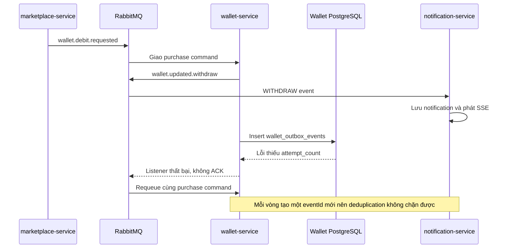

# Incident Report: Marketplace purchase spammed cash-out notifications

## Thông tin sự cố

| Thuộc tính             | Giá trị                                                                                        |
| ---------------------- | ---------------------------------------------------------------------------------------------- |
| Mức độ                 | Critical                                                                                       |
| Ngày phát hiện         | 2026-07-19                                                                                     |
| Nghiệp vụ bị ảnh hưởng | Học sinh mua sản phẩm trên Marketplace                                                         |
| Service liên quan      | `marketplace-service`, `wallet-service`, `notification-service`, RabbitMQ, PostgreSQL, MongoDB |
| Tác động đã ghi nhận   | 41.178 notification sai trên 2 tài khoản                                                       |
| Trạng thái             | Đã khắc phục và dọn dữ liệu lỗi                                                                |

## Dấu hiệu

### Người dùng nhìn thấy gì?

Sau khi học sinh mua Flashcard hoặc Quiz trên Marketplace:

1. Màn hình liên tục hiện notification **"Rút Coin thành công 💸"**.
2. Các notification có cùng số Coin với giá sản phẩm vừa mua.
3. Notification tiếp tục xuất hiện dù người dùng không thực hiện thao tác rút Coin.
4. Số lượng notification chưa đọc tăng rất nhanh.
5. SSE liên tục đẩy dữ liệu về trình duyệt, làm UI render liên tục và cuối cùng khiến trang bị chậm hoặc đứng.
6. Đơn hàng có thể không hoàn tất dù số dư và notification đã có dấu hiệu thay đổi.

Ví dụ notification sai:

```text
Rút Coin thành công 💸
Giao dịch rút/quy đổi 100 Coin của bạn đã được thực hiện thành công
(Mua Flashcard: Animal).
```

### Backend trông như thế nào?

`notification-service` lặp lại các log sau với tốc độ rất cao:

```text
Received WalletUpdatedEvent ..., type WITHDRAW, amount -100
Sent SSE notification to user ...
Sent WALLET_UPDATED notification to user ...
```

`wallet-service` liên tục nhận lại cùng một purchase command:

```text
Received wallet.debit.requested for orderId=..., amount=100
```

Sau đó transaction thất bại ở bảng outbox:

```text
ERROR: column "attempt_count" of relation "wallet_outbox_events" does not exist
```

RabbitMQ không thể ACK command thành công nên tiếp tục giao lại message.

## Cách reproduce

### Điều kiện cần

- Các service và RabbitMQ đang chạy.
- Có một sản phẩm Marketplace đã được Admin duyệt.
- Học sinh có đủ Coin để mua sản phẩm.
- Database wallet đang có bảng `wallet_outbox_events` với cột `retry_count` nhưng không có cột `attempt_count`.
- Chạy phiên bản code trước khi sửa, trong đó purchase được ghi là `WITHDRAW` và `debitPurchase()` phát `wallet.updated.withdraw`.

Có thể kiểm tra schema lỗi bằng câu SQL:

```sql
SELECT column_name
FROM information_schema.columns
WHERE table_schema = 'public'
  AND table_name = 'wallet_outbox_events'
ORDER BY ordinal_position;
```

### Các bước

1. Đăng nhập bằng tài khoản học sinh.
2. Mở Marketplace.
3. Chọn một sản phẩm đã được duyệt, ví dụ Flashcard `Animal` giá 100 Coin.
4. Thực hiện mua sản phẩm.
5. Giữ trang mở và quan sát khu vực notification.

### Kết quả thực tế trước khi sửa

- Notification **"Rút Coin thành công 💸"** xuất hiện liên tục.
- Cùng một order được `wallet-service` xử lý lại nhiều lần.
- Log liên tục báo thiếu cột `attempt_count`.
- `wallet.commands.queue` có message bị requeue/unacknowledged.
- MongoDB tăng nhanh số document trong collection `notifications`.

### Kết quả mong đợi

- Purchase command chỉ được xử lý một lần.
- Học sinh chỉ nhận notification mua hàng thành công từ luồng Marketplace.
- Không có notification rút Coin vì học sinh không thực hiện cash-out.
- Transaction wallet và outbox cùng commit thành công.
- RabbitMQ ACK message và không giao lại command.

## Nguyên nhân

### Giải thích ngắn gọn

Lỗi này là sự kết hợp của ba vấn đề:

1. **Mua hàng bị đặt tên nhầm là rút tiền.**  
   `wallet-service` lưu purchase bằng `TransactionType.WITHDRAW`. `notification-service` lại hiểu `WITHDRAW` là người dùng vừa rút Coin thật, nên tạo notification sai.

2. **Code và database không cùng schema.**  
   Entity `WalletOutboxEvent` yêu cầu cột `attempt_count`, nhưng database chỉ có cột `retry_count`. Vì vậy câu lệnh insert outbox luôn thất bại.

3. **Notification được gửi trước khi transaction database commit.**  
   `wallet.updated.withdraw` đã được gửi sang RabbitMQ, sau đó transaction PostgreSQL mới thất bại. PostgreSQL có thể rollback dữ liệu, nhưng không thể lấy lại message đã gửi sang RabbitMQ.

### Giải thích bằng một ví dụ dễ nhớ

Hãy tưởng tượng nhân viên xử lý đơn hàng làm theo thứ tự này:

1. Gửi tin nhắn cho học sinh: "Bạn đã rút 100 Coin".
2. Ghi sổ giao dịch và phiếu outbox.
3. Việc ghi sổ thất bại vì mẫu phiếu có một ô mà database không có.
4. Hệ thống hủy phần ghi sổ và yêu cầu nhân viên làm lại đơn hàng.
5. Nhân viên làm lại từ đầu và gửi thêm một tin nhắn mới.

Phiếu ghi sổ được hủy, nhưng tin nhắn đã gửi không thể thu hồi. Vì bước 3 luôn thất bại, vòng lặp không bao giờ kết thúc.

### Chuỗi sự kiện gây vòng lặp



### Tại sao số dư không nhất thiết bị trừ hàng nghìn lần?

Phần cập nhật số dư nằm trong transaction PostgreSQL nên được rollback khi insert outbox thất bại. Tuy nhiên, việc publish RabbitMQ là side effect bên ngoài transaction đó và không được rollback. Kết quả là dữ liệu wallet có thể quay lại trạng thái cũ, còn notification vẫn tiếp tục được tạo.

### Tại sao cơ chế chống trùng notification không cứu được lỗi này?

`NotificationService` có kiểm tra trùng theo `eventId`, nhưng mỗi lần retry, `WalletNotificationPublisher` tạo một UUID mới. Với hệ thống, mỗi notification trông như một event hoàn toàn mới nên tất cả đều được lưu.

## Cách giải quyết

### 1. Chặn notification sai tại consumer

Trong `notification-service`, chỉ `CASH_OUT` mới được xem là rút Coin thật. `WITHDRAW` không còn đi vào nhánh tạo notification cash-out.

File:

```text
src/services/notification-service/src/main/java/com/seika/notification_service/consumer/WalletEventListener.java
```

Quy tắc sau khi sửa:

```text
TOP_UP / DEPOSIT -> Notification nạp Coin
CASH_OUT         -> Notification rút Coin
WITHDRAW         -> Bỏ qua
```

### 2. Không publish wallet notification cho purchase

Đã bỏ lệnh `publishWalletUpdated(... WITHDRAW ...)` khỏi `WalletService.debitPurchase()`.

Purchase đã có notification riêng từ sự kiện `content.purchased` của Marketplace. Không cần phát thêm một wallet notification có ý nghĩa mơ hồ.

File:

```text
src/services/wallet-service/src/main/java/com/cardy/walletService/service/WalletService.java
```

### 3. Đồng bộ entity outbox với schema đang tồn tại

Database đã có cột `retry_count`, nhưng code lại bổ sung thêm `attempt_count` để làm cùng một nhiệm vụ. Đã:

- Xóa field `attemptCount` khỏi `WalletOutboxEvent`.
- Chuyển `WalletOutboxProcessor` sang đọc và cập nhật `retryCount`.
- Cập nhật test để kiểm tra retry bằng `retry_count`.

Các file:

```text
src/services/wallet-service/src/main/java/com/cardy/walletService/domain/WalletOutboxEvent.java
src/services/wallet-service/src/main/java/com/cardy/walletService/processor/WalletOutboxProcessor.java
src/services/wallet-service/src/test/java/com/cardy/walletService/processor/WalletOutboxProcessorTest.java
```

### 4. Thêm regression test

Test mới đảm bảo:

- Event `WITHDRAW` không tạo notification.
- Event `CASH_OUT` thật vẫn tạo đúng một notification.
- Outbox tiếp tục retry, backoff và chuyển DLQ bằng `retry_count`.

File:

```text
src/services/notification-service/src/test/java/com/seika/notification_service/consumer/WalletEventListenerTest.java
```

### 5. Dọn dữ liệu lỗi

Sau khi chặn nguồn spam, đã lọc theo tiêu đề và nội dung purchase để tránh xóa nhầm cash-out hợp lệ:

```javascript
{
  title: "Rút Coin thành công 💸",
  content: /Mua /
}
```

Kết quả:

- Đã xóa: `41.178` notification sai.
- Notification purchase spam còn lại: `0`.
- Không có cash-out hợp lệ trong tập dữ liệu bị xóa.

## Kiểm chứng sau khi sửa

- `WalletEventListenerTest`: 2 test pass.
- Test wallet outbox và command: 7 test pass.
- `wallet-service` và `notification-service` chạy thành công sau rebuild.
- `wallet.commands.queue`: `0 ready`, `0 unacknowledged`.
- `notification.wallet-events`: `0 ready`, `0 unacknowledged`.
- Purchase command bị kẹt trước đó đã commit thành công.
- Các `WITHDRAW` event tồn đọng được consume với log `Skipping notification` và không phát SSE.

## Bài học cần ghi nhớ

1. **Không dùng cùng một transaction type cho hai nghiệp vụ khác nghĩa.** Purchase và cash-out đều làm số dư giảm, nhưng ý nghĩa nghiệp vụ và notification hoàn toàn khác nhau.
2. **Không publish side effect trước khi transaction quan trọng commit.** Ưu tiên transactional outbox hoặc publish sau commit.
3. **Mọi thay đổi entity database cần migration rõ ràng.** Không dựa hoàn toàn vào `ddl-auto=update`, đặc biệt với môi trường đã có dữ liệu.
4. **Idempotency key phải ổn định theo nghiệp vụ.** UUID mới ở mỗi lần retry không thể chống trùng.
5. **Consumer cần retry hữu hạn và DLQ.** Một lỗi schema không được phép tạo vòng requeue vô hạn.
6. **Cần cảnh báo theo tốc độ notification.** Ví dụ cảnh báo khi một user nhận quá nhiều notification cùng loại trong một phút.
7. **Integration test phải bao gồm database schema thật.** Test với PostgreSQL/Testcontainers có thể phát hiện cột thiếu trước khi chạy manual test.
