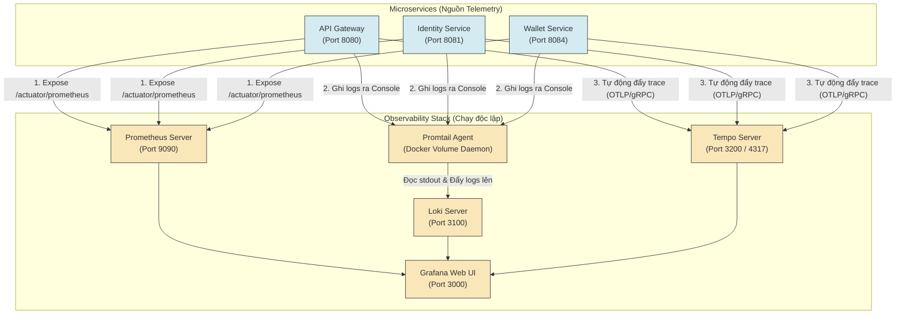

# HƯỚNG DẪN CHI TIẾT TỪ A-Z: THIẾT LẬP OBSERVABILITY STACK (LGTM) CHO MICROSERVICES

_Dành cho lập trình viên chưa từng làm về giám sát hệ thống (Monitoring/Observability)_

Chào người anh em! Nếu bạn là một nhà phát triển phần mềm, chắc chắn bạn đã từng nghe các từ khóa như "Monitoring", "Logging", "Tracing" hay các công cụ trong hệ sinh thái **LGTM** (Loki, Grafana, Tempo, Mimir/Prometheus).

Tài liệu này được viết ra để giải thích chi tiết, từng bước một, cách hoạt động và phương pháp tích hợp hệ thống giám sát này vào dự án Microservices hiện có của bạn từ con số 0.

---

## PHẦN 1: TƯ DUY VỀ OBSERVABILITY (CHO NGƯỜI MỚI)

### 1. Observability là gì? Nó khác gì với Monitoring truyền thống?

- **Monitoring (Giám sát)**: Trả lời câu hỏi **"Hệ thống có đang chạy không?"** (Ví dụ: Server RAM còn trống không? API Gateway có trả về code 200 không?). Nó thiên về việc kiểm tra trạng thái tĩnh.
- **Observability (Khả năng quan sát)**: Trả lời câu hỏi **"Tại sao hệ thống lại chạy chậm/lỗi?"** bằng cách thu thập các dữ liệu nội tại (telemetry) để tìm ra nguồn gốc của một lỗi chưa từng xảy ra trước đó.

Observability được xây dựng dựa trên **3 trụ cột chính (The Three Pillars)**:

1.  **Metrics (Chỉ số)**: Số liệu định lượng tại một thời điểm (Ví dụ: CPU dùng bao nhiêu %, có bao nhiêu request/giây).
2.  **Logs (Nhật ký)**: Dữ liệu văn bản mô tả sự kiện xảy ra (Ví dụ: `[User-Service] Error: User not found in database`).
3.  **Traces (Vết đi của yêu cầu)**: Hành trình của một request đi qua các microservice khác nhau (Ví dụ: Request bắt đầu từ API Gateway -> Identity -> Wallet -> Database).

---

### 2. Mô hình hoạt động: Centralized vs. Decentralized?

Một câu hỏi kinh điển của các dev mới làm monitoring: **"Mỗi Microservice chạy một máy chủ Prometheus/Loki riêng, hay chạy chung?"**

> [!IMPORTANT]
> **Câu trả lời là: KHÔNG chạy riêng.**
> Chúng ta sử dụng mô hình **Giám sát tập trung (Centralized Monitoring)**.
>
> - Có **duy nhất 1** máy chủ Prometheus, **1** máy chủ Loki, **1** máy chủ Tempo, và **1** máy chủ Grafana chạy độc lập trên các port riêng của chúng.
> - Các Microservices chỉ đóng vai trò là **"nguồn cấp dữ liệu" (Telemetry Sources)**. Chúng phơi (expose) dữ liệu ra ngoài, hoặc tự đẩy dữ liệu về các máy chủ tập trung này.

#### Sơ đồ hoạt động của LGTM Stack:



---

## PHẦN 2: THIẾT LẬP PHÍA MICROSERVICES (SPRING BOOT 3.x)

Để các microservice của bạn phát ra được Metrics, Logs (có trace ID) và Traces, chúng ta cần cấu hình code Java.

### Bước 1: Khai báo dependency trong file `pom.xml`

Thay vì phải cài các agent Java bên ngoài phức tạp, Spring Boot 3.x sử dụng **Micrometer** (thư viện đo lường chuẩn hóa) tích hợp sẵn để xuất dữ liệu trực tiếp:

```xml
<!-- 1. Kích hoạt Spring Boot Actuator để phơi các endpoint giám sát -->
<dependency>
    <groupId>org.springframework.boot</groupId>
    <artifactId>spring-boot-starter-actuator</artifactId>
</dependency>

<!-- 2. Xuất dữ liệu Metrics theo định dạng mà Prometheus đọc được -->
<dependency>
    <groupId>io.micrometer</groupId>
    <artifactId>micrometer-registry-prometheus</artifactId>
</dependency>

<!-- 3. Micrometer Tracing Bridge: Cầu nối giúp tạo Trace ID và Span ID -->
<dependency>
    <groupId>io.micrometer</groupId>
    <artifactId>micrometer-tracing-bridge-otel</artifactId>
</dependency>

<!-- 4. Exporter OTLP: Đẩy dữ liệu Trace đi qua giao thức OpenTelemetry sang Tempo -->
<dependency>
    <groupId>io.opentelemetry</groupId>
    <artifactId>opentelemetry-exporter-otlp</artifactId>
</dependency>
```

---

### Bước 2: Cấu hình chung cho ứng dụng (`application.yaml`)

Chúng ta cần cấu hình để Spring Boot biết:

- Mở endpoint `/actuator/prometheus`.
- Tự động gắn nhãn (tag) tên ứng dụng để Grafana lọc được.
- Địa chỉ của Tempo ở đâu để đẩy Trace về.

Cấu hình mẫu được áp dụng chung cho tất cả microservices:

```yaml
spring:
  application:
    name: wallet-service # Tên dịch vụ sẽ được dùng làm tag 'application'

management:
  # 1. Kích hoạt và phơi endpoint Prometheus ra ngoài
  endpoints:
    web:
      exposure:
        include: "health,info,prometheus"
  endpoint:
    health:
      show-details: always

  # 2. Đính kèm tag mặc định vào mọi metrics để Grafana không bị N/A
  metrics:
    tags:
      application: ${spring.application.name} # Gắn tên service vào nhãn 'application'
      namespace: default # Gắn nhãn 'namespace' mặc định

  # 3. Cấu hình gửi Traces qua giao thức OTLP về Tempo
  otlp:
    tracing:
      endpoint: "http://tempo:4317" # Port gRPC nhận trace của Tempo
  tracing:
    sampling:
      probability: 1.0 # Thu thập 100% traces (1.0 = 100%)
```

---

### Bước 3: Cấu hình Logs để gắn Trace ID và Span ID vào console

Nhờ có cầu nối `micrometer-tracing-bridge-otel`, mỗi khi có một request đi vào hệ thống, một `traceId` và `spanId` sẽ được tự động tạo và lưu trữ trong ThreadLocal (MDC - Mapped Diagnostic Context).

Ta cần cấu hình log pattern để in các ID này ra console. Khi cấu hình in ra console, **Promtail** sẽ đọc log này và đẩy lên **Loki**.

```yaml
logging:
  pattern:
    # Cú pháp in log chuẩn hóa chứa: [Tên_Service, Trace_ID, Span_ID]
    level: "%5p [${spring.application.name:},%X{traceId:-},%X{spanId:-}]"
  level:
    org.springframework.security: INFO
    org.springframework.web: INFO
```

_Ví dụ log thực tế được ghi nhận:_
`INFO [wallet-service,8db8d4987f6a51ed76090464c02e062,5d68fc0b8d8f024] 1 --- [wallet-service] c.c.w.controller.WalletController : Processing payment...`

---

### Bước 4: Mở chặn bảo mật Spring Security (Nếu có)

Nếu ứng dụng của bạn có sử dụng Spring Security, mặc định nó sẽ chặn endpoint `/actuator/prometheus` (trả về lỗi 401). Ta cần cho phép truy cập công khai endpoint này trong `SecurityConfig.java`:

```java
@Bean
public SecurityFilterChain securityFilterChain(HttpSecurity http) throws Exception {
    http
        .csrf(csrf -> csrf.disable())
        .authorizeHttpRequests(auth -> auth
            // Cho phép tất cả mọi người (bao gồm cả Prometheus) truy cập endpoint Prometheus
            .requestMatchers("/actuator/prometheus", "/actuator/health").permitAll()
            .anyRequest().authenticated()
        );
    return http.build();
}
```

---

## PHẦN 3: THIẾT LẬP HỆ THỐNG GIÁM SÁT (DOCKERIZE & CONFIG)

Tất cả các công cụ của Observability sẽ được quản lý bằng Docker Compose nhằm đảm bảo tính đồng bộ, cài đặt nhanh và dễ dàng di chuyển.

### 1. Docker Compose tổng thể (`docker-compose.observability.yml`)

Dưới đây là file Docker Compose thiết lập LGTM Stack kết nối với mạng nội bộ của ứng dụng (`seika-network`):

```yaml
version: "3.8"

services:
  # 1. Prometheus - Bộ thu thập Metrics từ Spring Boot
  prometheus:
    image: prom/prometheus:latest
    container_name: prometheus
    volumes:
      - ./observability/prometheus.yml:/etc/prometheus/prometheus.yml
    ports:
      - "9090:9090"
    command:
      - "--config.file=/etc/prometheus/prometheus.yml"
      - "--enable-feature=exemplar-storage" # Kích hoạt tính năng kết nối Metrics sang Tracing
    networks:
      - seika-network

  # 2. Loki - Bộ lưu trữ và quản lý Logs tập trung
  loki:
    image: grafana/loki:2.9.1
    container_name: loki
    command: -config.file=/etc/loki/local-config.yaml
    ports:
      - "3100:3100"
    volumes:
      - ./observability/loki-config.yaml:/etc/loki/local-config.yaml
    networks:
      - seika-network

  # 3. Promtail - Điệp viên (Agent) đọc log của các Container Docker và gửi về Loki
  promtail:
    image: grafana/promtail:2.9.1
    container_name: promtail
    volumes:
      # Mount Docker socket để Promtail biết thông tin metadata của các container khác
      - /var/run/docker.sock:/var/run/docker.sock:ro
      # Mount thư mục lưu log container của Docker để Promtail đọc
      - /var/lib/docker/containers:/var/lib/docker/containers:ro
      - ./observability/promtail-config.yaml:/etc/promtail/config.yaml
    command: -config.file=/etc/promtail/config.yaml
    networks:
      - seika-network

  # 4. Tempo - Bộ lưu trữ phân tán Traces
  tempo:
    image: grafana/tempo:2.4.1
    container_name: tempo
    command: ["-config.file=/etc/tempo.yaml"]
    ports:
      - "4317:4317" # Port nhận traces (OTLP gRPC) từ microservices
      - "3200:3200" # Port truy vấn traces của Grafana
    volumes:
      - ./observability/tempo-config.yaml:/etc/tempo.yaml
    networks:
      - seika-network

  # 5. Grafana - Giao diện trực quan hóa dữ liệu (UI hiển thị biểu đồ, logs, traces)
  grafana:
    image: grafana/grafana:latest
    container_name: grafana
    depends_on:
      - prometheus
      - loki
      - tempo
    ports:
      - "3000:3000"
    volumes:
      # Tự động nạp cấu hình Datasources và Dashboards lúc khởi động
      - ./observability/grafana-datasources.yaml:/etc/grafana/provisioning/datasources/datasources.yaml
      - ./observability/grafana-dashboards.yaml:/etc/grafana/provisioning/dashboards/dashboards.yaml
      - ./observability/dashboards:/var/lib/grafana/dashboards
    environment:
      # Thiết lập tự động đăng nhập quyền Admin không cần mật khẩu
      - GF_AUTH_ANONYMOUS_ENABLED=true
      - GF_AUTH_ANONYMOUS_ORG_ROLE=Admin
    networks:
      - seika-network

networks:
  seika-network:
    external: true
```

---

### 2. Ý nghĩa và Cấu hình của từng File Thiết lập (Configuration Files)

#### A. File cấu hình Prometheus: `observability/prometheus.yml`

File này ra lệnh cho Prometheus biết nó phải đi lấy dữ liệu (scrape) từ những địa chỉ nào, tần suất bao lâu một lần.

```yaml
global:
  scrape_interval: 15s # Cứ mỗi 15 giây, đi lấy metrics một lần

scrape_configs:
  - job_name: "spring-boot-actuator"
    metrics_path: "/actuator/prometheus" # Đường dẫn lấy metrics của Spring Boot
    static_configs:
      # Danh sách các microservice container đang chạy trong Docker Network
      - targets:
          - "identity-service:8081"
          - "profile-service:8082"
          - "notification-service:8083"
          - "wallet-service:8084"
          - "marketplace-service:8085"
          - "flashcard-service:8086"
          - "quiz-service:8087"
          - "reward-service:8088"
          - "api-gateway:8080"
```

#### B. File cấu hình Loki: `observability/loki-config.yaml`

Cấu hình nơi Loki lưu trữ dữ liệu log (ở đây dùng file system đơn giản để chạy cục bộ).

```yaml
auth_enabled: false

server:
  http_listen_port: 3100

common:
  ring:
    instance_addr: 127.0.0.1
    kvstore:
      store: inmemory
  replication_factor: 1
  path_prefix: /tmp/loki

schema_config:
  configs:
    - from: 2020-10-24
      store: tsdb
      object_store: filesystem
      schema: v13
      index:
        prefix: index_
        period: 24h

storage_config:
  filesystem:
    directory: /tmp/loki/chunks
```

#### C. File cấu hình Promtail: `observability/promtail-config.yaml`

Cấu hình Promtail đọc file log của Docker container, bóc tách nhãn tên của Container đó và gửi về Loki.

```yaml
server:
  http_listen_port: 9080
  grpc_listen_port: 0

positions:
  filename: /tmp/positions.yaml

clients:
  - url: http://loki:3100/loki/api/v1/push # Địa chỉ Loki nhận log push từ Promtail

scrape_configs:
  - job_name: container-logs
    docker_sd_configs:
      - host: unix:///var/run/docker.sock # Kết nối Docker Socket để khám phá container tự động
    relabel_configs:
      # Trích xuất và gắn tên container vào làm nhãn 'container'
      - source_labels: [__meta_docker_container_name]
        regex: "/(.*)"
        target_label: "container"
```

#### D. File cấu hình Tempo: `observability/tempo-config.yaml`

Tempo cấu hình các cổng kết nối (như gRPC 4317 chuẩn OpenTelemetry) để các microservice gửi Trace ID về.

```yaml
stream_over_http_enabled: true
server:
  http_listen_port: 3200

distributor:
  receivers:
    otlp:
      protocols:
        grpc:
          endpoint: 0.0.0.0:4317 # Port nhận traces gRPC từ code Java gửi lên

ingester:
  lifecycler:
    ring:
      kvstore:
        store: inmemory
      replication_factor: 1

compactor:
  compaction:
    block_size_bytes: 4194304
    compacted_block_retention: 48h

storage:
  trace:
    backend: local
    local:
      path: /tmp/tempo/traces
```

---

## PHẦN 4: KẾT NỐI TẤT CẢ VÀO GRAFANA

Làm sao để Grafana liên kết được dữ liệu giữa 3 công cụ (Metrics -> Logs -> Traces)?
Chúng ta thực hiện điều này thông qua cơ chế **Tự động khai báo Datasources (Provisioning)**.

### File cấu hình Datasources: `observability/grafana-datasources.yaml`

Grafana sẽ đọc file này khi khởi động và tự động cấu hình các cổng kết nối kèm theo các **mối liên hệ tương quan (Derived Fields/Traces to Logs)**:

```yaml
apiVersion: 1

datasources:
  # 1. Khai báo Prometheus làm nguồn Metrics
  - name: Prometheus
    type: prometheus
    access: proxy
    url: http://prometheus:9090
    isDefault: true
    version: 1
    editable: false
    uid: prometheus # UID cố định để liên kết cấu hình dashboard tránh lỗi N/A

  # 2. Khai báo Loki làm nguồn Logs
  - name: Loki
    type: loki
    access: proxy
    url: http://loki:3100
    version: 1
    editable: false
    jsonData:
      derivedFields:
        # Bắt liên kết từ Log sang Trace ID!
        # Nếu dòng log chứa 'traceId=xyz', Grafana tự động biến 'xyz' thành một đường link
        # Click vào link này sẽ nhảy trực tiếp sang xem sơ đồ phân tích trace tương ứng của Tempo!
        - datasourceUid: tempo
          matcherRegex: "traceId=(\\w+)"
          name: TraceID
          url: "$${__value.raw}"

  # 3. Khai báo Tempo làm nguồn Traces
  - name: Tempo
    type: tempo
    access: proxy
    url: http://tempo:3200
    version: 1
    editable: false
    uid: tempo
    jsonData:
      nodeGraph:
        enabled: true
      tracesToLogsV2:
        # Ngược lại, khi đang xem một TraceID của Tempo,
        # Grafana hiển thị nút "View logs" để tìm đúng các dòng log của Service liên quan tại Loki!
        datasourceUid: "loki"
        tags:
          - key: "service.name"
            dir: "app"
```

---

## PHẦN 5: CÁC LỆNH VẬN HÀNH & KỊCH BẢN KIỂM TRA

### 1. Khởi động toàn bộ hệ thống

Mỗi khi bạn thay đổi code Java, cấu hình YAML, hãy tuân thủ quy trình 3 bước sau:

```bash
# Bước 1: Build đóng gói các file .jar của Microservices
mvn clean package -DskipTests

# Bước 2: Build lại các Docker Image của dự án
docker compose -f docker-compose.yml -f docker-compose.observability.yml build

# Bước 3: Khởi chạy và ép buộc tạo mới toàn bộ container
docker compose -f docker-compose.yml -f docker-compose.observability.yml up -d --force-recreate
```

---

### 2. Kịch bản kiểm tra Hoạt động (Step-by-step Test Scenario)

Để kiểm chứng hệ thống hoạt động chính xác từ đầu tới cuối:

1.  **Tạo dữ liệu thử nghiệm**:
    Gọi thử một API bất kỳ của bạn đi qua API Gateway. Ví dụ gửi yêu cầu Login của `identity-service` hoặc thanh toán của `wallet-service`.
2.  **Xem biểu đồ hệ thống (Metrics)**:
    - Mở trình duyệt: [http://localhost:3000/d/spring_boot_21/spring-boot-3-x-statistics](http://localhost:3000/d/spring_boot_21/spring-boot-3-x-statistics).
    - Chọn bộ lọc: **Namespace** -> `default`, **Application** -> `wallet-service` (hoặc service bạn vừa gọi).
    - Kiểm tra các biểu đồ CPU, Heap Memory, Request Count đã nhảy dữ liệu lên hay chưa.
3.  **Truy vết Logs (Loki)**:
    - Tại Grafana, chọn menu **Explore** (hình la bàn bên trái) -> Chọn nguồn dữ liệu **Loki**.
    - Chọn bộ lọc: `{container="seika-wallet-service-1"}` và bấm **Run query**.
    - Bạn sẽ thấy tất cả nhật ký (Logs) của service đó đổ ra.
4.  **Bấm chuyển tiếp Trace (Tempo)**:
    - Trong các dòng logs hiển thị ở bước 3, tìm các log có in traceId (ví dụ: `traceId=8db8d4987f6a...`).
    - Cạnh traceId đó sẽ xuất hiện một đường link màu xanh có chữ **Tempo**. Hãy click vào link đó!
    - Màn hình Grafana sẽ chia đôi: Một bên là Logs, một bên là biểu đồ dạng **Timeline của Trace**. Bạn sẽ nhìn thấy chi tiết request này tốn bao nhiêu mili-giây, đi qua các phương thức (method) hay database queries nào của microservice!

Chúc bạn tích hợp hệ thống giám sát LGTM vào dự án thành công tốt đẹp! Có bất kỳ thắc mắc nào khác, hãy cứ hỏi tôi nhé!
