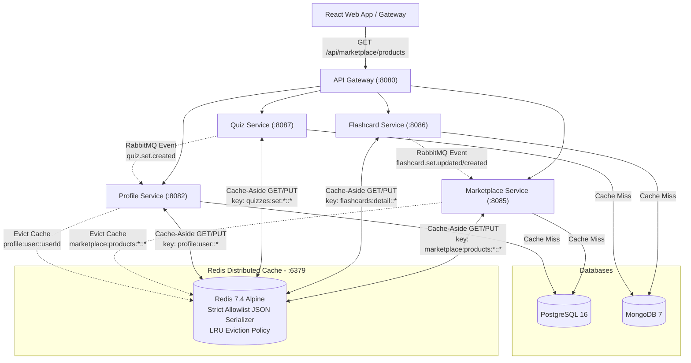

# Implementation Plan - Redis Distributed Caching Integration (Revised & Hardened v3)

## Goal Description

Hiện tại, theo khảo sát kiến trúc và báo cáo tổng kết dự án (`documentation/report/7_Conclusion_Future_Work.md`), các thao tác truy vấn đọc (Read-Heavy) như xem danh mục học liệu trên Marketplace, danh sách/chi tiết bộ từ vựng Flashcard, Quiz Set, và thông tin User Profile đang đi trực tiếp xuống cơ sở dữ liệu (`PostgreSQL` & `MongoDB`).

Mục tiêu của kế hoạch này là **tích hợp hệ thống phân tán Redis Cache (Distributed Caching)** vào giai đoạn 1 (Phase 1) cho 4 microservice chịu tải đọc lớn nhất: `marketplace-service`, `flashcard-service`, `quiz-service`, và `profile-service` theo mô hình **Cache-Aside** kết hợp **Event-Driven / Write-Through Eviction**.

Kế hoạch đã được tinh chỉnh khắt khe đáp ứng toàn bộ tiêu chuẩn bảo mật production (bao gồm cấu hình YAML tách biệt không fallback), chuẩn hóa DTO trả về đồng bộ đến tận Controller, tách bean helper để ngăn Spring AOP self-invocation, bắt buộc kiểm thử deserialize DTO round-trip, và tối ưu hóa ma trận xóa cache chính xác (loại bỏ eviction thừa).

---

## Architecture & Eviction Matrix



---

## Mandatory Engineering & Security Guidelines (Đã đồng thuận & chuẩn hóa)

### 1. Redis Authentication & Production Security

- **Dev/Local (`docker-compose.yml`)**: Bật `requirepass ${REDIS_PASSWORD:-seika_redis_secret}` kèm `--maxmemory 256mb --maxmemory-policy allkeys-lru` để mô phỏng chính xác môi trường thực tế.
- **Production (`docker-compose.prod.yml`) & Prod Config (`*-prod.yaml`)**:
  - Yêu cầu mật khẩu bắt buộc từ biến môi trường/secret: `${REDIS_PASSWORD?REDIS_PASSWORD is required in production}` (không có default fallback).
  - Các file YAML production (`marketplace-service-prod.yaml`, `flashcard-service-prod.yaml`, `quiz-service-prod.yaml`, `profile-service-prod.yaml`) **tuyệt đối không dùng fallback `seika_redis_secret`** (`password: ${REDIS_PASSWORD}`).
  - **KHÔNG publish port `6379` ra host** (chỉ cho phép truy cập nội bộ trong mạng Docker cluster).
  - Cấu hình `--maxmemory 512mb --maxmemory-policy allkeys-lru`.

### 2. Serialization Security & Mandatory DTO Standard

- **Tuyệt đối KHÔNG cache trực tiếp JPA Entity hay Mongo Document**.
- **Chuẩn hóa DTO tại Marketplace (`ProductResponse`)**: Vì `Product` hiện là JPA entity, chúng ta sẽ tạo DTO `ProductResponse` (`com.seika.marketplace_service.dto.ProductResponse`) để trả về từ service/catalog cache helper và lưu trong Redis. **Chữ ký phương thức trong `ProductController` cũng được đồng bộ hóa trả về `ResponseEntity<List<ProductResponse>>` / `ResponseEntity<ProductResponse>` để đảm bảo compile và hợp đồng API nhất quán.**
- Sử dụng `GenericJackson2JsonRedisSerializer` kết hợp với `PolymorphicTypeValidator` (Allowlist) khắt khe chỉ cho phép các package nội bộ của Seika và JDK primitive/collection/time:
  ```java
  PolymorphicTypeValidator ptv = BasicPolymorphicTypeValidator.builder()
          .allowIfBaseType("com.seika.")
          .allowIfBaseType("java.util.")
          .allowIfBaseType("java.time.")
          .build();
  ```
- **Bắt buộc kiểm thử deserialize round-trip**: Mỗi service chịu tải cache phải có unit test `RedisCacheSerializationTest.java` xác nhận chính xác khả năng serialize & deserialize cho DTO tương ứng (`ProductResponse`, `CardSetDTO`, `QuizSetResponse`, `UserProfileResponse`).

### 3. Marketplace Public Catalog Cache & Avoiding Spring Self-Invocation

Để tránh lỗi **Spring AOP Self-Invocation** khi `@Cacheable` và method lọc in-memory nằm chung trong `ProductService`, chúng ta tạo một Spring Bean / Helper độc lập:

- **`ProductCatalogCacheHelper.java`**: Chứa `@Cacheable(value = "marketplace:products:active", key = "'public'") getPublicPublishedProducts()` trả về `List<ProductResponse>`.
- **Tại `ProductService.getActiveProducts(String userId)`**: Gọi sang `catalogCacheHelper.getPublicPublishedProducts()`. Khi `userId == null/blank`, trả thẳng catalog đã cache. Khi có `userId`, tiếp tục lọc `unavailableProductIds` trên RAM từ danh sách public đó.

### 4. Static Tiered TTL Strategy (Chiến lược TTL Phân tầng tĩnh)

Cấu hình TTL tĩnh rõ ràng trong `RedisCacheConfiguration` (lưu ý: `entryTtl(Duration)` trong Spring Data Redis là TTL tĩnh chính xác):

- `marketplace:products:active` (Danh mục public): **30 phút**.
- `marketplace:products:detail` / `flashcards:detail` / `quizzes:set:detail` (Chi tiết item): **60 phút**.
- `flashcards:author` / `quizzes:set:author` (Danh sách theo tác giả): **30 phút**.
- `profile:user` (User Profile DTO): **60 phút** (được làm mới/xóa ngay khi có thay đổi).

### 5. Flashcard List Scope & Precision Eviction

- Hạn chế cache toàn bộ `getAll()` (`findAll()` không phân trang). Tập trung cache cho **Detail (`getById`)**, **Author List (`getByAuthor`)**, và **Search (`getByKeyword`)** với key rõ ràng.
- **Loại bỏ `CardSetService.buy()` khỏi ma trận xóa cache**: Do thao tác mua (`buy`) chỉ ghi nhận vào bảng `Purchase` mà không làm thay đổi nội dung DTO `CardSetDTO`, việc xóa cache detail/author ở hàm này là invalidation thừa và được loại bỏ.

---

## Comprehensive Eviction Matrix (Ma trận xóa Cache chính xác)

| Microservice              | Cache Name / Prefix                                                      | Trigger Methods & Event Consumers (Evict / Update)                                                                                                                                                                                                                                                                                                           |
| :------------------------ | :----------------------------------------------------------------------- | :----------------------------------------------------------------------------------------------------------------------------------------------------------------------------------------------------------------------------------------------------------------------------------------------------------------------------------------------------------- |
| **`marketplace-service`** | `marketplace:products:active::*`<br>`marketplace:products:detail::*`     | - **Seller actions**: `ProductService.archive()`, `hardDelete()`<br>- **Admin actions**: `AdminProductService.approve()`, `reject()`, `hide()`<br>- **RabbitMQ Consumers**: `ProductEventListener.handleContentCreatedEvent()` (khi nhận event `flashcard.set.created`, `quiz.set.created`, `flashcard.set.updated`, `quiz.set.updated`, `content.consumed`) |
| **`flashcard-service`**   | `flashcards:detail::*`<br>`flashcards:author::*`<br>`flashcards:list::*` | - **Author actions**: `CardSetService.create()`, `update()`, `delete()`<br>_(Lưu ý: Không evict khi `buy()` vì DTO không đổi)_                                                                                                                                                                                                                               |
| **`quiz-service`**        | `quizzes:set:detail::*`<br>`quizzes:set:author::*`                       | - **Author actions**: `QuizSetService.create()`, `update()`, `deleteByOwner()`                                                                                                                                                                                                                                                                               |
| **`profile-service`**     | `profile:user::*`                                                        | - **Direct API**: `UserProfileService.createUserProfile()`, `updateUserProfile()`, `addExp()`<br>- **RabbitMQ Consumers**: `RewardEventConsumer.handleRewardGrantedEvent()`<br>- **RabbitMQ Consumers**: `TeacherStatsConsumer.handleQuizSetCreated()`, `handleFlashcardSetCreated()`, `handleContentPurchased()`, `handleTeacherTierUpdated()`              |

---

## Proposed Changes (Chi tiết triển khai)

### 1. Infrastructure Layer (`docker-compose.yml`, `docker-compose.prod.yml`, `.env` & config YAMLs)

#### `docker-compose.yml` (Dev environment)

```yaml
redis:
  image: redis:7.4-alpine
  command: redis-server --requirepass ${REDIS_PASSWORD:-seika_redis_secret} --maxmemory 256mb --maxmemory-policy allkeys-lru
  ports:
    - "6379:6379"
  environment:
    REDIS_PASSWORD: ${REDIS_PASSWORD:-seika_redis_secret}
  volumes:
    - redis_data:/data
  healthcheck:
    test:
      [
        "CMD",
        "redis-cli",
        "-a",
        "${REDIS_PASSWORD:-seika_redis_secret}",
        "ping",
      ]
    interval: 10s
    timeout: 5s
    retries: 5
  restart: unless-stopped
```

#### `docker-compose.prod.yml` (Production environment - Secured)

```yaml
redis:
  image: redis:7.4-alpine
  command: redis-server --requirepass ${REDIS_PASSWORD?REDIS_PASSWORD is required in production} --maxmemory 512mb --maxmemory-policy allkeys-lru
  # KHÔNG expose ports ra ngoài host ở prod
  environment:
    REDIS_PASSWORD: ${REDIS_PASSWORD?REDIS_PASSWORD is required in production}
  volumes:
    - redis_data:/data
  healthcheck:
    test: ["CMD", "redis-cli", "-a", "${REDIS_PASSWORD}", "ping"]
    interval: 10s
    timeout: 5s
    retries: 5
  restart: unless-stopped
```

#### `src/config-service/src/main/resources/configs/` (Dev vs Prod config separation)

```yaml
# Dev config (trong {service}-service.yaml / {service}-service-dev.yaml)
spring:
  cache:
    type: redis
  data:
    redis:
      host: ${REDIS_HOST:redis}
      port: ${REDIS_PORT:6379}
      password: ${REDIS_PASSWORD:seika_redis_secret}
      timeout: 5000ms

# Production config (trong {service}-service-prod.yaml) — KHÔNG CÓ FALLBACK
spring:
  cache:
    type: redis
  data:
    redis:
      password: ${REDIS_PASSWORD}
```

---

### 2. Shared Cache Configuration (`RedisCacheConfig.java`)

Tạo tại `com.seika.{service}.config.RedisCacheConfig` trong cả 4 services:

```java
package com.seika.marketplace_service.config;

import com.fasterxml.jackson.annotation.JsonTypeInfo;
import com.fasterxml.jackson.databind.ObjectMapper;
import com.fasterxml.jackson.databind.SerializationFeature;
import com.fasterxml.jackson.databind.jsontype.BasicPolymorphicTypeValidator;
import com.fasterxml.jackson.databind.jsontype.PolymorphicTypeValidator;
import com.fasterxml.jackson.datatype.jsr310.JavaTimeModule;
import org.springframework.cache.CacheManager;
import org.springframework.cache.annotation.EnableCaching;
import org.springframework.context.annotation.Bean;
import org.springframework.context.annotation.Configuration;
import org.springframework.data.redis.cache.RedisCacheConfiguration;
import org.springframework.data.redis.cache.RedisCacheManager;
import org.springframework.data.redis.connection.RedisConnectionFactory;
import org.springframework.data.redis.serializer.GenericJackson2JsonRedisSerializer;
import org.springframework.data.redis.serializer.RedisSerializationContext;
import org.springframework.data.redis.serializer.StringRedisSerializer;

import java.time.Duration;
import java.util.HashMap;
import java.util.Map;

@Configuration
@EnableCaching
public class RedisCacheConfig {

    @Bean
    public CacheManager cacheManager(RedisConnectionFactory connectionFactory) {
        ObjectMapper objectMapper = new ObjectMapper();
        objectMapper.registerModule(new JavaTimeModule());
        objectMapper.disable(SerializationFeature.WRITE_DATES_AS_TIMESTAMPS);

        PolymorphicTypeValidator ptv = BasicPolymorphicTypeValidator.builder()
                .allowIfBaseType("com.seika.")
                .allowIfBaseType("java.util.")
                .allowIfBaseType("java.time.")
                .build();

        objectMapper.activateDefaultTyping(ptv, ObjectMapper.DefaultTyping.NON_FINAL, JsonTypeInfo.As.PROPERTY);

        GenericJackson2JsonRedisSerializer serializer = new GenericJackson2JsonRedisSerializer(objectMapper);

        RedisCacheConfiguration defaultConfiguration = RedisCacheConfiguration.defaultCacheConfig()
                .entryTtl(Duration.ofMinutes(30))
                .disableCachingNullValues()
                .serializeKeysWith(RedisSerializationContext.SerializationPair.fromSerializer(new StringRedisSerializer()))
                .serializeValuesWith(RedisSerializationContext.SerializationPair.fromSerializer(serializer));

        Map<String, RedisCacheConfiguration> cacheConfigurations = new HashMap<>();
        cacheConfigurations.put("marketplace:products:active", defaultConfiguration.entryTtl(Duration.ofMinutes(30)));
        cacheConfigurations.put("marketplace:products:detail", defaultConfiguration.entryTtl(Duration.ofMinutes(60)));
        cacheConfigurations.put("flashcards:list", defaultConfiguration.entryTtl(Duration.ofMinutes(30)));
        cacheConfigurations.put("flashcards:detail", defaultConfiguration.entryTtl(Duration.ofMinutes(60)));
        cacheConfigurations.put("flashcards:author", defaultConfiguration.entryTtl(Duration.ofMinutes(30)));
        cacheConfigurations.put("quizzes:set:detail", defaultConfiguration.entryTtl(Duration.ofMinutes(60)));
        cacheConfigurations.put("quizzes:set:author", defaultConfiguration.entryTtl(Duration.ofMinutes(30)));
        cacheConfigurations.put("profile:user", defaultConfiguration.entryTtl(Duration.ofMinutes(60)));

        return RedisCacheManager.builder(connectionFactory)
                .cacheDefaults(defaultConfiguration)
                .withInitialCacheConfigurations(cacheConfigurations)
                .build();
    }
}
```

---

## Verification & Testing Plan

### 1. Automated Unit / Slice Tests (Bao gồm Serialization Test)

```powershell
.\src\services\marketplace-service\mvnw.cmd -f src\services\marketplace-service\pom.xml test
.\src\services\flashcard-service\mvnw.cmd -f src\services\flashcard-service\pom.xml test
.\src\services\quiz-service\mvnw.cmd -f src\services\quiz-service\pom.xml test
.\src\services\profile-service\mvnw.cmd -f src\services\profile-service\pom.xml test
```

### 2. Manual Verification & Cache Hit/Miss Inspection

1. Khởi động cụm dịch vụ:
   ```powershell
   docker compose up -d --build redis config-service marketplace-service flashcard-service quiz-service profile-service
   ```
2. Kiểm tra `ping` qua CLI: `docker compose exec redis redis-cli -a seika_redis_secret ping` -> `PONG`.
3. Kiểm tra Cache Hit/Miss qua endpoint `GET /api/marketplace/products` và xem JSON cache sinh ra (`redis-cli keys "marketplace:products:active::*"`).
