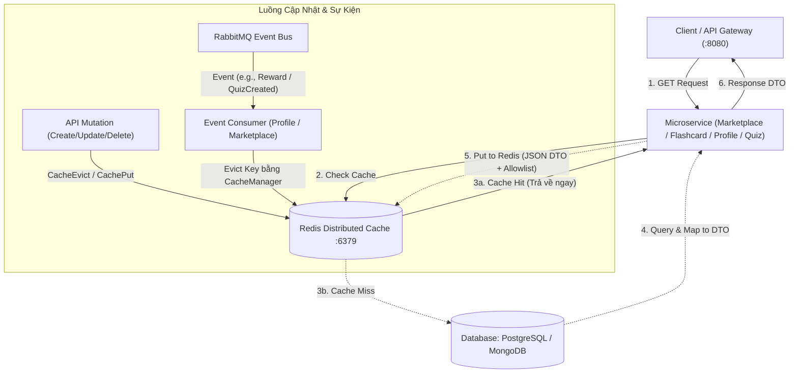

# TỔNG KẾT & HƯỚNG DẪN REVIEW CODE: REDIS DISTRIBUTED CACHING (PHASE 1)

**Ngày hoàn thành:** 21/07/2026  
**Phạm vi:** `marketplace-service`, `flashcard-service`, `quiz-service`, `profile-service`, `config-service`, và hạ tầng Docker Compose.  
**Mục tiêu:** Tối ưu hóa hiệu năng cho các thao tác đọc tải cao (Read-Heavy) theo cơ chế **Cache-Aside** kết hợp **Event-Driven Eviction (Xóa/Cập nhật cache qua sự kiện)**, tuân thủ nghiêm ngặt các tiêu chuẩn bảo mật production và kiến trúc Spring Boot.

---

## 1. Cơ chế Hoạt động của Redis trong Dự án

### 1.1. Luồng dữ liệu (Cache-Aside & Event-Driven Eviction)

Hệ thống áp dụng mô hình **Cache-Aside (Lazy Loading)** cho truy vấn và **Write-Through / Event-Driven Invalidation** khi có thay đổi dữ liệu:



### 1.2. Các Nguyên lý Kiến trúc & Bảo mật Đã Áp dụng

1. **Bảo mật & Cấu hình môi trường tách biệt (`No Fallback in Prod`)**:
   - Ở môi trường development (`docker-compose.yml`), Redis có mật khẩu qua biến `REDIS_PASSWORD` (mặc định: `seika_redis_secret`) và cấu hình giới hạn bộ nhớ (`--maxmemory 256mb --maxmemory-policy allkeys-lru`).
   - Ở môi trường production (`docker-compose.prod.yml` & cấu hình `*-prod.yaml`), **tuyệt đối không sử dụng mật khẩu fallback mặc định**. Cấu hình bắt buộc lấy từ biến môi trường (`${REDIS_PASSWORD?REDIS_PASSWORD is required in production}`) và **không mở cổng 6379 ra ngoài host** để ngăn chặn tấn công từ mạng ngoài.
2. **Serialization An toàn tuyệt đối (DTO Only & Allowlist Validator)**:
   - **Tuyệt đối KHÔNG cache trực tiếp JPA Entity hay MongoDB Document** để tránh rủi ro `LazyInitializationException`, lỗi vòng lặp tham chiếu, và lộ thông tin nhạy cảm.
   - Sử dụng `GenericJackson2JsonRedisSerializer` đi kèm với **`PolymorphicTypeValidator` (Allowlist)** chỉ cho phép deserialize các class thuộc package nội bộ `com.seika.*` cùng các kiểu cơ bản của JDK (`java.util.*`, `java.time.*`, `java.math.*`).
3. **Quy tắc Key Namespace (`computePrefixWith`)**:
   - Mặc định Spring Data Redis nối key bằng dấu hai chấm kép `::`. Chúng ta cấu hình tường minh `computePrefixWith(cacheName -> cacheName + "::")` để đảm bảo định dạng key chuẩn: `<cache-name>::<key>` (Ví dụ: `marketplace:products:active::all` hay `profile:user::cf2e5a14-056c-40ec-82e5-a9db1adde3da`).
4. **Phòng chống lỗi Spring AOP Self-Invocation**:
   - Khi một phương thức trong class gọi một phương thức khác có gắn `@Cacheable` trong **cùng chính class đó** (`this.method()`), Spring Proxy bị bỏ qua và cache không hoạt động.
   - **Giải pháp:** Tại Marketplace Service, logic cache danh mục public được tách riêng ra một Spring Bean độc lập là [`ProductCatalogCacheHelper`](file:///F:/Microservices%20Projects/Seika/src/services/marketplace-service/src/main/java/com/seika/marketplace_service/helper/ProductCatalogCacheHelper.java).

---

## 2. Hướng dẫn Review Code theo Từng Service

Dưới đây là danh sách chi tiết các file đã thêm mới hoặc chỉnh sửa để bạn dễ dàng nhấn vào xem code:

### 2.1. Hạ tầng & Cấu hình tập trung (Infrastructure & Config Service)

| File                                                                                                                                                                                                                                           | Loại thay đổi | Giải thích chi tiết                                                                                                                                         |
| :--------------------------------------------------------------------------------------------------------------------------------------------------------------------------------------------------------------------------------------------- | :-----------: | :---------------------------------------------------------------------------------------------------------------------------------------------------------- |
| [`docker-compose.yml`](file:///F:/Microservices%20Projects/Seika/docker-compose.yml)                                                                                                                                                           |    Modify     | Thêm `--requirepass ${REDIS_PASSWORD:-seika_redis_secret}` và `--maxmemory 256mb --maxmemory-policy allkeys-lru`. Cập nhật healthcheck dùng `redis-cli -a`. |
| [`docker-compose.prod.yml`](file:///F:/Microservices%20Projects/Seika/docker-compose.prod.yml)                                                                                                                                                 |    Modify     | Cấu hình production: Yêu cầu bắt buộc biến `REDIS_PASSWORD`, gỡ bỏ `ports: 6379:6379` khỏi host, giới hạn bộ nhớ `--maxmemory 512mb`.                       |
| [`src/config-service/.../marketplace-service.yaml`](file:///F:/Microservices%20Projects/Seika/src/config-service/src/main/resources/configs/marketplace-service.yaml) <br> _(và các file `.yaml` dev của flashcard, quiz, profile)_            |    Modify     | Thêm cấu hình `spring.cache.type: redis` và `spring.data.redis.host/port/password` cho môi trường dev.                                                      |
| [`src/config-service/.../marketplace-service-prod.yaml`](file:///F:/Microservices%20Projects/Seika/src/config-service/src/main/resources/configs/marketplace-service-prod.yaml) <br> _(và các file `-prod.yaml` của flashcard, quiz, profile)_ |    Modify     | Thêm cấu hình Redis cho production với nguyên tắc **không fallback**: `password: ${REDIS_PASSWORD}`.                                                        |

---

### 2.2. Marketplace Service (`marketplace-service`)

Service chịu tải tra cứu danh mục sản phẩm lớn nhất toàn hệ thống. Đã được chuyển đổi sang cache DTO `ProductResponse`.

| File                                                                                                                                                                                             | Loại thay đổi | Giải thích chi tiết                                                                                                                                                                                    |
| :----------------------------------------------------------------------------------------------------------------------------------------------------------------------------------------------- | :-----------: | :----------------------------------------------------------------------------------------------------------------------------------------------------------------------------------------------------- |
| [`RedisCacheConfig.java`](file:///F:/Microservices%20Projects/Seika/src/services/marketplace-service/src/main/java/com/seika/marketplace_service/config/RedisCacheConfig.java)                   |    **New**    | Cấu hình `RedisCacheManager`, allowlist serializer, và TTL tĩnh (`marketplace:products:active`: 30 phút, `marketplace:products:detail`: 60 phút).                                                      |
| [`ProductResponse.java`](file:///F:/Microservices%20Projects/Seika/src/services/marketplace-service/src/main/java/com/seika/marketplace_service/dto/ProductResponse.java)                        |    **New**    | DTO chuẩn hóa để thay thế JPA Entity `Product` khi lưu cache và trả về cho Controller.                                                                                                                 |
| [`ProductCatalogCacheHelper.java`](file:///F:/Microservices%20Projects/Seika/src/services/marketplace-service/src/main/java/com/seika/marketplace_service/helper/ProductCatalogCacheHelper.java) |    **New**    | Spring Bean độc lập chứa `@Cacheable(value = "marketplace:products:active", key = "'all'")` giúp tránh lỗi Spring AOP self-invocation.                                                                 |
| [`ProductService.java`](file:///F:/Microservices%20Projects/Seika/src/services/marketplace-service/src/main/java/com/seika/marketplace_service/service/ProductService.java)                      |    Modify     | Chuyển đổi `getActiveProducts(userId)` gọi qua helper cache. Khi `userId` khác null, thực hiện lọc danh sách sản phẩm bị ẩn/khóa trên RAM từ danh sách public cache. Đồng bộ trả về `ProductResponse`. |
| [`ProductController.java`](file:///F:/Microservices%20Projects/Seika/src/services/marketplace-service/src/main/java/com/seika/marketplace_service/controller/ProductController.java)             |    Modify     | Đồng bộ chữ ký phương thức trả về `ResponseEntity<List<ProductResponse>>` và `ResponseEntity<ProductResponse>`.                                                                                        |
| [`AdminProductService.java`](file:///F:/Microservices%20Projects/Seika/src/services/marketplace-service/src/main/java/com/seika/marketplace_service/service/AdminProductService.java)            |    Modify     | Thêm `@CacheEvict(value = "marketplace:products:active", allEntries = true)` khi Admin duyệt (`approve`), từ chối (`reject`) hoặc ẩn (`hide`) sản phẩm.                                                |
| [`TeacherRatingService.java`](file:///F:/Microservices%20Projects/Seika/src/services/marketplace-service/src/main/java/com/seika/marketplace_service/service/TeacherRatingService.java)          |    Modify     | Thêm `@CacheEvict(value = "marketplace:products:active", allEntries = true)` khi uy tín/tier của giáo viên thay đổi.                                                                                   |
| [`ProductEventListener.java`](file:///F:/Microservices%20Projects/Seika/src/services/marketplace-service/src/main/java/com/seika/marketplace_service/consumer/ProductEventListener.java)         |    Modify     | Inject `CacheManager` để tự động xóa cache danh mục `marketplace:products:active` khi RabbitMQ nhận sự kiện tạo/sửa flashcard/quiz hoặc mua hàng thành công (`content.consumed`).                      |
| [`RedisCacheSerializationTest.java`](file:///F:/Microservices%20Projects/Seika/src/services/marketplace-service/src/test/java/com/seika/marketplace_service/RedisCacheSerializationTest.java)    |    **New**    | Slice test kiểm chứng khả năng serialize/deserialize JSON của `ProductResponse` với cấu hình allowlist.                                                                                                |

---

### 2.3. Flashcard Service (`flashcard-service`) & Quiz Service (`quiz-service`)

Hai service lưu trữ chi tiết nội dung học liệu và danh sách bộ đề theo tác giả.

| File                                                                                                                                                                                                                                                                                                                                                                                                                  | Loại thay đổi | Giải thích chi tiết                                                                                                                                                                                                                                                                                                 |
| :-------------------------------------------------------------------------------------------------------------------------------------------------------------------------------------------------------------------------------------------------------------------------------------------------------------------------------------------------------------------------------------------------------------------- | :-----------: | :------------------------------------------------------------------------------------------------------------------------------------------------------------------------------------------------------------------------------------------------------------------------------------------------------------------ |
| [`flashcard_service/.../RedisCacheConfig.java`](file:///F:/Microservices%20Projects/Seika/src/services/flashcard-service/src/main/java/com/seika/flashcard_service/config/RedisCacheConfig.java) <br> [`quiz_service/.../RedisCacheConfig.java`](file:///F:/Microservices%20Projects/Seika/src/services/quiz-service/src/main/java/com/seika/quiz_service/config/RedisCacheConfig.java)                               |    **New**    | Cấu hình TTL tĩnh: 60 phút cho chi tiết (`flashcards:detail`, `quizzes:set:detail`), 30 phút cho danh sách tác giả (`flashcards:author`, `quizzes:set:author`).                                                                                                                                                     |
| [`CardSetService.java`](file:///F:/Microservices%20Projects/Seika/src/services/flashcard-service/src/main/java/com/seika/flashcard_service/service/CardSetService.java)                                                                                                                                                                                                                                               |    Modify     | Gắn `@Cacheable` cho `getCardSetById()`, `getCardSetsByAuthor()`. Gắn `@CacheEvict` khi `createCardSet()`, `updateCardSet()`, `deleteCardSet()`. <br>**Lưu ý Review:** Hàm `buy()` **không có `@CacheEvict`** vì thao tác mua chỉ thêm record vào bảng `Purchase` chứ không làm thay đổi nội dung DTO `CardSetDTO`. |
| [`QuizSetService.java`](file:///F:/Microservices%20Projects/Seika/src/services/quiz-service/src/main/java/com/seika/quiz_service/service/QuizSetService.java)                                                                                                                                                                                                                                                         |    Modify     | Gắn `@Cacheable` cho `getQuizSetById()`, `getQuizSetsByAuthorId()`. Gắn `@CacheEvict` khi tạo mới, cập nhật, hoặc xóa quiz.                                                                                                                                                                                         |
| [`flashcard_service/.../RedisCacheSerializationTest.java`](file:///F:/Microservices%20Projects/Seika/src/services/flashcard-service/src/test/java/com/seika/flashcard_service/RedisCacheSerializationTest.java) <br> [`quiz_service/.../RedisCacheSerializationTest.java`](file:///F:/Microservices%20Projects/Seika/src/services/quiz-service/src/test/java/com/seika/quiz_service/RedisCacheSerializationTest.java) |    **New**    | Kiểm thử round-trip serialize/deserialize JSON cho `CardSetDTO` và `QuizSetResponse`.                                                                                                                                                                                                                               |

---

### 2.4. Profile Service (`profile-service`)

Service quản lý thông tin người dùng, EXP, level, chuỗi học tập (streak) và danh hiệu giáo viên.

| File                                                                                                                                                                                  | Loại thay đổi | Giải thích chi tiết                                                                                                                                                                                                                                                                                               |
| :------------------------------------------------------------------------------------------------------------------------------------------------------------------------------------ | :-----------: | :---------------------------------------------------------------------------------------------------------------------------------------------------------------------------------------------------------------------------------------------------------------------------------------------------------------- |
| [`RedisCacheConfig.java`](file:///F:/Microservices%20Projects/Seika/src/services/profile-service/src/main/java/com/seika/profile_service/config/RedisCacheConfig.java)                |    **New**    | Cấu hình TTL 60 phút cho cache `profile:user`.                                                                                                                                                                                                                                                                    |
| [`UserProfileService.java`](file:///F:/Microservices%20Projects/Seika/src/services/profile-service/src/main/java/com/seika/profile_service/service/UserProfileService.java)           |    Modify     | Gắn `@Cacheable(value = "profile:user", key = "#userId")` khi đọc profile.<br>Gắn `@CachePut(value = "profile:user", key = "#result.userId")` khi tạo mới và cập nhật profile.<br>Gắn `@CacheEvict(value = "profile:user", key = "#userId")` khi gọi `addExp(userId, exp)` để đảm bảo điểm số EXP luôn chính xác. |
| [`RewardEventConsumer.java`](file:///F:/Microservices%20Projects/Seika/src/services/profile-service/src/main/java/com/seika/profile_service/consumer/RewardEventConsumer.java)        |    Modify     | Inject `CacheManager`, khi nhận sự kiện `reward.granted` qua RabbitMQ, lập tức xóa cache `profile:user::userId` tương ứng.                                                                                                                                                                                        |
| [`TeacherStatsConsumer.java`](file:///F:/Microservices%20Projects/Seika/src/services/profile-service/src/main/java/com/seika/profile_service/consumer/TeacherStatsConsumer.java)      |    Modify     | Inject `CacheManager`, tự động xóa cache `profile:user::userId` khi nhận các sự kiện: tạo bộ đề mới (`handleQuizSetCreated`, `handleFlashcardSetCreated`), có học liệu được mua (`handleContentPurchased`), hoặc khi danh hiệu thay đổi (`handleTeacherTierUpdated`).                                             |
| [`pom.xml`](file:///F:/Microservices%20Projects/Seika/src/services/profile-service/pom.xml)                                                                                           |    Modify     | Thêm dependency `com.h2database:h2` (`<scope>test</scope>`) giúp unit test `ProfileServiceApplicationTests` chạy thành công với embedded database thay vì PostgreSQL thực.                                                                                                                                        |
| [`RedisCacheSerializationTest.java`](file:///F:/Microservices%20Projects/Seika/src/services/profile-service/src/test/java/com/seika/profile_service/RedisCacheSerializationTest.java) |    **New**    | Kiểm thử serialize/deserialize cho `UserProfileResponse`.                                                                                                                                                                                                                                                         |

---

## 3. Ma trận TTL & Chiến lược Xóa Cache Tổng hợp (Eviction Matrix)

| Cache Namespace               |  TTL Tĩnh   | Ví dụ Key thực tế                           | Khi nào Cache được tạo?                                   | Khi nào Cache bị xóa / làm mới?                                                                                                                                                                               |
| :---------------------------- | :---------: | :------------------------------------------ | :-------------------------------------------------------- | :------------------------------------------------------------------------------------------------------------------------------------------------------------------------------------------------------------ |
| `marketplace:products:active` | **30 phút** | `marketplace:products:active::all`          | Khi có người truy cập danh sách sản phẩm trên Marketplace | - Khi Admin approve / reject / hide sản phẩm<br>- Khi uy tín (tier/rating) giáo viên thay đổi<br>- Khi có sự kiện tạo mới/cập nhật Flashcard hoặc Quiz qua RabbitMQ<br>- Khi có giao dịch mua hàng thành công |
| `marketplace:products:detail` | **60 phút** | `marketplace:products:detail::faebf7df-...` | Khi xem chi tiết 1 sản phẩm                               | - Khi sản phẩm bị ẩn/khóa/xóa                                                                                                                                                                                 |
| `flashcards:detail`           | **60 phút** | `flashcards:detail::6a5cb171...`            | Khi xem chi tiết bộ từ vựng                               | - Khi tác giả cập nhật hoặc xóa bộ từ vựng                                                                                                                                                                    |
| `flashcards:author`           | **30 phút** | `flashcards:author::0099b41f-...`           | Khi xem danh sách bộ từ vựng của một tác giả              | - Khi tác giả tạo mới, cập nhật hoặc xóa bộ từ vựng                                                                                                                                                           |
| `quizzes:set:detail`          | **60 phút** | `quizzes:set:detail::6a5cb334...`           | Khi xem chi tiết bộ câu hỏi Quiz                          | - Khi tác giả cập nhật hoặc xóa bộ câu hỏi                                                                                                                                                                    |
| `quizzes:set:author`          | **30 phút** | `quizzes:set:author::0099b41f-...`          | Khi xem danh sách Quiz của một tác giả                    | - Khi tác giả tạo mới, cập nhật hoặc xóa Quiz                                                                                                                                                                 |
| `profile:user`                | **60 phút** | `profile:user::cf2e5a14-...`                | Khi tra cứu thông tin người dùng / trang cá nhân          | - Khi cập nhật thông tin (`@CachePut`)<br>- Khi cộng EXP trực tiếp (`addExp`)<br>- Khi RabbitMQ xử lý sự kiện thưởng EXP (`reward.granted`)<br>- Khi thống kê giáo viên thay đổi (`TeacherStatsConsumer`)     |

---

## 4. Cách Kiểm chứng & Debug cho Developer

### 4.1. Chạy Unit / Slice Tests Tự động

Để kiểm tra tính đúng đắn của logic serialization và cấu hình Spring Test mà không cần bật dịch vụ bên ngoài:

```powershell
# Chạy bộ test cho từng microservice
.\src\services\marketplace-service\mvnw.cmd -f src\services\marketplace-service\pom.xml test
.\src\services\flashcard-service\mvnw.cmd -f src\services\flashcard-service\pom.xml test
.\src\services\quiz-service\mvnw.cmd -f src\services\quiz-service\pom.xml test
.\src\services\profile-service\mvnw.cmd -f src\services\profile-service\pom.xml test
```

_Lưu ý:_ Các service đều đã được trang bị file [`src/test/resources/application.yaml`](file:///F:/Microservices%20Projects/Seika/src/services/marketplace-service/src/test/resources/application.yaml) tắt Config Server (`spring.cloud.config.enabled=false`) và sử dụng H2 Database (`@ActiveProfiles("test")`) giúp test hoàn toàn độc lập và siêu nhanh.

### 4.2. Kiểm tra Cache trong Docker Compose qua CLI

Khởi động toàn bộ cụm dịch vụ:

```powershell
docker compose up -d --build redis config-service marketplace-service flashcard-service quiz-service profile-service
```

1. **Kiểm tra kết nối Redis:**

   ```powershell
   docker compose exec redis redis-cli -a seika_redis_secret ping
   # Kết quả trả về: PONG
   ```

2. **Kiểm tra danh sách các Key đang lưu trong Cache:**

   ```powershell
   docker compose exec redis redis-cli -a seika_redis_secret keys "*"
   # Ví dụ kết quả:
   # 1) "marketplace:products:active::all"
   # 2) "profile:user::cf2e5a14-056c-40ec-82e5-a9db1adde3da"
   ```

3. **Xem nội dung JSON của một Cache Key cụ thể:**
   ```powershell
   docker compose exec redis redis-cli -a seika_redis_secret get "profile:user::cf2e5a14-056c-40ec-82e5-a9db1adde3da"
   ```
   _Kết quả JSON thực tế hiển thị type metadata an toàn:_
   ```json
   {
     "@class": "com.seika.profile_service.dto.user_profile.UserProfileResponse",
     "id": "d46d0ba0-cf1e-43c7-8485-7767bf23d20f",
     "userId": "cf2e5a14-056c-40ec-82e5-a9db1adde3da",
     "fullName": "Test Teacher Cache",
     "dateOfBirth": "1990-01-01",
     "gender": "MALE",
     "exp": 0,
     "level": 1,
     "currentStreak": 0,
     "longestStreak": 0,
     "quizzesCompleted": 0
   }
   ```
