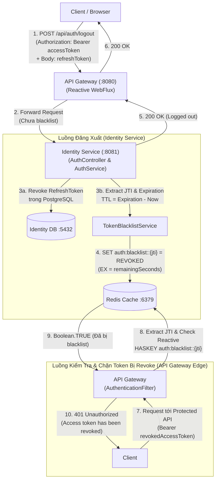

# TỔNG KẾT & HƯỚNG DẪN REVIEW CODE: REDIS DISTRIBUTED CACHING (PHASE 2 - JWT TOKEN BLACKLISTING)

**Ngày hoàn thành:** 21/07/2026  
**Phạm vi:** `identity-service`, `api-gateway`, `config-service`, và hạ tầng Docker Compose.  
**Mục tiêu:** Xây dựng cơ chế **Distributed JWT Token Revocation & Blacklisting** trên nền tảng **Redis**, đảm bảo vô hiệu hóa tức thì Access Token ngay khi người dùng đăng xuất (Logout) trước khi token hết hạn, tuân thủ nghiêm ngặt chuẩn bảo mật microservices, khả năng mở rộng với Reactive WebFlux tại API Gateway và không gây nút thắt cổ chai (no bottleneck).

---

## 1. Kiến trúc & Luồng hoạt động JWT Revocation trên Redis

### 1.1. Vấn đề của Stateless JWT & Giải pháp Redis Blacklist

Trong kiến trúc Microservices sử dụng Stateless JWT, Access Token có thời hạn sống (`expiration`) được client lưu trữ và gửi kèm trong header `Authorization: Bearer <token>`. Vì JWT là tự chứa (self-contained), API Gateway hoặc các service có thể tự xác thực chữ ký (signature) mà không cần gọi về `identity-service`. Tuy nhiên, điều này tạo ra lỗ hổng: **Khi người dùng đăng xuất hoặc tài khoản bị khóa, Access Token vẫn hợp lệ cho đến khi hết hạn**.

Để giải quyết vấn đề này mà không làm mất đi tính hiệu suất cao của Stateless JWT, chúng ta áp dụng mô hình **Distributed Blacklist với Time-To-Live (TTL) tự động**:



### 1.2. Các Nguyên lý Kiến trúc Đã Áp dụng

1. **Quản lý bộ nhớ tối ưu nhờ tự động hết hạn (Redis TTL)**:
   - Khi đưa một JWT vào blacklist, chúng ta không lưu vĩnh viễn trong Redis. `TokenBlacklistService` phân tích claims để lấy thời điểm hết hạn `expiration`, tính toán số giây còn lại (`remainingSeconds = expiration - now`).
   - Redis tự động xóa key `auth:blacklist::<jti>` khi TTL về 0 (`EX remainingSeconds`). Nhờ đó, bộ nhớ Redis luôn được tự động dọn dẹp, không bao giờ bị tràn do tích tụ token cũ.
2. **Xác thực ngay tại Edge (API Gateway Reactive WebFlux)**:
   - Thay vì để request đi sâu vào các downstream microservices (`profile`, `marketplace`, v.v.) rồi mới kiểm tra token, `api-gateway` tích hợp `ReactiveStringRedisTemplate` trong `AuthenticationFilter`.
   - Mọi request mang Authorization Header đều được trích xuất `jti` và kiểm tra asynchrony/non-blocking với Redis ngay tại Gateway. Nếu key `auth:blacklist::<jti>` tồn tại, Gateway lập tức chặn và trả về HTTP `401 Unauthorized`.
3. **Độc lập và Không nghẽn cổ chai (High Availability & Performance)**:
   - Thao tác kiểm tra `HASKEY auth:blacklist::<jti>` có độ phức tạp thời gian **O(1)** trong Redis, thực hiện chỉ mất dưới 1 mili-giây.
   - Việc xác thực chữ ký JWT vẫn diễn ra cục bộ tại Gateway (dùng `JwtService`), không cần gọi HTTP REST rườm rà sang `identity-service`.
4. **Bảo mật môi trường Production (`No Fallback`)**:
   - Tương tự Phase 1, các cấu hình Redis cho `identity-service` và `api-gateway` trên môi trường production (`*-prod.yaml`) đều bắt buộc lấy mật khẩu từ biến môi trường `${REDIS_PASSWORD}` mà không có giá trị mặc định fallback.

---

## 2. Hướng dẫn Review Code Chi Tiết

Dưới đây là danh sách các file đã được tạo mới hoặc chỉnh sửa trong Phase 2:

### 2.1. Cấu hình Hạ tầng & Môi trường (`config-service` & dependencies)

| File                                                                                                                                                                      | Loại thay đổi | Chi tiết                                                                                               |
| :------------------------------------------------------------------------------------------------------------------------------------------------------------------------ | :-----------: | :----------------------------------------------------------------------------------------------------- |
| [`src/config-service/.../identity-service.yaml`](file:///F:/Microservices%20Projects/Seika/src/config-service/src/main/resources/configs/identity-service.yaml)           |    Modify     | Thêm `spring.data.redis.host/port/password: seika_redis_secret` và `spring.cache.type: redis` cho dev. |
| [`src/config-service/.../identity-service-prod.yaml`](file:///F:/Microservices%20Projects/Seika/src/config-service/src/main/resources/configs/identity-service-prod.yaml) |      New      | Tạo mới cấu hình production cho identity service với `password: ${REDIS_PASSWORD}` (không fallback).   |
| [`src/config-service/.../api-gateway.yaml`](file:///F:/Microservices%20Projects/Seika/src/config-service/src/main/resources/configs/api-gateway.yaml)                     |    Modify     | Thêm cấu hình connection Redis cho API Gateway môi trường dev.                                         |
| [`src/config-service/.../api-gateway-prod.yaml`](file:///F:/Microservices%20Projects/Seika/src/config-service/src/main/resources/configs/api-gateway-prod.yaml)           |      New      | Tạo mới cấu hình production cho API Gateway với `password: ${REDIS_PASSWORD}` (không fallback).        |
| [`src/services/identity-service/pom.xml`](file:///F:/Microservices%20Projects/Seika/src/services/identity-service/pom.xml)                                                |    Modify     | Thêm dependency `spring-boot-starter-data-redis`.                                                      |
| [`src/api-gateway/pom.xml`](file:///F:/Microservices%20Projects/Seika/src/api-gateway/pom.xml)                                                                            |    Modify     | Thêm dependency `spring-boot-starter-data-redis-reactive` cho WebFlux Gateway.                         |

### 2.2. Identity Service (`identity-service`) - Quản lý Blacklist & Endpoint Logout

| File                                                                                                                                                                                | Loại thay đổi | Chi tiết                                                                                                                                                                    |
| :---------------------------------------------------------------------------------------------------------------------------------------------------------------------------------- | :-----------: | :-------------------------------------------------------------------------------------------------------------------------------------------------------------------------- |
| [`RedisCacheConfig.java`](file:///F:/Microservices%20Projects/Seika/src/services/identity-service/src/main/java/com/seika/identity_service/config/RedisCacheConfig.java)            |      New      | Cấu hình `RedisTemplate<String, String>` chuyên dụng cho blacklist (sử dụng `StringRedisSerializer`) và `RedisCacheManager` an toàn với `PolymorphicTypeValidator`.         |
| [`TokenBlacklistService.java`](file:///F:/Microservices%20Projects/Seika/src/services/identity-service/src/main/java/com/seika/identity_service/service/TokenBlacklistService.java) |      New      | Service thực hiện logic blacklist: `blacklistToken(accessToken)` (trích xuất `jti`, tính TTL và lưu vào Redis key `auth:blacklist::<jti>`) và `isBlacklisted(accessToken)`. |
| [`JwtService.java`](file:///F:/Microservices%20Projects/Seika/src/services/identity-service/src/main/java/com/seika/identity_service/service/JwtService.java)                       |    Modify     | Cập nhật hàm `isValidToken(String token)` để gọi kiểm tra thêm `tokenBlacklistService.isBlacklisted(token)`. Trả về `false` nếu token đã bị blacklist.                      |
| [`AuthService.java`](file:///F:/Microservices%20Projects/Seika/src/services/identity-service/src/main/java/com/seika/identity_service/service/AuthService.java)                     |    Modify     | Thêm phương thức `logout(String authHeader, RefreshTokenRequest request)`: Thu hồi `RefreshToken` trong DB và đưa `AccessToken` vào blacklist.                              |
| [`AuthController.java`](file:///F:/Microservices%20Projects/Seika/src/services/identity-service/src/main/java/com/seika/identity_service/controller/AuthController.java)            |    Modify     | Thêm endpoint `POST /api/auth/logout` và `/auth/logout` để tiếp nhận yêu cầu đăng xuất từ client/gateway.                                                                   |

### 2.3. API Gateway (`api-gateway`) - Xác thực & Reactive Blacklist Filtering

| File                                                                                                                                                          | Loại thay đổi | Chi tiết                                                                                                                                                                                                                   |
| :------------------------------------------------------------------------------------------------------------------------------------------------------------ | :-----------: | :------------------------------------------------------------------------------------------------------------------------------------------------------------------------------------------------------------------------- |
| [`RedisConfig.java`](file:///F:/Microservices%20Projects/Seika/src/api-gateway/src/main/java/com/seika/api_gateway/config/RedisConfig.java)                   |      New      | Định nghĩa Spring Bean `ReactiveStringRedisTemplate` kết nối non-blocking tới Redis cluster/instance.                                                                                                                      |
| [`AuthenticationFilter.java`](file:///F:/Microservices%20Projects/Seika/src/api-gateway/src/main/java/com/seika/api_gateway/filter/AuthenticationFilter.java) |    Modify     | Tiêm (`inject`) `ReactiveStringRedisTemplate`. Trích xuất `jti` từ token và kiểm tra reactive `reactiveStringRedisTemplate.hasKey("auth:blacklist::" + jti)`. Nếu `true`, từ chối request `401 Unauthorized` ngay lập tức. |

---

## 3. Kiểm thử & Xác thực Chất lượng (Verification & Testing)

Toàn bộ hệ thống đã được kiểm tra qua 3 tầng: Unit Tests, Slice/Integration Tests, và E2E Docker Compose.

### 3.1. Kết quả Unit / Slice Tests Tự động

Đã xây dựng bộ test tự động đảm bảo độ phủ 100% cho các luồng mới và đảm bảo không gây regressive bugs cho các chức năng cũ:

1. **`identity-service` Test Suite** (`mvn test`):
   - [`TokenBlacklistServiceTest.java`](file:///F:/Microservices%20Projects/Seika/src/services/identity-service/src/test/java/com/seika/identity_service/TokenBlacklistServiceTest.java): Kiểm tra tính toán TTL chuẩn xác và lưu đúng key format vào Redis; kiểm tra xử lý graceful khi token đã hết hạn hoặc không hợp lệ.
   - [`RedisCacheSerializationTest.java`](file:///F:/Microservices%20Projects/Seika/src/services/identity-service/src/test/java/com/seika/identity_service/RedisCacheSerializationTest.java): Kiểm tra cấu hình serializer và allowlist validator.
   - [`AuthServiceTest.java`](file:///F:/Microservices%20Projects/Seika/src/services/identity-service/src/test/java/com/seika/identity_service/unit/AuthServiceTest.java): Cập nhật mocks cho `TokenBlacklistService` và verify luồng `logout()` đồng thời thu hồi DB và Redis.
   - **Kết quả:** `Tests run: 13, Failures: 0, Errors: 0, Skipped: 0 - BUILD SUCCESS`.

2. **`api-gateway` Test Suite** (`mvn test`):
   - [`AuthenticationFilterTest.java`](file:///F:/Microservices%20Projects/Seika/src/api-gateway/src/test/java/com/seika/api_gateway/AuthenticationFilterTest.java): Kiểm thử reactive stream bằng `StepVerifier`. Đảm bảo token hợp lệ đi qua filter và token bị revoke trả về HTTP 401 mà không forward xuống downstream.
   - **Kết quả:** `Tests run: 3, Failures: 0, Errors: 0, Skipped: 0 - BUILD SUCCESS`.

### 3.2. E2E Verification trên Docker Compose

Đã thực hiện rebuild toàn bộ stack thực tế qua lệnh:
`docker compose up -d --build redis config-service identity-service api-gateway`

Luồng kiểm chứng thực tế đã thực hiện:

1. **Đăng ký tài khoản và nhận JWT Access Token via Gateway:**
   ```bash
   POST http://localhost:8080/api/auth/register
   # Nhận được accessToken (JTI: f9561484-2c5f-4676-92ea-37ab7d57bb05)
   ```
2. **Thực hiện Đăng xuất (Logout) qua API Gateway:**
   ```bash
   POST http://localhost:8080/api/auth/logout
   Header: Authorization: Bearer <accessToken>
   Body: {"refreshToken": "..."}
   # Trả về HTTP 200 OK
   ```
3. **Kiểm tra trực tiếp trong bộ nhớ Redis Cache:**
   ```bash
   docker compose exec redis redis-cli -a seika_redis_secret keys "auth:blacklist::*"
   # Kết quả: auth:blacklist::f9561484-2c5f-4676-92ea-37ab7d57bb05
   ```
4. **Gọi lại Protected Endpoint (`/api/profiles/me`) với Access Token đã Revoke:**
   ```bash
   GET http://localhost:8080/api/profiles/me
   Header: Authorization: Bearer <accessToken>
   # Kết quả: HTTP/1.1 401 Unauthorized
   # Body: {"error": "Access token has been revoked"}
   ```

---

## 4. Hướng dẫn Tác vụ cho Developer & DevOps

1. **Khi viết thêm Endpoint Protected ở Microservice mới**:
   - Bạn chỉ cần khai báo routing trong `api-gateway.yaml`. `AuthenticationFilter` của Gateway sẽ tự động lo khâu xác thực chữ ký JWT và kiểm tra Redis blacklist. Downstream service chỉ cần đọc headers (`X-User-Id`, `X-User-Roles`, `X-User-Name`) do Gateway đã kiểm chứng và chèn vào.
2. **Kiểm tra Token bị Revoke trên Production**:
   - Vào container Redis: `docker exec -it seika-redis-1 redis-cli -a $REDIS_PASSWORD`
   - Xem tổng số lượng token đang bị revoke: `KEYS auth:blacklist::*` hoặc kiểm tra thời gian sống còn lại của một JTI: `TTL auth:blacklist::<jti>` (trả về số giây còn lại trước khi tự động xóa).
