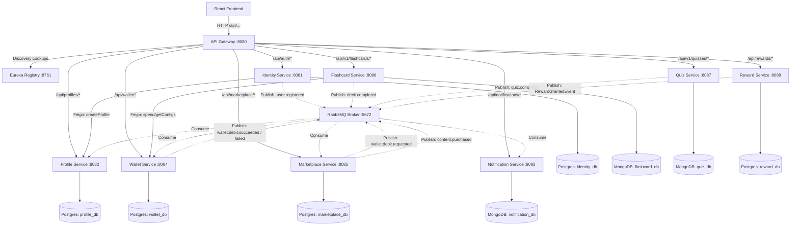
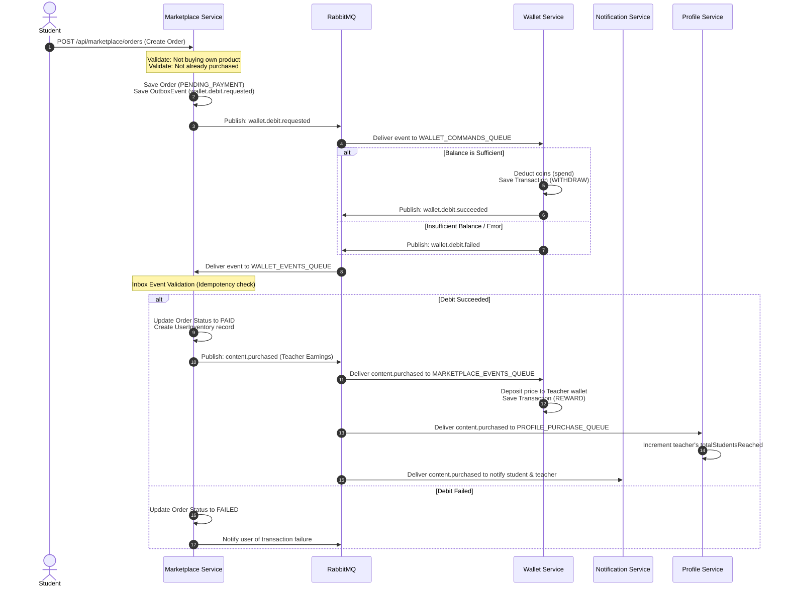

# Seika System Flows and Testing Guide

This document provides a comprehensive guide to the core business flows, event-driven integrations, error handling, edge cases, and expected behaviors across the Seika microservices learning ecosystem. It serves as an authoritative reference for QA engineers, developers, and testers during the verification and testing phases.

---

## 1. System Architecture & Service Topology

Seika is built as a microservices architecture utilizing Spring Cloud Gateway for API routing, Netflix Eureka for service discovery, RabbitMQ for asynchronous event choreography, and independent databases for service isolation.



---

## 2. Core Business Flows & Integration Choreography

### Flow 1: User Registration & Onboarding
This flow ensures a synchronized user record across identity, profile, and wallet services.

1. **Client Registration Request**: Client POSTs `RegisterRequest` to `/api/auth/register`.
2. **Identity Creation & Validation**: `identity-service` validates that the username is unique and the requested role is either `STUDENT` or `TEACHER`.
3. **Synchronous Profile Setup (Saga Step 1)**: `identity-service` calls `profile-service` via OpenFeign `ProfileClient.createProfile()`.
   - **Rollback Hook**: If profile creation fails (e.g. database down, timeout), `identity-service` rolls back user registration transaction and returns an HTTP `500` error.
4. **Token Generation**: Identity Service generates JWT access and refresh tokens.
5. **Asynchronous Wallet Setup (Saga Step 2)**: `identity-service` publishes `user.registered` event to the `identity.events` exchange.
6. **Wallet Initialization**: `wallet-service` consumes `user.registered`, parses user roles, and provisions a wallet:
   - **Initial Balance**: Students receive **500 coins** (configurable via config key `STUDENT_INITIAL_COINS`). Teachers receive **0 coins** (configurable via `TEACHER_INITIAL_COINS`).

---

### Flow 2: Content Creation, Submission & Moderation
This flow controls how learning resources (Flashcards & Quizzes) are published to the public marketplace.

1. **Draft Creation**: A Teacher creates a flashcard deck (`CardSet`) or a `Quiz` via their content manager interface. The initial status is saved locally in draft state.
2. **Price Range Validation**:
   - For flashcards, `flashcard-service` calls `wallet-service` configuration endpoint to fetch `MIN_PRODUCT_PRICE` (default: 10 coins) and `MAX_PRODUCT_PRICE` (default: 100,000 coins).
   - If the price is $> 0$ and outside this range, creation throws an `IllegalArgumentException` (e.g., `"Giá sản phẩm phải nằm trong khoảng từ 10 đến 100000 coin!"`).
3. **Submission Event**: Creating/modifying the content publishes a creation event (`flashcard.set.created` or `quiz.set.created`) to the `content.events` exchange.
4. **Marketplace Mirroring**: `marketplace-service` consumes this event and creates a corresponding `Product` record with `active = false` and `status = PENDING_REVIEW`.
5. **Admin Moderation**:
   - Admin views the moderation queue via `/api/marketplace/admin/products/pending`.
   - **Approve**: POSTing to `/api/marketplace/admin/products/{productId}/approve` changes product status to `PUBLISHED` and `active = true`. A reviewed event is published to notify the teacher. The item is now visible to all students in the marketplace.
   - **Reject**: POSTing to `/api/marketplace/admin/products/{productId}/reject` changes status to `REJECTED`, `active = false`, and attaches a `rejectionReason`. A reviewed event notifies the teacher.

---

### Flow 3: Marketplace Purchase Saga (Choreographed Transactions)
To maintain database consistency without local constraints, a distributed Saga pattern is choreographed using RabbitMQ.



---

### Flow 4: Study, Progress Tracking & Rewards
This flow rewards students with coins, experience points (EXP), and level-ups upon completing educational content.

1. **Session Completion**:
   - **Flashcards**: When progress reaches 100% on a deck, `flashcard-service` records a `StudySession` (`completed = true`) and publishes a `deck.completed` event to `learning.events` exchange.
   - **Quizzes**: When a student submits quiz answers, `quiz-service` calculates the score (number of correct answers / total questions * 100). If the score $\ge 80.0\%$, the attempt is marked as `passed = true` and `quiz-service` publishes a `quiz.completed` event to `learning.events` exchange.
2. **Reward Processing & Rules**:
   - `reward-service` consumes the completion events.
   - **Flashcard Cooldown**: Checked using `LearningRewardLog`. If the user has already received a reward for this deck, they can only receive a new reward if the cooldown period has passed (configured via `reward.flashcard.cooldown-days`, default: `lastRewardAt.plusDays(cooldown)`).
   - **Quiz Duplication Limit**: A student is only rewarded for their **first-time pass** on a quiz set. Subsequent passing attempts are recorded but do not trigger rewards.
   - **Event Outbox**: If eligible, a `RewardGrantedEvent` is saved to the outbox and published to the message broker.
3. **Downstream Rewards Application**:
   - **Wallet Service**: Receives `RewardGrantedEvent` and deposits reward coins (type: `REWARD`).
   - **Profile Service**: Receives `RewardGrantedEvent` and increments profile EXP.
     - **Level Up Calculation**: Simple leveling logic: $\text{Level} = \lfloor \text{EXP} / 100 \rfloor + 1$. If the new level is higher than the current level, the profile updates and logs a level up.
   - **Notification Service**: Receives `RewardGrantedEvent` and pushes a system notification to the student about coins and EXP earned.

---

### Flow 5: Financial Operations (Top Up & Cash Out)
Manual wallet transactions are governed by strict conversion rates and validation constraints.

```
                  ┌──────────────────────────────┐
                  │      STUDENT TOP-UP FLOW     │
                  │  Rate: 100 VND = 1 Coin      │
                  │  Min conversion: 1 Coin      │
                  └──────────────┬───────────────┘
                                 │
                   (User posts TopUpReqDTO)
                                 ▼
                     Amount <= 0?  ──► YES ──► Throw IllegalArgumentException
                                 │ NO
                     Coins < 1?   ──► YES ──► Throw IllegalArgumentException
                                 │ NO
                                 ▼
             Calculate Coins = Floor(AmountVND / Rate)
               Update Balance & Record TOP_UP Transaction
```

```
                  ┌──────────────────────────────┐
                  │     TEACHER CASH-OUT FLOW    │
                  │  Rate: 1 Coin = 90 VND       │
                  │  Min request: 10 Coins       │
                  │  Rule: Multiple of 10 Coins  │
                  └──────────────┬───────────────┘
                                 │
                   (User posts TransactionReqDTO)
                                 ▼
                    Amount < 10 OR
               Amount % 10 != 0?  ──► YES ──► Throw IllegalArgumentException
                                 │ NO
                   Balance < Amount? ──► YES ──► Throw IllegalStateException
                                 │ NO
                                 ▼
               Calculate VND = AmountCoins * Rate
             Update Balance & Record CASH_OUT Transaction
```

---

## 3. Comprehensive Test & Edge Cases Directory

| Test Case ID | Target Component | Flow/Action | Inputs / Context | Expected API Response / Status Code | Expected Database / System State Updates |
| :--- | :--- | :--- | :--- | :--- | :--- |
| **TC-AUTH-01** | Identity Service | Registration | Duplicated username | `400 Bad Request`<br/>`"Username already exists"` | No database updates. Transaction rolled back. |
| **TC-AUTH-02** | Identity Service | Registration | Role other than `STUDENT` or `TEACHER` (e.g. `ADMIN`) | `400 Bad Request`<br/>`"Only STUDENT or TEACHER can be selected during registration"` | No database updates. |
| **TC-AUTH-03** | Profile / Identity | Registration | Profile service database down / timeout during register | `500 Internal Server Error`<br/>`"Could not create user profile. Registration rolled back."` | User transaction rolled back in Identity DB. No user or profile created. |
| **TC-AUTH-04** | Wallet / Identity | Registration | Successful register | `200 OK` + Access Token + Refresh Token | User record saved in Identity DB. Profile record saved in Profile DB. `user.registered` event published. Wallet created in Wallet DB with initial balance. |
| **TC-WALL-01** | Wallet Service | Get Balance | Authenticated User | `200 OK` + Balance (number/decimal) | Reads balance from Wallet DB. If no wallet exists (rare exception), creates one with default balance. |
| **TC-WALL-02** | Wallet Service | Top Up (Student) | Top up amount = 0 VND | `400 Bad Request`<br/>`"Số tiền nạp phải lớn hơn 0"` | No balance or transaction updates. |
| **TC-WALL-03** | Wallet Service | Top Up (Student) | Top up amount = 50 VND (Rate: 100 VND/Coin) | `400 Bad Request`<br/>`"Số tiền nạp không đủ để quy đổi tối thiểu 1 Coin..."` | No balance or transaction updates. |
| **TC-WALL-04** | Wallet Service | Top Up (Student) | Top up amount = 10,050 VND | `200 OK` + `TopUpDTO`<br/>(coinsReceived = 100) | Balance incremented by 100 coins. `TOP_UP` transaction logged. |
| **TC-WALL-05** | Wallet Service | Cash Out (Teacher) | Cash out amount = 5 coins | `400 Bad Request`<br/>`"Số tiền rút phải lớn hơn hoặc bằng 10 và là bội số của 10"` | No updates. |
| **TC-WALL-06** | Wallet Service | Cash Out (Teacher) | Cash out amount = 25 coins | `400 Bad Request`<br/>`"Số tiền rút phải lớn hơn hoặc bằng 10 và là bội số của 10"` | No updates. |
| **TC-WALL-07** | Wallet Service | Cash Out (Teacher) | Cash out amount = 50 coins (Balance = 20 coins) | `500 Internal Server Error`<br/>`"Số dư không đủ để thực hiện giao dịch!"` | Balance unchanged. No transaction log created. |
| **TC-WALL-08** | Wallet Service | Cash Out (Teacher) | Cash out amount = 50 coins (Balance = 100 coins) | `200 OK`<br/>`{"message": "Rút tiền thành công"}` | Balance decremented by 50 coins. `CASH_OUT` transaction logged. |
| **TC-MARK-01** | Marketplace | Create Order | Buying own product (`userId == sellerUserId`) | `400 Bad Request`<br/>`"Bạn không thể tự mua sản phẩm của chính mình."` | Order not created. |
| **TC-MARK-02** | Marketplace | Create Order | Product already purchased (Status is `PAID` or `PENDING_PAYMENT`) | `400 Bad Request`<br/>`"Bạn đã sở hữu hoặc đang có giao dịch mua sản phẩm này rồi."` | Order not created. |
| **TC-MARK-03** | Marketplace | Create Order | Valid product | `200 OK` + Order details | Order saved (status = `PENDING_PAYMENT`). Outbox event saved. `wallet.debit.requested` event published. |
| **TC-MARK-04** | Marketplace Saga | Debit Response | Successful debit (`wallet.debit.succeeded` event received) | Asynchronous process (idempotent validation via Inbox) | Order status updated to `PAID`. Item added to student's `UserInventory`. `content.purchased` event published. |
| **TC-MARK-05** | Marketplace Saga | Debit Response | Failed debit (`wallet.debit.failed` event received due to insufficient funds) | Asynchronous process | Order status updated to `FAILED`. No inventory added. No notifications sent to seller. |
| **TC-MARK-06** | Marketplace Saga | Seller Reward | Processing `content.purchased` | Asynchronous process | Teacher's wallet is credited the product price (type: `REWARD`). `profile-service` updates teacher statistics. |
| **TC-MARK-07** | Marketplace Saga | Idempotency | Processing duplicate `wallet.debit.succeeded` | Asynchronous process (Inbox record check) | Skips execution with logs. No double inventory or double payment processing. |
| **TC-REWD-01** | Reward Service | Flashcard Reward | Progress < 100% | Asynchronous progress event received | Study session progress recorded, but no completion rewards are triggered. |
| **TC-REWD-02** | Reward Service | Flashcard Reward | Completed (100% progress) first time | Asynchronous completion event received | `LearningRewardLog` created. `RewardGrantedEvent` saved to outbox. Student awarded coins (Wallet) & EXP (Profile). |
| **TC-REWD-03** | Reward Service | Flashcard Reward | Completed during cooldown period | Asynchronous completion event received | Study session logged. Cooldown check fails. Skips reward granting. |
| **TC-REWD-04** | Reward Service | Quiz Reward | Passed (Score = 75%) | Asynchronous completion event received | Attempt logged (`passed = false`). No reward granted because score is below threshold (80%). |
| **TC-REWD-05** | Reward Service | Quiz Reward | Passed (Score = 90%) first time | Asynchronous completion event received | Attempt logged (`passed = true`). `LearningRewardLog` saved. `RewardGrantedEvent` published. Rewards applied. |
| **TC-REWD-06** | Reward Service | Quiz Reward | Passed (Score = 95%) second time | Asynchronous completion event received | Attempt logged (`passed = true`). Already rewarded check fails. Skips reward. |
| **TC-PROF-01** | Profile Service | Experience Add | EXP added triggers level up (e.g. EXP goes from 90 to 110) | Asynchronous `RewardGrantedEvent` received | Game profile updates: EXP += 20, Level is recalculated: `(110/100) + 1 = 2`. Level set to 2. Level up logged. |

---

## 4. Interactive Frontend Verification Checklist

Verify that the React frontend client at `src/web-app` matches the expected user experience and correctly integrates with backend logic.

### 4.1 Quiz Interactive Elements
*   **Multiple Choice Quiz (MCQ)**:
    *   Selecting an option updates the component state.
    *   Submitting highlights the chosen option (Green for correct, Red for incorrect with the correct answer highlighted in Green).
*   **Fill in the Blank Quiz (FIB)**:
    *   The question text must replace underscores (`_`) with an input box.
    *   Other sequence marks must be formatted as static line placeholders.
    *   Correctness verification must trim user input and perform a case-insensitive check against the accepted answers list.
*   **Reorder Quiz**:
    *   Initial state must shuffle the elements. The component includes a safe loop to ensure the shuffled order is not identical to the correct order.
    *   Users can click on items to swap positions or use Up/Down keys to reorder.
    *   Upon submission, correct items in the correct index position are colored Green, and incorrect items are colored Red.
*   **General Grading Rule**:
    *   Students must score $\ge 80\%$ of correct items to pass the quiz and qualify for coin/EXP rewards.

### 4.2 Dashboard Auth Gating & Layouts
*   **Routing Authorization**:
    *   A guest entering `/student/dashboard` or `/teacher/dashboard` is redirected to `/auth/login`.
    *   Redirection maps old layout `/dashboard` to `/student/dashboard` for backward compatibility.
*   **Student Layout**:
    *   Available sub-routes: `learning` (Learning Hub), `flashcard/:id` (Flashcard Study), `quiz/:id` (Quiz Taking), `marketplace` (Buying products), `wallet` (Coin top up / history), and `profile` (Student profile settings).
*   **Teacher Layout**:
    *   Available sub-routes: `content` (Content manager to create quizzes and decks), `wallet` (Cash out earnings), `statistics` (Revenue dashboards, top sold items, student reached list), and `profile`.
*   **Admin Layout**:
    *   Available sub-routes: `users` (User manager), `moderation` (Moderation queue to approve/reject draft content), `config` (Configure initial balances, top-up rates, withdrawal rates, and price thresholds), and `revenue` (System revenue summary).
