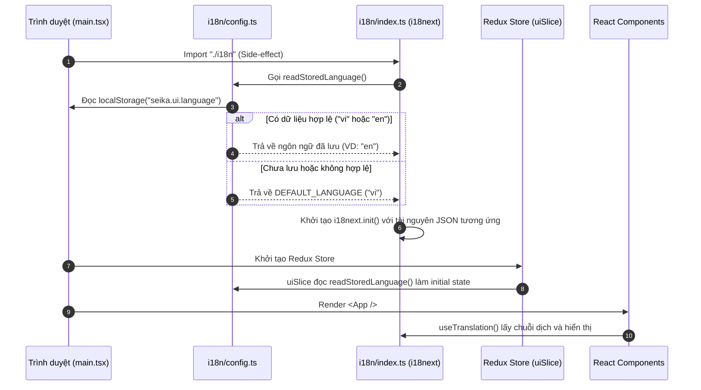
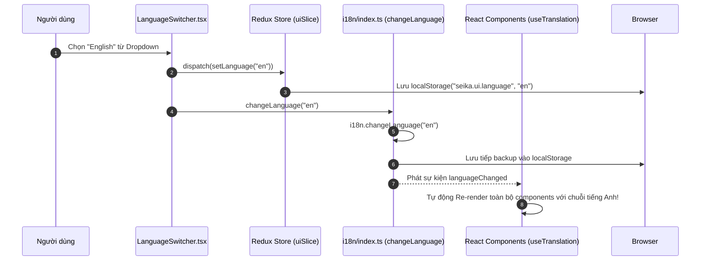

# HƯỚNG DẪN CHI TIẾT TỪ A-Z: CÔNG NGHỆ i18n VÀ CÁCH TÍCH HỢP TRONG ĐỒ ÁN SEIKA

_Tài liệu hướng dẫn thực tế, đối chiếu trực tiếp giữa lý thuyết Quốc tế hóa (i18n) với thư viện `i18next` + `react-i18next` và kiến trúc triển khai thực tế trong đồ án **Seika**._

---

## PHẦN 1: TƯ DUY VÀ KHÁI NIỆM CỐT LÕI VỀ i18n

### 1. i18n là gì? Tại sao lại viết tắt là "i18n"?

- **Internationalization (i18n - Quốc tế hóa)**: Là từ viết tắt của **I**nternationalizatio**n** (bắt đầu bằng chữ **i**, kết thúc bằng chữ **n**, và ở giữa có đúng **18** chữ cái). Đây là quá trình thiết kế và chuẩn bị kiến trúc phần mềm sao cho ứng dụng có thể hỗ trợ nhiều ngôn ngữ, vùng miền khác nhau mà không cần phải viết lại mã nguồn (logic code).
- **Localization (l10n - Bản địa hóa)**: Là quá trình đưa các nội dung cụ thể (bản dịch văn bản, định dạng tiền tệ, ngày tháng, cấu trúc văn hóa) vào một ứng dụng đã được "quốc tế hóa" (i18n) để phục vụ cho một quốc gia hay vùng lãnh thổ cụ thể (ví dụ: `vi-VN` cho Việt Nam, `en-US` cho Mỹ).

> [!NOTE]
> **Sự khác biệt cốt lõi:** i18n là **khung xương kiến trúc** (tách văn bản ra khỏi code, chuẩn bị cơ chế chuyển đổi), còn l10n là **đắp thịt (nội dung từ điển)** vào khung xương đó cho từng ngôn ngữ.

---

### 2. Hệ sinh thái `i18next` và `react-i18next` trong React

Khi hỏi ChatGPT về i18n trong React, bạn thường được giới thiệu về `i18next` kết hợp với `react-i18next`. Đây là sự lựa chọn tiêu chuẩn công nghiệp (industry standard) và cũng chính là công nghệ được áp dụng trong đồ án Seika vì những lý do sau:

1. **Tách biệt logic và nội dung (Separation of Concerns):** Toàn bộ chuỗi văn bản (strings) không còn nằm cứng (hardcoded) trong các file `.tsx` mà được đưa vào các file từ điển JSON riêng biệt.
2. **Cơ chế Namespaces (Không gian tên):** Cho phép chia nhỏ từ điển khổng lồ thành các file nhỏ (`common.json`, `auth.json`, `learning.json`...), giúp ứng dụng tải nhanh hơn và dễ quản lý khi làm việc nhóm.
3. **Tích hợp hoàn hảo với React (React Hooks & Reactivity):** Cung cấp hook `useTranslation()`. Khi người dùng đổi ngôn ngữ, tất cả các components đang sử dụng hook này sẽ **tự động re-render** để hiển thị ngôn ngữ mới ngay lập tức mà không cần tải lại trang (reload).
4. **Cơ chế Fallback (Dự phòng tự động):** Nếu một từ khóa (key) chưa được dịch ở tiếng Việt (`vi`), `i18next` sẽ tự động hiển thị từ khóa tương ứng ở ngôn ngữ dự phòng (`en`) thay vì làm lỗi ứng dụng hay hiển thị chuỗi trống.

---

### 3. Các thuật ngữ quan trọng cần nhớ

- **Translation Key (Từ khóa dịch):** Là một định danh dạng chuỗi (thường dùng dấu chấm để lồng nhóm, ví dụ: `hub.title` hay `productCard.ownedBadge`) đại diện cho một câu văn trên giao diện.
- **Namespace (NS):** Tên của nhóm từ điển (quy ước theo module/tính năng). Ví dụ: namespace `learning` tương ứng với cặp file `locales/vi/learning.json` và `locales/en/learning.json`.
- **Interpolation (Chèn biến động):** Khả năng chèn giá trị từ code JS vào trong chuỗi dịch thông qua cú pháp `{{tên_biến}}`. Ví dụ: `"pageNumber": "Trang {{page}}"`. React-i18next tự động xử lý XSS protection cho các biến này.

---

## PHẦN 2: ĐỐI CHIẾU LÝ THUYẾT VÀ KIẾN TRÚC THỰC TẾ TRONG SEIKA

### 1. Cấu trúc thư mục i18n trong Seika (`src/web-app/src/`)

Dưới đây là sơ đồ đối chiếu các file thực tế trong đồ án của bạn và nhiệm vụ của chúng:

```
src/web-app/src/
├── i18n/
│   ├── config.ts               # [CẤU HÌNH GỐC] Định nghĩa danh sách ngôn ngữ ("vi", "en"), Namespaces, Storage Key
│   ├── index.ts                # [KHỞI TẠO i18next] Load các file JSON từ điển, khai báo fallback và cấu hình instance
│   └── locales/
│       ├── vi/                 # [TỪ ĐIỂN TIẾNG VIỆT] (Default Language - Ngôn ngữ mặc định)
│       │   ├── common.json     # Chuỗi dùng chung: navigation, buttons, header, phân trang...
│       │   ├── learning.json   # Chuỗi cho Learning Hub, Flashcard, Quiz
│       │   ├── marketplace.json# Chuỗi cho Cửa hàng, mua sắm
│       │   ├── wallet.json     # Chuỗi cho Ví tiền, nạp/rút, lịch sử giao dịch
│       │   └── ... (auth, profile, teacher, admin, errors, toasts)
│       └── en/                 # [TỪ ĐIỂN TIẾNG ANH] (Fallback Language - Bản đối chiếu tiếng Anh)
│           ├── common.json
│           ├── learning.json
│           └── ...
├── store/
│   ├── uiSlice.ts              # [REDUX STATE] Lưu trạng thái `language` trong store và đồng bộ với localStorage
│   └── index.ts                # Đăng ký `uiReducer` vào Redux store tổng
├── hooks/
│   └── useActiveLocale.ts      # [CUSTOM HOOK] Selector đọc `state.ui.language` cho các utils/formatters
├── components/i18n/
│   └── LanguageSwitcher.tsx    # [UI COMPONENT] Dropdown chuyển đổi ngôn ngữ trên Header (Tiếng Việt / English)
└── main.tsx                    # [ENTRY POINT] Import "./i18n" để khởi chạy side-effect ngay trước khi render React
```

---

### 2. Luồng hoạt động (Data & Control Flow) trong Seika

Để hiểu rõ cách `i18next`, `React`, `Redux` và `localStorage` phối hợp với nhau, hãy quan sát 2 luồng hoạt động dưới đây:

#### A. Giai đoạn Khởi tạo ứng dụng (khi người dùng mới mở trang `main.tsx`)



#### B. Giai đoạn Người dùng chọn đổi ngôn ngữ (`<LanguageSwitcher />`)



---

## PHẦN 3: PHÂN TÍCH CODE TỪ CODEBASE SEIKA (DEEP DIVE)

Hãy cùng giải phẫu các file cốt lõi trong dự án của bạn để thấy cách lý thuyết được áp dụng:

### 1. Cấu hình định danh & Helper ([i18n/config.ts](file:///F:/Microservices%20Projects/Seika/src/web-app/src/i18n/config.ts))

File này định nghĩa "luật chơi" cho hệ thống i18n của Seika:

```ts
export const SUPPORTED_LANGUAGES = ["vi", "en"] as const;
export type SupportedLanguage = (typeof SUPPORTED_LANGUAGES)[number];

export const DEFAULT_LANGUAGE: SupportedLanguage = "vi"; // Tiếng Việt là mặc định
export const FALLBACK_LANGUAGE: SupportedLanguage = "en"; // Tiếng Anh là dự phòng

// Danh sách các Namespaces chia theo các module của đồ án
export const NAMESPACES = [
  "common",
  "auth",
  "wallet",
  "marketplace",
  "learning",
  "profile",
  "teacher",
  "admin",
  "errors",
  "toasts",
] as const;

export const UI_LANGUAGE_STORAGE_KEY = "seika.ui.language";

// Helper đọc ngôn ngữ từ localStorage một cách an toàn (tránh lỗi khi chạy SSR/chưa có window)
export const readStoredLanguage = (): SupportedLanguage => {
  if (typeof window === "undefined") return DEFAULT_LANGUAGE;
  const raw = window.localStorage.getItem(UI_LANGUAGE_STORAGE_KEY);
  return isSupportedLanguage(raw) ? raw : DEFAULT_LANGUAGE;
};
```

### 2. Khởi tạo instance và gom từ điển ([i18n/index.ts](file:///F:/Microservices%20Projects/Seika/src/web-app/src/i18n/index.ts))

Thay vì fetch các file JSON từ server qua mạng (có thể gây độ trễ hoặc lỗi mạng), Seika chọn giải pháp **import trực tiếp (eager load)** vào bundle của Vite vì kích thước văn bản rất nhỏ. Điều này giúp giao diện không bao giờ bị nhấp nháy hay phải chờ `Suspense`:

```ts
import i18n from "i18next";
import { initReactI18next } from "react-i18next";
import {
  DEFAULT_LANGUAGE,
  FALLBACK_LANGUAGE,
  NAMESPACES,
  readStoredLanguage,
  type SupportedLanguage,
} from "./config";

// Import toàn bộ từ điển tĩnh
import viCommon from "./locales/vi/common.json";
import viLearning from "./locales/vi/learning.json";
// ... (các file vi khác)
import enCommon from "./locales/en/common.json";
import enLearning from "./locales/en/learning.json";
// ... (các file en khác)

const resources = {
  vi: { common: viCommon, learning: viLearning /* ... */ },
  en: { common: enCommon, learning: enLearning /* ... */ },
} as const;

void i18n.use(initReactI18next).init({
  resources,
  lng: readStoredLanguage(),
  fallbackLng: FALLBACK_LANGUAGE,
  defaultNS: "common", // Nếu gọi t("...") mà không ghi rõ namespace, sẽ lấy từ common.json
  ns: [...NAMESPACES],
  interpolation: { escapeValue: false }, // React đã tự động chống XSS
  returnNull: false,
});

// Hàm public để đổi ngôn ngữ từ bất kỳ đâu (middleware, component...)
export const changeLanguage = async (
  lang: SupportedLanguage,
): Promise<void> => {
  await i18n.changeLanguage(lang);
  if (typeof window !== "undefined") {
    window.localStorage.setItem("seika.ui.language", lang);
  }
};
```

### 3. Đồng bộ với Redux Store ([store/uiSlice.ts](file:///F:/Microservices%20Projects/Seika/src/web-app/src/store/uiSlice.ts))

Trong Seika, Redux đóng vai trò là **Single Source of Truth** cho trạng thái toàn cục. Khi `uiSlice` lưu trữ `language`, các custom hook hoặc tiện ích định dạng ngày tháng/số liệu (`useActiveLocale()`) có thể dễ dàng đọc được ngôn ngữ hiện tại:

```ts
const uiSlice = createSlice({
  name: "ui",
  initialState: { language: readStoredLanguage() },
  reducers: {
    setLanguage(state, action: PayloadAction<SupportedLanguage>) {
      state.language = action.payload;
      if (typeof window !== "undefined") {
        window.localStorage.setItem(UI_LANGUAGE_STORAGE_KEY, action.payload);
      }
    },
  },
});
```

### 4. Component chuyển đổi ngôn ngữ ([LanguageSwitcher.tsx](file:///F:/Microservices%20Projects/Seika/src/web-app/src/components/i18n/LanguageSwitcher.tsx))

Component này được gắn vào góc phải của 3 Layout chính ([StudentDashboardLayout](file:///F:/Microservices%20Projects/Seika/src/web-app/src/layouts/StudentDashboardLayout.tsx#L236), `TeacherDashboardLayout`, `AdminDashboardLayout`) ngay trước icon thông báo `<Bell>`:

```tsx
function LanguageSwitcher() {
  const { t } = useTranslation("common");
  const dispatch = useAppDispatch();
  const language = useAppSelector((state) => state.ui.language);

  const handleChange = async (next: SupportedLanguage) => {
    if (next === language) return;
    dispatch(setLanguage(next)); // 1. Cập nhật Redux store + localStorage
    await changeLanguage(next); // 2. Cập nhật instance i18next -> kích hoạt re-render UI
  };

  return (
    <select
      value={language}
      onChange={(e) => void handleChange(e.target.value as SupportedLanguage)}
      className="bg-transparent text-sm font-sans-ui text-cream focus:outline-none cursor-pointer pr-1"
    >
      <option value="vi">Tiếng Việt</option>
      <option value="en">English</option>
    </select>
  );
}
```

---

## PHẦN 4: THỰC CHIẾN TÍCH HỢP TRONG COMPONENTS & PAGES

Để hiểu rõ cách chuyển đổi một trang hardcoded tiếng Việt sang dùng i18n, hãy quan sát đối chiếu trực tiếp từ file [LearningHub.tsx](file:///F:/Microservices%20Projects/Seika/src/web-app/src/pages/student/LearningHub.tsx) của đồ án:

### 1. Cách khai báo và sử dụng Hook `useTranslation`

Trong bất kỳ Function Component nào của React (`ProductCard`, `LearningHub`...), bạn chỉ cần gọi hook:

```tsx
import { useTranslation } from "react-i18next";

function ProductCard({ title, description, ctaLabel, onClick }) {
  // Khai báo sử dụng namespace "learning"
  const { t } = useTranslation("learning");

  return (
    <SectionCard>
      {/* Truy xuất key lồng nhau: "productCard.ownedBadge" */}
      <StatusPill variant="info">{t("productCard.ownedBadge")}</StatusPill>

      <h3>{title}</h3>

      {/* Nếu description rỗng thì lấy string fallback từ từ điển */}
      <p>{description || t("productCard.noDescription")}</p>

      <Button onClick={onClick}>{ctaLabel}</Button>
    </SectionCard>
  );
}
```

### 2. So sánh Trước và Sau khi refactor (`LearningHub.tsx`)

| Vị trí / Chi tiết                   | TRƯỚC KHI CÓ i18n (Hardcoded Tiếng Việt)                                                          | SAU KHI TÍCH HỢP i18n (Chuẩn Seika)                                                                |
| :---------------------------------- | :------------------------------------------------------------------------------------------------ | :------------------------------------------------------------------------------------------------- |
| **Tiêu đề trang (`PageHeader`)**    | `title="Trung tâm học tập"`<br>`subtitle="Chọn bộ thẻ hoặc bài quiz đã mua và bắt đầu ôn luyện."` | `title={t("hub.title")}`<br>`subtitle={t("hub.subtitle")}`                                         |
| **Nút Làm mới (`Button`)**          | `<Button>Làm mới</Button>`                                                                        | `<Button>{t("common:actions.refresh")}</Button>` _(Gọi key từ namespace `common`)_                 |
| **Trạng thái đang tải**             | `<p>Đang tải kho nội dung…</p>`                                                                   | `<p>{t("hub.loading")}</p>`                                                                        |
| **Trạng thái trống (`EmptyState`)** | `title="Chưa có bộ flashcard nào"`<br>`description="Mua bộ thẻ từ Marketplace để bắt đầu học."`   | `title={t("emptyState.flashcard.title")}`<br>`description={t("emptyState.flashcard.description")}` |

Và hai file JSON tương ứng của namespace `learning` sẽ chứa nội dung đối chiếu chuẩn xác:

**[locales/vi/learning.json](file:///F:/Microservices%20Projects/Seika/src/web-app/src/i18n/locales/vi/learning.json):**

```json
{
  "hub": {
    "title": "Trung tâm học tập",
    "subtitle": "Chọn bộ thẻ hoặc bài quiz đã mua và bắt đầu ôn luyện.",
    "loading": "Đang tải kho nội dung…"
  },
  "productCard": {
    "ownedBadge": "Đã sở hữu",
    "noDescription": "Chưa có mô tả"
  },
  "emptyState": {
    "flashcard": {
      "title": "Chưa có bộ flashcard nào",
      "description": "Mua bộ thẻ từ Marketplace để bắt đầu học."
    }
  }
}
```

**[locales/en/learning.json](file:///F:/Microservices%20Projects/Seika/src/web-app/src/i18n/locales/en/learning.json):**

```json
{
  "hub": {
    "title": "Learning Hub",
    "subtitle": "Pick a flashcard deck or quiz you've bought and start revising.",
    "loading": "Loading your library…"
  },
  "productCard": {
    "ownedBadge": "Owned",
    "noDescription": "No description yet."
  },
  "emptyState": {
    "flashcard": {
      "title": "No flashcard decks yet",
      "description": "Buy a deck from the Marketplace to start learning."
    }
  }
}
```

### 3. Xử lý Chèn biến động (Interpolation) trong Seika

Trong các tính năng như hiển thị tiến độ học Flashcard hay làm Quiz, câu văn luôn chứa các con số thay đổi theo thời gian thực. Ta sử dụng cú pháp `{{biến}}`:

**Trong từ điển JSON ([locales/vi/learning.json](file:///F:/Microservices%20Projects/Seika/src/web-app/src/i18n/locales/vi/learning.json#L38)):**

```json
{
  "flashcardDetail": {
    "progressCard": "Card {{current}} / {{total}}",
    "masteryScore": "{{correct}} / {{total}} thẻ",
    "masteryPercentage": "{{percent}}% đúng"
  }
}
```

**Cách gọi trong Component ([FlashcardDetail.tsx](file:///F:/Microservices%20Projects/Seika/src/web-app/src/pages/student/FlashcardDetail.tsx)):**

```tsx
// Truyền object chứa giá trị các biến vào tham số thứ 2 của hàm t()
<span>
  {t("flashcardDetail.progressCard", {
    current: currentIndex + 1,
    total: cards.length,
  })}
</span>

// Kết quả hiển thị khi currentIndex = 2 và cards.length = 10:
// -> "Card 3 / 10"
```

---

## PHẦN 5: CÁC NGUYÊN TẮC VÀ BÀI HỌC KIẾN TRÚC TỪ ĐỒ ÁN SEIKA

Khi tích hợp i18n cho đồ án theo bản kế hoạch kiến trúc Seika, có những nguyên tắc bắt buộc (Global Constraints) đã được áp dụng mà bạn cần nắm vững khi mở rộng dự án sau này:

### 1. Tiếng Việt (`vi`) là Ngôn ngữ Mặc định & Nguồn Chân Lý (Source of Truth)

Vì Seika là hệ thống phục vụ cho học viên và lớp học tại Việt Nam, toàn bộ giao diện mặc định sẽ hiển thị tiếng Việt nếu người dùng chưa từng lưu tùy chọn nào. Mọi chuỗi hardcoded cũ trong components chính là Nguồn Chân Lý để tạo ra file `vi/*.json`.

### 2. Xử lý từ khóa đặc thù giữ nguyên tiếng Anh

Theo đặc tả của đồ án Seika, một số thuật ngữ mang tính thương hiệu hoặc khái niệm phổ biến toàn cầu không nên cố dịch gượng ép sang tiếng Việt. Các từ khóa:

- `"Flashcard"`, `"Quiz"`, `"Teacher"`, `"NEWBIE"`, `"Coins"`...
  Được giữ nguyên cách viết ở cả 2 ngôn ngữ hoặc dùng từ tương đương ngắn gọn nếu hợp lý.

### 3. Định dạng Số và Ngày tháng theo Locale (Number & Date Formatting)

Một lỗi phổ biến khi làm i18n là chỉ dịch chữ nhưng lại hardcode định dạng `Intl` hoặc `toLocaleDateString("vi-VN")`. Trong Seika, định dạng số/ngày tháng phải tuân theo ngôn ngữ đang kích hoạt:

```tsx
// KHÔNG NÊN: Hardcode vi-VN
const formatted = new Intl.NumberFormat("vi-VN").format(balance);

// CHUẨN SEIKA: Sử dụng hook hoặc helper đọc active locale
const locale = useActiveLocale(); // trả về "vi" hoặc "en"
const formatted = new Intl.NumberFormat(
  locale === "vi" ? "vi-VN" : "en-US",
).format(balance);
```

### 4. Xử lý thông báo Toasts (`sonner`)

Trong Seika, các hàm utility cho toast ([toastUtils.ts](file:///F:/Microservices%20Projects/Seika/src/web-app/src/components/toast/toastUtils.ts)) có chữ ký nhận tham số là chuỗi string: `showSuccess(message: string)`.
Do đó, khi hiển thị thông báo, ta **không thay đổi API của hàm toast**, mà thực hiện dịch chuỗi ngay tại nơi gọi hàm (Call-site):

```tsx
import { showSuccess, showError } from "@/components/toast/toastUtils";

// Khi người dùng lưu hồ sơ thành công:
showSuccess(t("toasts.profile.saved")); // t() sẽ trả về chuỗi đã dịch

// Khi có lỗi từ API:
showError(t("errors.networkError"));
```

---

## PHẦN 6: TỔNG KẾT & CHEAT SHEET CHO NHÀ PHÁT TRIỂN

Dưới đây là tóm tắt nhanh quy trình 4 bước mỗi khi bạn cần thêm một văn bản/nút bấm mới vào màn hình trong đồ án Seika:

| Bước  | Hành động                                                      | Ví dụ                                                                        |
| :---: | :------------------------------------------------------------- | :--------------------------------------------------------------------------- |
| **1** | **Xác định Namespace** phù hợp với màn hình bạn đang làm.      | Màn hình ví tiền $\rightarrow$ Namespace `wallet`                            |
| **2** | **Thêm cặp key-value** vào file `locales/vi/wallet.json`.      | `"cashOut.title": "Yêu cầu rút tiền"`                                        |
| **3** | **Thêm bản dịch tương ứng** vào file `locales/en/wallet.json`. | `"cashOut.title": "Withdrawal Request"`                                      |
| **4** | **Gọi hook và truy xuất key** trong component `.tsx`.          | `const { t } = useTranslation("wallet");`<br>`<h1>{t("cashOut.title")}</h1>` |

> [!TIP]
> **LỜI KHUYÊN KHI DEBUG:**
> Nếu trên màn hình của bạn hiển thị nguyên văn chuỗi từ khóa như `learning.hub.title` thay vì chữ đã dịch, nguyên nhân chắc chắn là:
>
> 1. Bạn viết sai chính tả tên key trong file JSON hoặc trong cú pháp `t("...")`.
> 2. Bạn quên truyền namespace vào hook (`useTranslation("learning")`) hoặc chưa thêm file JSON đó vào danh sách `resources` trong [index.ts](file:///F:/Microservices%20Projects/Seika/src/web-app/src/i18n/index.ts).
