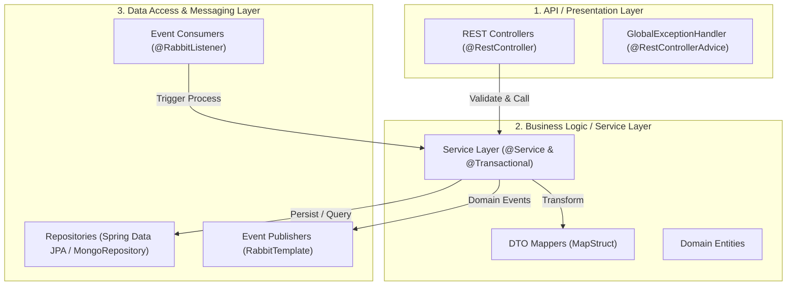
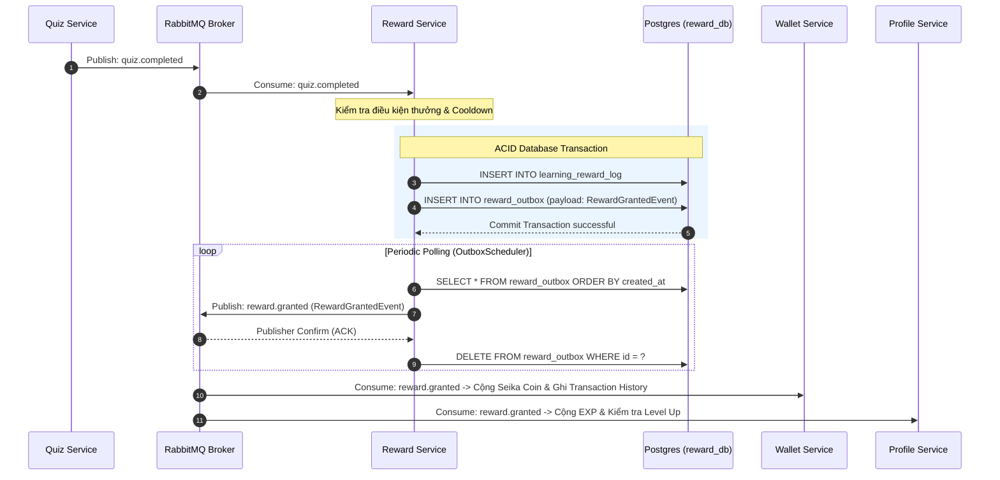
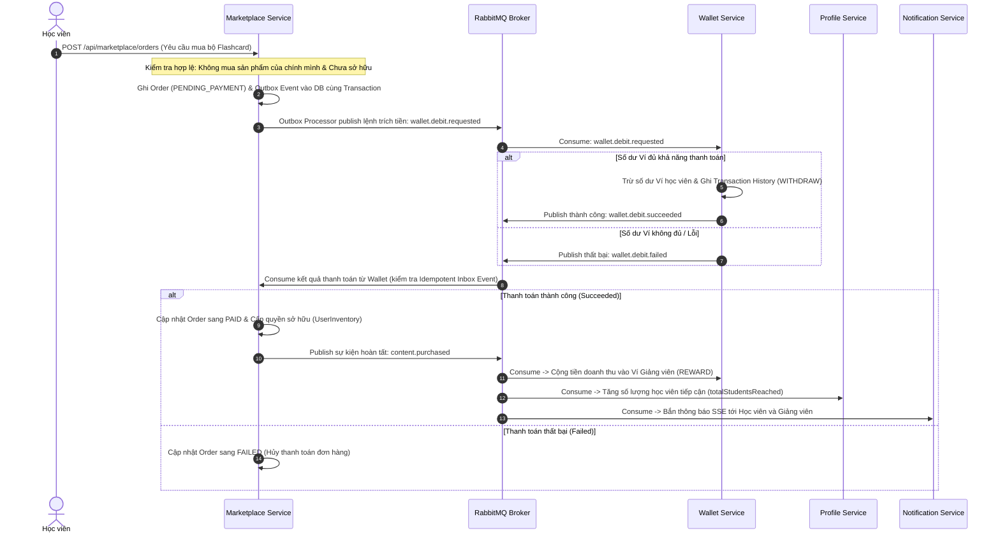
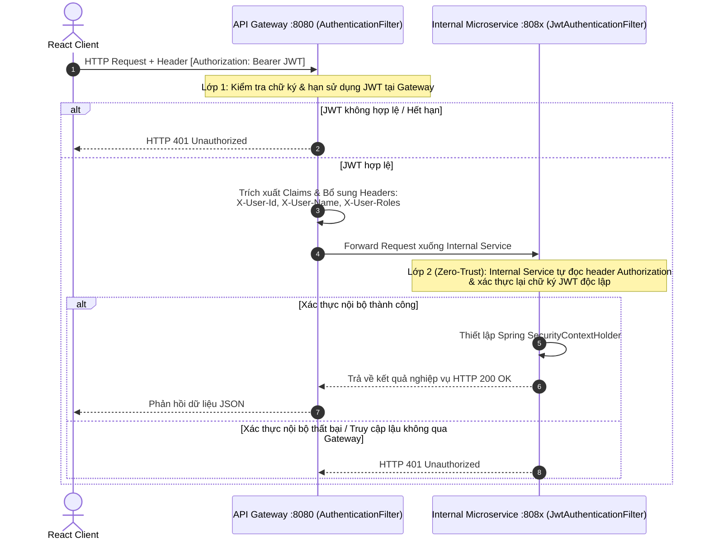
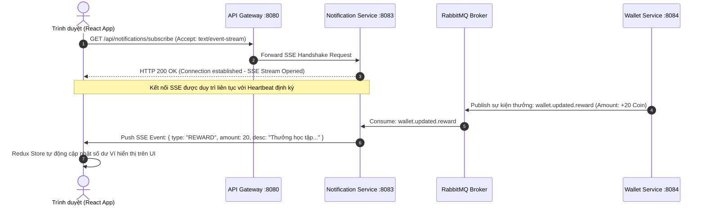
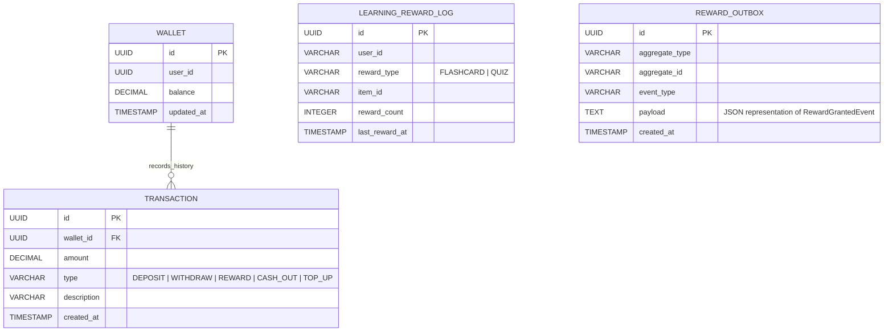
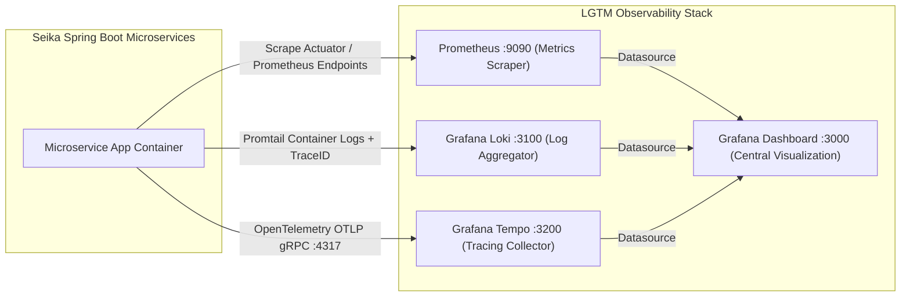

# CHƯƠNG 3. PHÂN TÍCH VÀ THIẾT KẾ HỆ THỐNG (SYSTEM ANALYSIS AND DESIGN)

## 3.1. Tổng quan kiến trúc hệ thống (System Architecture Overview)

Nền tảng học tập kết hợp trò chơi hóa (Gamification Learning Platform) **Seika** được thiết kế theo hướng chuyên sâu trên nền tảng kiến trúc **Cloud-Native Microservices** kết hợp **Event-Driven Architecture (EDA)**. Thay vì xây dựng một khối ứng dụng duy nhất (Monolith) tiềm ẩn nhiều rủi ro về nút thắt cổ chai hiệu năng và độ phức tạp bảo trì, hệ thống được phân tách thành các dịch vụ độc lập có ranh giới nghiệp vụ rõ ràng, tuân thủ nguyên tắc **Domain-Driven Design (DDD)** và **Database-per-Service**.

Theo chiều cắt dọc (Vertical Slice), toàn bộ nền tảng Seika được phân tầng thành 5 lớp kiến trúc cốt lõi:

1. **Lớp Trình diễn phía Client (Client / Presentation Layer)**:
   - Là ứng dụng **Single-Page Application (SPA)** phát triển trên nền tảng **React 19 + TypeScript + Vite**, cung cấp giao diện tương tác tốc độ cao cho 3 nhóm đối tượng người dùng chính: Học viên (Student), Giảng viên (Teacher) và Quản trị viên (Admin).
   - Client giao tiếp với backend thông qua giao thức HTTP/RESTful cho các thao tác đồng bộ và kết nối **Server-Sent Events (SSE)** để nhận luồng thông báo thời gian thực từ máy chủ.

2. **Lớp Cổng điều phối & Định tuyến (Edge Gateway & Discovery Layer)**:
   - **Spring Cloud Gateway (Reactive WebFlux)**: Đóng vai trò là điểm tiếp nhận duy nhất (Single Entry Point) cho toàn bộ lưu lượng truy cập từ bên ngoài vào hệ thống. Gateway đảm nhận các tác vụ cắt ngang (Cross-cutting Concerns) bao gồm: chấm dứt kết nối bảo mật (SSL/TLS Termination), kiểm tra định danh JWT sơ bộ, định tuyến động (Dynamic Routing) xuống các microservice phía sau, kiểm soát truy cập đồng thời (Rate Limiting) và tổng hợp tài liệu OpenAPI/Swagger.
   - **Netflix Eureka Server**: Đóng vai trò registry trung tâm cho khám phá dịch vụ động (Service Discovery), cho phép các microservices đăng ký trạng thái sức khỏe và định vị địa chỉ mạng của nhau một cách linh hoạt.
   - **Spring Cloud Config Server**: Quản lý tập trung toàn bộ cấu hình môi trường (Database URLs, JWT Secrets, tham số nghiệp vụ) cho tất cả các microservices.

3. **Lớp Dịch vụ Nghiệp vụ Lõi (Core Business Microservices Layer)**:
   - Bao gồm 8 microservices độc lập được phát triển trên nền tảng **Java 21 + Spring Boot 4.0.4**: `identity-service`, `profile-service`, `flashcard-service`, `quiz-service`, `reward-service`, `wallet-service`, `marketplace-service`, và `notification-service`.
   - Các dịch vụ nghiệp vụ giao tiếp đồng bộ nội bộ thông qua **Spring Cloud OpenFeign** và giao tiếp bất đồng bộ thông qua nền tảng hàng đợi tin nhắn **RabbitMQ**.

4. **Lớp Giao tiếp & Xử lý sự kiện (Messaging & Choreography Layer)**:
   - Sử dụng **RabbitMQ Topic Exchanges** (`learning.events`, `content.events`, `identity.events`, `wallet.events`, `marketplace.events`) làm xương sống giao tiếp bất đồng bộ, giúp triệt tiêu độ phụ thuộc liên kết cứng (Tight Coupling) giữa các dịch vụ.

5. **Lớp Lưu trữ Dữ liệu Phân tán & Giám sát (Persistence & Observability Layer)**:
   - Áp dụng chiến lược **Polyglot Persistence**, kết hợp giữa cơ sở dữ liệu quan hệ **PostgreSQL 16** (cho dữ liệu tài chính, định danh có tính toàn vẹn ACID cao) và cơ sở dữ liệu tài liệu **MongoDB 7** (cho nội dung học tập linh hoạt và thông báo tốc độ cao).
   - Hệ thống giám sát toàn diện **LGTM Stack** (Loki - Grafana - Tempo - Prometheus) tích hợp **OpenTelemetry / Micrometer Tracing**, đảm bảo khả năng theo dõi request xuyên suốt toàn bộ phân hệ.

```mermaid
graph TD
    subgraph ClientLayer ["1. Client Layer"]
        SPA["React 19 SPA (Student / Teacher / Admin UI)"]
    end

    subgraph EdgeLayer ["2. Edge Gateway & Discovery Layer"]
        Gateway["Spring Cloud Gateway :8080 (Reactive WebFlux)"]
        Eureka["Netflix Eureka Server :8761"]
        Config["Spring Cloud Config Server :8888"]
    end

    subgraph CoreLayer ["3. Core Business Microservices Layer"]
        Identity["Identity Service :8081"]
        Profile["Profile Service :8082"]
        Notification["Notification Service :8083"]
        Wallet["Wallet Service :8084"]
        Marketplace["Marketplace Service :8085"]
        Flashcard["Flashcard Service :8086"]
        Quiz["Quiz Service :8087"]
        Reward["Reward Service :8088"]
    end

    subgraph MessagingLayer ["4. Event Messaging Layer"]
        Broker["RabbitMQ Event Broker :5672 (Topic Exchanges)"]
    end

    subgraph PersistenceLayer ["5. Polyglot Persistence Layer"]
        PG_ID[(Postgres: identity_db)]
        PG_PROF[(Postgres: profile_db)]
        PG_WAL[(Postgres: wallet_db)]
        PG_MKT[(Postgres: marketplace_db)]
        PG_REW[(Postgres: reward_db)]
        MG_FLASH[(MongoDB: flashcard_db)]
        MG_QUIZ[(MongoDB: quiz_db)]
        MG_NOTIF[(MongoDB: notification_db)]
    end

    subgraph ObservabilityLayer ["Cross-Cutting Observability Stack"]
        LGTM["LGTM Stack: Prometheus + Grafana + Loki + Tempo"]
    end

    %% Client Routing
    SPA -->|HTTP / REST| Gateway
    SPA -->|SSE Stream| Gateway

    %% Discovery & Config
    Gateway -->|Discovery Lookup| Eureka
    Identity & Profile & Wallet & Marketplace & Flashcard & Quiz & Reward & Notification -.->|Register| Eureka
    Identity & Profile & Wallet & Marketplace & Flashcard & Quiz & Reward & Notification -.->|Fetch Config| Config

    %% Gateway to Microservices
    Gateway -->|/api/auth/*| Identity
    Gateway -->|/api/profiles/*| Profile
    Gateway -->|/api/notifications/*| Notification
    Gateway -->|/api/wallet/*| Wallet
    Gateway -->|/api/marketplace/*| Marketplace
    Gateway -->|/api/v1/flashcards/*| Flashcard
    Gateway -->|/api/v1/quizzes/*| Quiz
    Gateway -->|/api/rewards/*| Reward

    %% Synchronous Feign Calls
    Identity -->|OpenFeign: createProfile| Profile
    Flashcard -->|OpenFeign: checkPriceLimits| Wallet

    %% Async RabbitMQ Events
    Identity & Flashcard & Quiz & Marketplace & Wallet & Reward ==>|Publish Domain Events| Broker
    Broker ==>|Consume Events| Profile & Wallet & Marketplace & Notification & Reward

    %% DB Connections
    Identity --- PG_ID
    Profile --- PG_PROF
    Wallet --- PG_WAL
    Marketplace --- PG_MKT
    Reward --- PG_REW
    Flashcard --- MG_FLASH
    Quiz --- MG_QUIZ
    Notification --- MG_NOTIF

    %% Tracing
    Gateway & Identity & Profile & Wallet & Marketplace & Flashcard & Quiz & Reward & Notification -.->|OpenTelemetry OTLP| LGTM
```



_Figure 3.1. Sơ đồ tổng quan toàn bộ thành phần kiến trúc hệ thống Seika (System Architecture Overview)._

---

## 3.2. Thiết kế Microservices phía Backend (Backend Microservices Design)

### 3.2.1. Phân tích miền nghiệp vụ và Ngữ cảnh giới hạn (Domain Analysis & Bounded Contexts)

Áp dụng phương pháp luận **Domain-Driven Design (DDD)**, hệ thống Seika được phân rã thành **8 Bounded Contexts (Ngữ cảnh nghiệp vụ giới hạn)** độc lập. Mỗi Bounded Context sở hữu một mô hình dữ liệu (Domain Model) riêng biệt, giải quyết một tập hợp quy tắc nghiệp vụ đặc thù và được bao gói bên trong một microservice độc lập:

1. **Identity Context (`identity-service`)**:
   - Quản lý vòng đời tài khoản người dùng, xác thực (Authentication), cấp phát và kiểm tra chữ ký mã thông báo an toàn **JWT (JSON Web Token)**.
   - Phân quyền dựa trên vai trò (Role-Based Access Control - RBAC) gồm 3 vai trò chính: `STUDENT`, `TEACHER`, và `ADMIN`.

2. **Profile Context (`profile-service`)**:
   - Quản lý hồ sơ cá nhân mở rộng của học viên và giảng viên, theo dõi tiến độ tích lũy điểm kinh nghiệm (**EXP**), cấp độ học viên (**Level**) và chuỗi ngày học tập liên tục (**Learning Streak**).

3. **Flashcard Context (`flashcard-service`)**:
   - Quản lý nghiệp vụ tạo và chỉnh sửa bộ thẻ ghi nhớ (Card Sets / Decks), các thẻ học (Cards) và ghi nhận phiên học tập (Study Sessions).

4. **Quiz Context (`quiz-service`)**:
   - Quản lý ngân hàng câu hỏi, bài kiểm tra trắc nghiệm (Quizzes), tiến hành chấm điểm tự động và ghi nhận kết quả hoàn thành bài thi của học viên.

5. **Reward Context (`reward-service`)**:
   - Đóng vai trò bộ não điều phối cơ chế trò chơi hóa (**Gamification Engine**). Tiếp nhận sự kiện hoàn thành bài học (Flashcard/Quiz), tính toán logic phần thưởng, kiểm soát thời gian làm nguội (**Cooldown Period**) và phát hành quyết định trao thưởng.

6. **Wallet Context (`wallet-service`)**:
   - Quản lý tài chính tiền tệ ảo **Seika Coin**. Xử lý số dư ví, nạp tiền (Top-up), thanh toán mua sắm tài liệu (Spend), thu nhập giảng viên (Reward/Earning), yêu cầu rút tiền (Cash-out) và ghi nhận sổ cái lịch sử giao dịch đảm bảo nguyên tắc ACID.

7. **Marketplace Context (`marketplace-service`)**:
   - Quản lý sàn giao dịch nội dung học tập, quy trình đăng bán bộ Flashcard/Quiz của giảng viên, quy trình kiểm duyệt của Quản trị viên và luồng đặt mua sản phẩm của học viên.

8. **Notification Context (`notification-service`)**:
   - Quản lý hệ thống thông báo đa kênh, duy trì kết nối thời gian thực **Server-Sent Events (SSE)** để chuyển tiếp ngay lập tức các thay đổi về số dư ví, phần thưởng và tiến độ học tập tới trình duyệt người dùng.

```mermaid
graph LR
    subgraph CorePlatform ["Seika Core Learning Platform"]
        ID[Identity Context]
        PROF[Profile Context]
        FLASH[Flashcard Context]
        QUIZ[Quiz Context]
        REW[Reward Context]
        WAL[Wallet Context]
        MKT[Marketplace Context]
        NOTIF[Notification Context]
    end

    ID -->|Synchronous Feign Call: createProfile| PROF
    ID -->|Event: user.registered| WAL
    FLASH & QUIZ -->|Event: deck/quiz.completed| REW
    REW -->|Event: RewardGrantedEvent| WAL & PROF & NOTIF
    MKT <-->|Event Choreography (Outbox/Inbox)| WAL
    MKT -->|Event: content.purchased| PROF & NOTIF
```

_Figure 3.2. Sơ đồ ánh xạ các Ngữ cảnh nghiệp vụ giới hạn (Bounded Context Map) của Seika._

---

### 3.2.2. Cấu trúc nội bộ phân tầng của Microservice (Internal 3-Tier Layered Architecture)

Bên trong mỗi Microservice, kiến trúc phần mềm được thiết kế tuân thủ mô hình **Kiến trúc Phân tầng 3 Lớp (3-Tier Layered Architecture)** chuẩn mực của Spring Boot nhằm tách biệt rõ ràng giữa giao thức tiếp nhận API bên ngoài, logic nghiệp vụ cốt lõi và tầng truy cập dữ liệu:



_Figure 3.3. Cấu trúc nội bộ theo mô hình Kiến trúc Phân tầng 3 Lớp (Layered Architecture) của một Microservice trong Seika._

- **API / Presentation Layer**: Chứa các Controller chịu trách nhiệm tiếp nhận yêu cầu HTTP, kiểm tra hợp lệ dữ liệu đầu vào theo chuẩn Jakarta Validation (`@NotNull`, `@Min`, `@Size`), chuẩn hóa phản hồi theo định dạng chung `ApiResponse<T>` và xử lý ngoại lệ tập trung qua `GlobalExceptionHandler`.
- **Application & Domain Layer**: Nơi chứa logic nghiệp vụ cốt lõi, quản lý giao dịch CSDL (`@Transactional`). Dữ liệu được chuyển đổi giữa DTO và Domain Entity tự động thông qua công cụ **MapStruct**.
- **Infrastructure Layer**: Đóng gói các chi tiết công nghệ nền tảng bao gồm truy xuất CSDL (Spring Data JPA / MongoRepository) và tương tác hệ thống hàng đợi sự kiện (RabbitMQ Publishers / Consumers).

---

### 3.2.3. Các mẫu thiết kế phân tán nâng cao (Advanced Architectural & Distributed Patterns)

Để đảm bảo hệ thống vận hành tin cậy, nhất quán dữ liệu trong môi trường phân tán và an toàn bảo mật tối đa, Seika triển khai 3 mẫu thiết kế kỹ thuật chuyên sâu:

#### A. Mô hình Transactional Outbox Pattern (Đảm bảo tính nhất quán dữ liệu cuối - Eventual Consistency)

Trong kiến trúc vi dịch vụ, việc vừa cập nhật cơ sở dữ liệu nội bộ vừa gửi tin nhắn sang RabbitMQ trong cùng một thao tác nghiệp vụ tiềm ẩn rủi ro **Dual-Write Inconsistency** (lỗi xảy ra khi CSDL đã commit nhưng RabbitMQ bị gián đoạn mạng, dẫn đến mất tin nhắn).

Seika giải quyết triệt để bài toán này bằng **Transactional Outbox Pattern** tại dịch vụ `reward-service`:

1. Khi học viên hoàn thành bài học đủ điều kiện nhận thưởng, `RewardProcessor` thực hiện một giao dịch CSDL duy nhất (`@Transactional`): vừa ghi lịch sử nhận thưởng vào bảng `learning_reward_log`, vừa ghi sự kiện JSON vào bảng `reward_outbox`.
2. Một tiến trình ngầm **OutboxScheduler** định kỳ quét bảng `reward_outbox` theo thứ tự thời gian, gửi sự kiện `RewardGrantedEvent` sang RabbitMQ exchange `learning.events` với routing key `reward.granted`.
3. Sau khi RabbitMQ xác nhận nhận tin thành công, bản ghi trong bảng outbox mới được xóa/đánh dấu hoàn tất, đảm bảo gửi tin nhắn chính xác **ít nhất một lần (At-Least-Once Delivery)**.



_Figure 3.4. Sơ đồ tuần tự cơ chế Transactional Outbox Pattern cho luồng cấp phần thưởng học tập._

---

#### B. Mô hình Event Choreography kết hợp Transactional Outbox & Inbox Pattern (Quy trình phối hợp xử lý sự kiện liên dịch vụ)

Quy trình mua bán tài liệu trên `marketplace-service` liên quan đến sự phối hợp giữa số dư ví tiền (`wallet-service`) và tiến trình học tập (`profile-service`, `notification-service`). Để duy trì tính nhất quán và chống xử lý lặp sự kiện trong môi trường phân tán mà không sử dụng khóa hai pha (2PC), hệ thống áp dụng mô hình **Event Choreography kết hợp Transactional Outbox & Inbox Pattern**:



_Figure 3.5. Sơ đồ tuần tự Event Choreography & Idempotent Inbox/Outbox cho quy trình mua sắm trên Marketplace._

---

#### C. Mô hình Bảo mật kép 2 lớp Defense-in-Depth (Zero-Trust Security Architecture)

Để bảo vệ toàn diện hệ thống khỏi các nguy cơ tấn công xâm nhập từ bên ngoài cũng như tấn công leo thang đặc quyền nội bộ (Lateral Movement Attack), Seika triển khai cơ chế **Bảo mật kép 2 lớp (Dual-Layer Defense-in-Depth)**:

1. **Lớp Cổng biên (Edge Authentication Layer tại API Gateway)**:
   - Mọi request từ bên ngoài phải đi qua `AuthenticationFilter` của Gateway. Bộ lọc kiểm tra tính hợp lệ của token JWT (chữ ký HS256, thời hạn expiration).
   - Khi token hợp lệ, Gateway bóc tách thông tin người dùng và gắn vào các HTTP Header chuẩn hóa (`X-User-Id`, `X-User-Name`, `X-User-Roles`) trước khi chuyển tiếp xuống microservice đích.
2. **Lớp Nội bộ (Internal Microservice Authentication Layer)**:
   - Tất cả 100% các internal microservices (`wallet-service`, `reward-service`, `quiz-service`, v.v.) đều tích hợp bộ lọc riêng `JwtAuthenticationFilter` cùng cấu hình `SecurityConfig` (Spring Security).
   - Bộ lọc nội bộ tiếp tục tự phân tích header `Authorization: Bearer <token>` để xác thực chữ ký JWT độc lập và thiết lập `SecurityContextHolder`. Kể cả khi kẻ tấn công vượt qua được tường lửa hoặc truy cập trực tiếp vào cổng nội bộ của container (Ví dụ: gọi trực tiếp vào `http://wallet-service:8084`), request lập tức bị từ chối với lỗi HTTP 401 Unauthorized nếu không có JWT hợp lệ.



_Figure 3.6. Sơ đồ cơ chế Bảo mật kép 2 lớp Defense-in-Depth giữa API Gateway và Internal Microservices._

---

## 3.3. Thiết kế ứng dụng Web phía Client & Trải nghiệm người dùng Real-time (Client Application Design & Real-Time UX)

Ứng dụng phía Client của Seika được phát triển dưới dạng **Single-Page Application (SPA)** hiện đại sử dụng **React 19, TypeScript 5.9 và Vite 6**. Kiến trúc giao diện được phân tổ chức rõ ràng theo các **Hành trình người dùng (User Journeys)** cốt lõi:

- **Student Workspace**: Giao diện học tập liền mạch cho phép học viên ôn luyện thẻ Flashcard theo thuật toán Spaced Repetition, tham gia làm bài trắc nghiệm Quiz, theo dõi chỉ số kinh nghiệm EXP/Level và quản lý số dư Ví Seika Coin.
- **Marketplace Hub**: Cửa hàng tài liệu trực quan, hỗ trợ học viên tìm kiếm và mua sắm các bộ học liệu do giảng viên phát hành.
- **Teacher Dashboard**: Trung tâm sáng tạo nội dung, thống kê doanh thu bán tài liệu và số lượng học viên tiếp cận.
- **Admin Portal**: Khu vực quản trị và kiểm duyệt sản phẩm đăng bán trên sàn Marketplace.

### Cơ chế đồng bộ hóa thời gian thực Server-Sent Events (SSE)

Thay vì sử dụng phương pháp Polling liên tục gây tốn kém tài nguyên máy chủ và băng thông mạng, Seika ứng dụng giao thức **Server-Sent Events (SSE)** thông qua kết nối HTTP duy trì liên tục từ trình duyệt tới `notification-service`:

1. Ngay khi người dùng đăng nhập thành công, Frontend khởi tạo kết nối SSE tới đường dẫn `/api/notifications/subscribe`.
2. Bất kỳ sự kiện nghiệp vụ nào phát sinh dưới background (Ví dụ: `wallet-service` cộng số dư thưởng Flashcard, `profile-service` cộng EXP lên cấp) đều được gửi sang `notification-service` qua RabbitMQ.
3. `notification-service` định vị luồng SSE của người dùng tương ứng và đẩy sự kiện xuống trình duyệt trong tính bằng mili-giây, giúp giao diện tự động cập nhật số dư Ví và thông báo cho người dùng một cách lập tức.



_Figure 3.7. Sơ đồ luồng đồng bộ hóa dữ liệu thời gian thực giữa Backend và Trình duyệt qua Server-Sent Events (SSE)._

---

## 3.4. Thiết kế Cơ sở dữ liệu và Chiến lược Polyglot Persistence (Database & Polyglot Persistence Design)

Hệ thống Seika tuân thủ tuyệt đối mô hình **Database-per-Service (Mỗi dịch vụ một cơ sở dữ liệu riêng biệt)** nhằm đảm bảo khả năng mở rộng độc lập và tránh xung đột khóa chung. Đồng thời, nền tảng áp dụng chiến lược **Polyglot Persistence (Đa công nghệ lưu trữ)** để lựa chọn hệ quản trị CSDL phù hợp nhất với đặc thù cấu trúc dữ liệu và mô hình truy cập của từng Bounded Context:

| Microservice (Bounded Context)                    |      Database Technology       | Workload Characteristics                                                                                                       | Rationale for Selection                                                                                                                                           |
| :------------------------------------------------ | :----------------------------: | :----------------------------------------------------------------------------------------------------------------------------- | :---------------------------------------------------------------------------------------------------------------------------------------------------------------- |
| **Identity Context** (`identity-service`)         |   **PostgreSQL 16** (RDBMS)    | Giao dịch ACID, quản lý thông tin định danh, phân quyền RBAC (`STUDENT`, `TEACHER`, `ADMIN`) & quản lý vòng đời Refresh Token. | Đảm bảo tính toàn vẹn và nhất quán tuyệt đối cho tài khoản người dùng; ràng buộc lược đồ (Schema) chặt chẽ ngăn ngừa lỗi bất thường dữ liệu xác thực.             |
| **Profile Context** (`profile-service`)           |   **PostgreSQL 16** (RDBMS)    | Quản lý hồ sơ người dùng có cấu trúc, theo dõi cấp độ (Level), điểm kinh nghiệm (EXP) và chuỗi ngày học tập liên tục (Streak). | Phù hợp truy vấn quan hệ nối hồ sơ học viên/giảng viên với thống kê hoạt động; đảm bảo tính chính xác khi cập nhật điểm thưởng kinh nghiệm.                       |
| **Wallet Context** (`wallet-service`)             |   **PostgreSQL 16** (RDBMS)    | Xử lý tài chính đồng thời cao, nạp/trừ số dư Seika Coin và ghi nhật ký sổ cái bất biến (Immutable Ledger).                     | Yêu cầu mức cách ly giao dịch ACID khắt khe (`@Transactional`); ràng buộc khóa ngoại giữa số dư `Wallet` và lịch sử `Transaction` ngăn rủi ro sai lệch dòng tiền. |
| **Marketplace Context** (`marketplace-service`)   |   **PostgreSQL 16** (RDBMS)    | Quản lý đơn hàng (Orders), danh mục học liệu, kho sở hữu tài liệu (UserInventory) và bảng Transactional Outbox/Inbox.          | Đảm bảo tính nhất quán giữa đơn hàng thanh toán và cấp quyền sở hữu tài liệu; hỗ trợ Transactional Outbox/Inbox chống xử lý lặp sự kiện.                          |
| **Reward Context** (`reward-service`)             |   **PostgreSQL 16** (RDBMS)    | Xử lý sự kiện hoàn thành bài học, kiểm tra điều kiện Cooldown và ghi nhật ký phần thưởng kèm bảng Outbox.                      | Đảm bảo thao tác ghi nhận thưởng (`learning_reward_log`) và phát hành sự kiện (`reward_outbox`) diễn ra nguyên tử (Atomic ACID Transaction).                      |
| **Flashcard Context** (`flashcard-service`)       | **MongoDB 7** (Document Store) | Tỷ lệ đọc cao (Read-heavy), cấu trúc dữ liệu lồng nhau phức tạp (bộ thẻ CardSet chứa danh sách Card) & phiên học tập.          | Cấu trúc tài liệu linh hoạt cho phép lưu trữ toàn bộ bộ thẻ học viên trong một document, truy xuất cực nhanh với 1 lần đọc đĩa không cần Join bảng phức tạp.      |
| **Quiz Context** (`quiz-service`)                 | **MongoDB 7** (Document Store) | Tỷ lệ đọc cao, ngân hàng câu hỏi đa dạng (trắc nghiệm, đáp án lồng nhau) & ghi nhận kết quả làm bài thi của học viên.          | Mô hình Document linh hoạt tự nhiên phù hợp với cấu trúc câu hỏi/đáp án lồng nhau và hỗ trợ thông lượng cao cho số lượng lớn lượt thi đồng thời.                  |
| **Notification Context** (`notification-service`) | **MongoDB 7** (Document Store) | Thông lượng ghi cao (Write-heavy), cấu trúc payload thông báo đa dạng & chuyển tiếp thời gian thực qua SSE.                    | Tốc độ ghi chép cực nhanh, hỗ trợ cơ chế tự động dọn dẹp theo thời gian (TTL Index) và schema linh hoạt cho nhiều loại thông báo khác nhau.                       |

_Table 3.1. Bảng lựa chọn công nghệ cơ sở dữ liệu theo chiến lược Polyglot Persistence (Database Technology Selection)._



_Figure 3.8. Sơ đồ thực thể quan hệ (ERD) tiêu biểu của hệ thống lưu trữ giao dịch (Wallet DB & Reward DB)._

---

### 3.4.2. Chi tiết cấu trúc các bảng và tài liệu cơ sở dữ liệu (Database Schema Specifications)

Dưới đây là đặc tả chi tiết cấu trúc lược đồ dữ liệu thực tế của từng microservice theo chiến lược Polyglot Persistence đã lựa chọn:

#### A. Nhóm dịch vụ quan hệ (PostgreSQL 16 - RDBMS ACID)

##### 1. Identity Service Database (`identity_db`)

| Column     |     Type     |      Constraints       | Description                                                   |
| :--------- | :----------: | :--------------------: | :------------------------------------------------------------ |
| `id`       | VARCHAR(36)  |      PRIMARY KEY       | Khóa chính định danh duy nhất của tài khoản người dùng (UUID) |
| `username` | VARCHAR(255) |    UNIQUE, NOT NULL    | Tên đăng nhập (Email) duy nhất trong hệ thống                 |
| `password` | VARCHAR(255) |           -            | Mật khẩu đã được mã hóa bảo mật BCrypt                        |
| `enabled`  |   BOOLEAN    | NOT NULL, DEFAULT true | Trạng thái kích hoạt tài khoản                                |

_Table 3.2. Cấu trúc bảng `users` trong `identity_db` (PostgreSQL)._

| Column       |     Type     |      Constraints      | Description                                          |
| :----------- | :----------: | :-------------------: | :--------------------------------------------------- |
| `id`         | VARCHAR(36)  |      PRIMARY KEY      | Khóa chính định danh phiên Refresh Token (UUID)      |
| `token`      | VARCHAR(512) |   UNIQUE, NOT NULL    | Chuỗi Refresh Token an toàn                          |
| `expires_at` |  TIMESTAMP   |       NOT NULL        | Thời điểm hết hạn của Token                          |
| `revoked`    |   BOOLEAN    |       NOT NULL        | Trạng thái thu hồi hoặc vô hiệu hóa Token            |
| `user_id`    | VARCHAR(36)  | FOREIGN KEY, NOT NULL | Khóa ngoại liên kết tới tài khoản trong bảng `users` |

_Table 3.3. Cấu trúc bảng `refresh_tokens` trong `identity_db` (PostgreSQL)._

##### 2. Profile Service Database (`profile_db`)

| Column              |    Type     | Constraints | Description                                         |
| :------------------ | :---------: | :---------: | :-------------------------------------------------- |
| `user_id`           | VARCHAR(36) | PRIMARY KEY | Khóa chính trùng với ID học viên                    |
| `exp`               |   BIGINT    |  NOT NULL   | Tổng điểm kinh nghiệm tích lũy từ hoạt động học tập |
| `level`             |     INT     |  NOT NULL   | Cấp độ hiện tại của học viên                        |
| `current_streak`    |     INT     |      -      | Chuỗi ngày học tập liên tục hiện tại                |
| `longest_streak`    |     INT     |      -      | Kỷ lục chuỗi ngày học tập liên tục dài nhất         |
| `last_active_date`  |    DATE     |      -      | Ngày hoàn thành bài học gần nhất                    |
| `quizzes_completed` |     INT     |      -      | Tổng số lượng bài Quiz đã hoàn thành                |

_Table 3.4. Cấu trúc bảng `game_profile` trong `profile_db` (PostgreSQL)._

| Column                     |    Type     |     Constraints     | Description                                 |
| :------------------------- | :---------: | :-----------------: | :------------------------------------------ |
| `user_id`                  | VARCHAR(36) |     PRIMARY KEY     | Khóa chính trùng với ID giảng viên          |
| `total_quiz_created`       |     INT     | NOT NULL, DEFAULT 0 | Tổng số bộ đề Quiz đã phát hành             |
| `total_flashcards_created` |     INT     | NOT NULL, DEFAULT 0 | Tổng số bộ thẻ Flashcard đã phát hành       |
| `total_students_reached`   |     INT     | NOT NULL, DEFAULT 0 | Tổng lượt học viên tiếp cận và mua học liệu |

_Table 3.5. Cấu trúc bảng `teacher_profile` trong `profile_db` (PostgreSQL)._

##### 3. Wallet Service Database (`wallet_db`)

| Column      |     Type      |          Constraints           | Description                                    |
| :---------- | :-----------: | :----------------------------: | :--------------------------------------------- |
| `id`        |     UUID      |          PRIMARY KEY           | Khóa chính định danh ví tiền                   |
| `user_id`   |     UUID      |        UNIQUE, NOT NULL        | Khóa ngoại định danh người dùng sở hữu ví      |
| `balance`   | DECIMAL(19,2) | NOT NULL, CHECK (balance >= 0) | Số dư Seika Coin hiện tại (ràng buộc không âm) |
| `update_at` |   TIMESTAMP   |               -                | Thời điểm biến động số dư gần nhất             |

_Table 3.6. Cấu trúc bảng `wallets` trong `wallet_db` (PostgreSQL)._

| Column        |     Type      |      Constraints      | Description                                                            |
| :------------ | :-----------: | :-------------------: | :--------------------------------------------------------------------- |
| `id`          |     UUID      |      PRIMARY KEY      | Khóa chính định danh giao dịch sổ cái                                  |
| `wallet_id`   |     UUID      | FOREIGN KEY, NOT NULL | Khóa ngoại liên kết tới ví phát sinh giao dịch                         |
| `amount`      | DECIMAL(19,2) |       NOT NULL        | Giá trị biến động Seika Coin                                           |
| `type`        |  VARCHAR(32)  |       NOT NULL        | Loại giao dịch (`DEPOSIT`, `WITHDRAW`, `REWARD`, `CASH_OUT`, `TOP_UP`) |
| `description` | VARCHAR(255)  |           -           | Mô tả lý do hoặc nội dung giao dịch                                    |
| `created_at`  |   TIMESTAMP   |       NOT NULL        | Thời gian tạo nhật ký giao dịch bất biến                               |

_Table 3.7. Cấu trúc bảng `transactions` trong `wallet_db` (PostgreSQL)._

##### 4. Marketplace Service Database (`marketplace_db`)

| Column            |     Type      | Constraints | Description                                                               |
| :---------------- | :-----------: | :---------: | :------------------------------------------------------------------------ |
| `id`              |  VARCHAR(36)  | PRIMARY KEY | Khóa chính định danh sản phẩm học liệu                                    |
| `name`            | VARCHAR(255)  |  NOT NULL   | Tên học liệu đăng bán trên sàn Marketplace                                |
| `description`     |     TEXT      |      -      | Mô tả giới thiệu chi tiết sản phẩm                                        |
| `price`           | DECIMAL(19,2) |  NOT NULL   | Giá niêm yết Seika Coin                                                   |
| `type`            |  VARCHAR(32)  |  NOT NULL   | Loại sản phẩm (`FLASHCARD` hoặc `QUIZ`)                                   |
| `reference_id`    |  VARCHAR(64)  |  NOT NULL   | ID tham chiếu sang bộ gốc trên Flashcard/Quiz Service                     |
| `teacher_user_id` |  VARCHAR(36)  |  NOT NULL   | ID giảng viên phát hành sản phẩm                                          |
| `status`          |  VARCHAR(32)  |  NOT NULL   | Trạng thái kiểm duyệt (`DRAFT`, `PENDING_REVIEW`, `APPROVED`, `REJECTED`) |
| `active`          |    BOOLEAN    |  NOT NULL   | Trạng thái bật/tắt hiển thị trên sàn                                      |

_Table 3.8. Cấu trúc bảng `products` trong `marketplace_db` (PostgreSQL)._

| Column         |     Type      | Constraints | Description                                                 |
| :------------- | :-----------: | :---------: | :---------------------------------------------------------- |
| `id`           |  VARCHAR(36)  | PRIMARY KEY | Khóa chính định danh đơn hàng                               |
| `user_id`      |  VARCHAR(36)  |  NOT NULL   | ID học viên thực hiện mua hàng                              |
| `status`       |  VARCHAR(32)  |  NOT NULL   | Trạng thái thanh toán (`PENDING_PAYMENT`, `PAID`, `FAILED`) |
| `total_amount` | DECIMAL(19,2) |  NOT NULL   | Tổng thanh toán Seika Coin                                  |
| `created_at`   |   TIMESTAMP   |  NOT NULL   | Thời điểm khởi tạo đơn hàng                                 |

_Table 3.9. Cấu trúc bảng `orders` trong `marketplace_db` (PostgreSQL)._

| Column         |    Type     | Constraints | Description                                 |
| :------------- | :---------: | :---------: | :------------------------------------------ |
| `id`           | VARCHAR(36) | PRIMARY KEY | Khóa chính bản ghi sở hữu tài liệu          |
| `user_id`      | VARCHAR(36) |  NOT NULL   | ID học viên đã mua và sở hữu học liệu       |
| `product_id`   | VARCHAR(36) |  NOT NULL   | ID sản phẩm trên Marketplace                |
| `product_type` | VARCHAR(32) |  NOT NULL   | Loại học liệu (`FLASHCARD` hoặc `QUIZ`)     |
| `reference_id` | VARCHAR(64) |  NOT NULL   | ID tham chiếu học liệu để mở quyền truy cập |
| `order_id`     | VARCHAR(36) |  NOT NULL   | ID đơn hàng thanh toán thành công           |

_Table 3.10. Cấu trúc bảng `user_inventory` trong `marketplace_db` (PostgreSQL)._

##### 5. Reward Service Database (`reward_db`)

| Column           |    Type     | Constraints | Description                                            |
| :--------------- | :---------: | :---------: | :----------------------------------------------------- |
| `id`             |  BIGSERIAL  | PRIMARY KEY | Khóa chính tự động tăng                                |
| `user_id`        | VARCHAR(36) |  NOT NULL   | ID học viên nhận thưởng                                |
| `reward_type`    | VARCHAR(32) |  NOT NULL   | Loại học liệu nhận thưởng (`FLASHCARD`, `QUIZ`)        |
| `item_id`        | VARCHAR(64) |  NOT NULL   | ID bộ học liệu học viên đã hoàn thành                  |
| `reward_count`   |     INT     |  NOT NULL   | Số lượt đã nhận thưởng của bài học này                 |
| `last_reward_at` |  TIMESTAMP  |  NOT NULL   | Thời gian nhận thưởng gần nhất (phục vụ tính Cooldown) |

_Table 3.11. Cấu trúc bảng `learning_reward_logs` trong `reward_db` (PostgreSQL)._

#### B. Nhóm dịch vụ tài liệu (MongoDB 7 - NoSQL Document Store)

##### 1. Flashcard Service Database (`flashcard_db`)

| Field                     |      Type      | Description                                                                                  |
| :------------------------ | :------------: | :------------------------------------------------------------------------------------------- |
| `_id`                     |     String     | Unique identifier định danh bộ thẻ Flashcard                                                 |
| `title`                   |     String     | Tiêu đề hiển thị của bộ thẻ học                                                              |
| `summary` / `description` |     String     | Mô tả ngắn gọn chi tiết nội dung bộ thẻ                                                      |
| `authorId`                |     String     | ID người dùng/giảng viên biên soạn bộ thẻ                                                    |
| `price`                   |    Decimal     | Giá trị học phí niêm yết (0 nếu miễn phí)                                                    |
| `cards`                   | Array (Object) | Danh sách các thẻ con lồng nhau, mỗi thẻ gồm `frontSide` (mặt trước) và `backSide` (mặt sau) |

_Table 3.12. Cấu trúc Collection `card_sets` trong `flashcard_db` (MongoDB)._

##### 2. Quiz Service Database (`quiz_db`)

| Field         |      Type      | Description                                         |
| :------------ | :------------: | :-------------------------------------------------- |
| `_id`         |     String     | Unique identifier định danh bộ đề kiểm tra Quiz     |
| `title`       |     String     | Tiêu đề bộ bài trắc nghiệm                          |
| `description` |     String     | Mô tả tóm tắt nội dung bài kiểm tra                 |
| `quizIds`     | Array (String) | Danh sách ID tham chiếu các câu hỏi con thuộc bộ đề |
| `createdBy`   |     String     | ID tác giả khởi tạo bộ đề                           |
| `price`       |    Decimal     | Giá niêm yết bộ đề thi                              |
| `createdAt`   |    DateTime    | Mốc thời gian khởi tạo bộ đề                        |

_Table 3.13. Cấu trúc Collection `quiz_sets` trong `quiz_db` (MongoDB)._

##### 3. Notification Service Database (`notification_db`)

| Field     |  Type  | Description                                                       |
| :-------- | :----: | :---------------------------------------------------------------- |
| `_id`     | String | Unique identifier định danh thông báo                             |
| `userId`  | String | ID người dùng nhận thông báo (Indexed)                            |
| `type`    | String | Phân loại thông báo (`WALLET`, `REWARD`, `SYSTEM`, `MARKETPLACE`) |
| `channel` | String | Kênh phát hành thông báo (`IN_APP`, `EMAIL`)                      |
| `status`  | String | Trạng thái hiển thị (`UNREAD`, `READ`)                            |
| `title`   | String | Tiêu đề ngắn gọn hiển thị trên thông báo                          |
| `content` | String | Nội dung chi tiết thông báo                                       |
| `eventId` | String | ID sự kiện gốc (đảm bảo tính Idempotency tránh gửi trùng)         |

_Table 3.14. Cấu trúc Collection `notifications` trong `notification_db` (MongoDB)._

---

## 3.5. Thiết kế Hạ tầng, Giám sát hệ thống và Đánh giá hiệu năng (Infrastructure, Observability & Performance Testing Design)

### 3.5.1. Triển khai Container hóa (Containerization & Network Topology)

Toàn bộ nền tảng Seika được chuẩn hóa đóng gói trong các container Docker và được định nghĩa phối hợp vận hành thông qua cấu hình `docker-compose.yml`. Các container được cô lập trong mạng ảo riêng (`seika-network`), chỉ cho phép truy cập public vào API Gateway (`:8080`) và Trình diễn Frontend, trong khi toàn bộ các microservices và CSDL nằm trong mạng nội bộ an toàn.

---

### 3.5.2. Hệ thống Giám sát toàn diện LGTM Stack (Distributed Observability Stack)

Để đảm bảo khả năng theo dõi sức khỏe hệ thống và gỡ lỗi nhanh chóng trong môi trường vi dịch vụ phức tạp, Seika tích hợp bộ công cụ giám sát toàn diện **LGTM Stack (Loki - Grafana - Tempo - Prometheus)** kết hợp **OpenTelemetry / Micrometer Tracing**:

- **Metrics (Prometheus & Grafana)**: Thu thập liên tục các chỉ số sức khỏe máy ảo JVM (Memory Heap, Garbage Collection), số lượng kết nối mạng và chỉ số Spring Boot APM (thông lượng HTTP, độ trễ xử lý).
- **Distributed Tracing (Grafana Tempo)**: Mọi request vào hệ thống đều được tự động gắn mã **TraceID** định danh duy nhất cùng các **SpanID** con. TraceID này truyền đi liên tục qua các cuộc gọi OpenFeign HTTP và đi xuyên qua cả các sự kiện RabbitMQ, cho phép vẽ lại toàn bộ sơ đồ đường đi của request qua N microservices.
- **Centralized Logging (Grafana Loki & Promtail)**: Toàn bộ nhật ký (Logs) của các container được Promtail thu thập, tự động nhúng TraceID/SpanID và gửi về máy chủ Loki, cho phép kỹ sư truy vết nguyên nhân lỗi gốc rễ (Root Cause Analysis) chính xác chỉ với 1 thao tác click từ Trace sang Log.



_Figure 3.9. Sơ đồ đường ống thu thập dữ liệu giám sát phân tán (Distributed Observability Pipeline - LGTM Stack)._

---

### 3.5.3. Chiến lược kiểm thử chịu tải và Đánh giá hiệu năng (Performance & Load Testing Strategy)

Để xác minh năng lực xử lý dưới tải lớn, Seika áp dụng công cụ **Grafana k6** để thiết lập kịch bản kiểm thử chịu tải mô phỏng hàng ngàn học viên truy cập đồng thời vào hệ thống:

- Các kịch bản kiểm thử tập trung vào các điểm nút thắt cổ chai (Bottlenecks) tiềm ẩn như: xác thực JWT tại API Gateway, quy trình thanh toán trên Marketplace và luồng xử lý sự kiện thưởng học tập.
- Dữ liệu kết quả từ k6 được đối chiếu trực tiếp trên Grafana APM Dashboard để theo dõi hành vi sử dụng bộ nhớ JVM, tỷ lệ thành công HTTP và độ trễ phản hồi ở mức phân vị thứ 95 (P95 Response Time), bảo chứng cho tính ổn định của hệ thống trước khi đưa vào vận hành thực tế.
