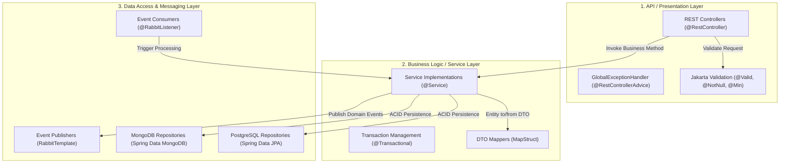
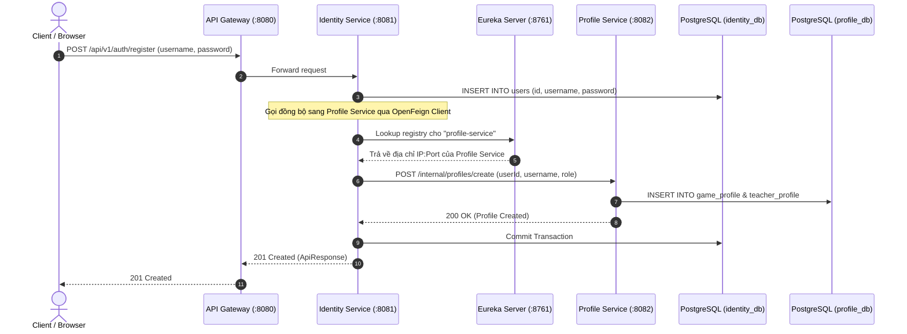
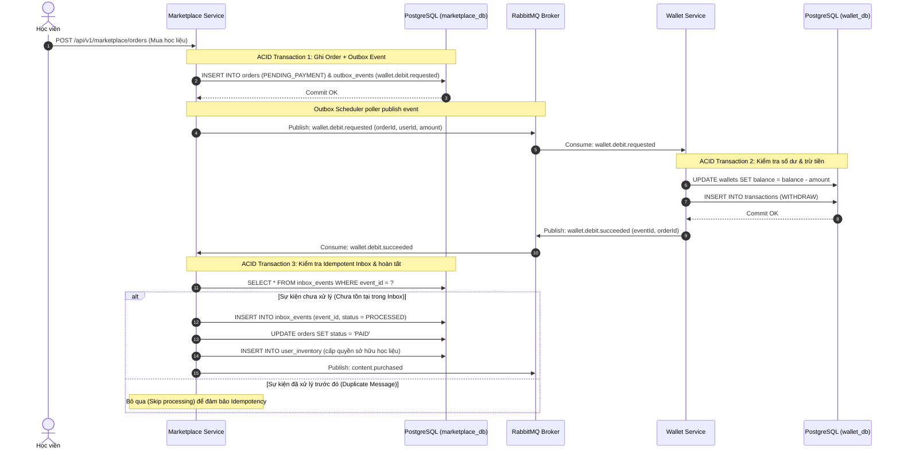
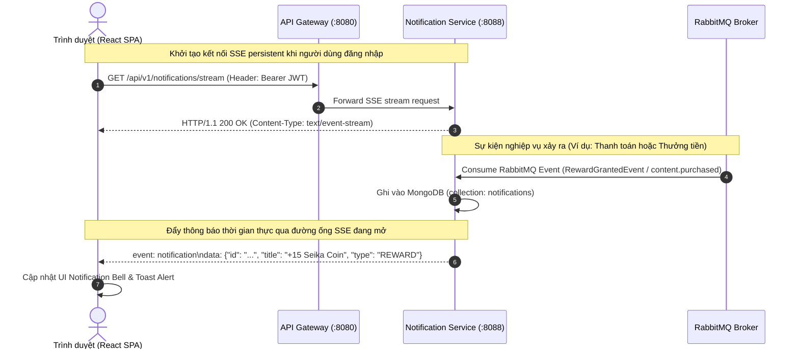
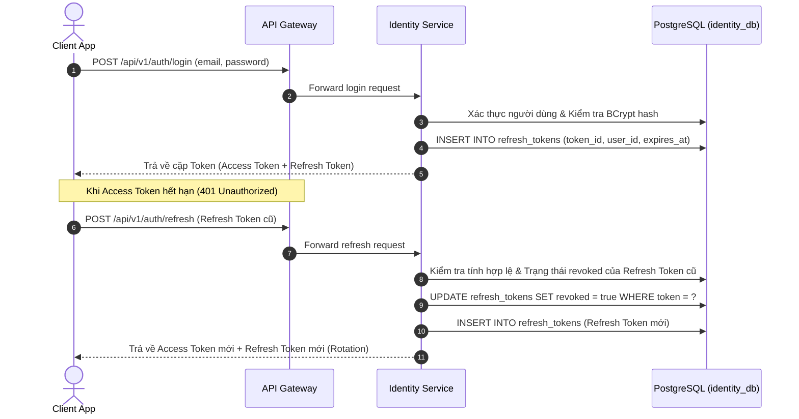

# CHƯƠNG 4. HIỆN THỰC HÓA HỆ THỐNG (IMPLEMENTATION)

Chương này trình bày chi tiết quá trình hiện thực hóa nền tảng học tập trực tuyến Seika dựa trên thiết kế kiến trúc đã được định nghĩa tại Chương 3. Toàn bộ hệ thống được triển khai tuân thủ các chuẩn mực kỹ thuật hiện đại của kiến trúc Vi dịch vụ (Microservices Architecture), áp dụng ngôn ngữ **Java 21**, nền tảng **Spring Boot 3.4/4.0** kết hợp hệ sinh thái **Spring Cloud 2025.1.1** cho Backend, giao diện **React 19 + TypeScript + Vite** cho Frontend, và bộ công cụ **LGTM Stack** cho giám sát vận hành.

---

## 4.1. Hiện thực hóa các dịch vụ lõi Backend (Backend Microservices Implementation)

Hệ thống Seika bao gồm 8 microservices độc lập (`identity-service`, `profile-service`, `wallet-service`, `marketplace-service`, `reward-service`, `flashcard-service`, `quiz-service`, và `notification-service`). Mỗi dịch vụ được thiết kế với ranh giới nghiệp vụ rõ ràng (Bounded Context) và sở hữu kho lưu trữ dữ liệu riêng biệt theo mô hình **Database-per-Service**.

### 4.1.1. Cấu trúc nội bộ phân tầng của Microservice (Internal 3-Tier Layered Architecture)

Khác với các ứng dụng nguyên khối truyền thống hoặc các mô hình phức tạp như CQRS/Clean Architecture không cần thiết cho các tác vụ mang tính chất CRUD và Event-Driven rõ ràng, các microservice trong Seika được triển khai theo **Kiến trúc Phân tầng 3 Lớp (3-Tier Layered Architecture)** chuẩn mực của Spring Boot nhằm tối ưu hóa hiệu suất phát triển và dễ dàng bảo trì:



_Figure 4.1. Cấu trúc tổ chức lớp nội bộ và luồng xử lý yêu cầu trong một Microservice Seika._

Trách nhiệm cụ thể của từng tầng được hiện thực hóa như sau:

- **Tầng Giao diện API (Presentation Layer)**: Tiếp nhận các yêu cầu HTTP/RESTful từ API Gateway. Dữ liệu đầu vào được kiểm tra hợp lệ tự động thông qua **Jakarta Validation** (`@Valid`, `@NotBlank`, `@Min`). Tất cả phản hồi đều được bao bọc trong đối tượng chuẩn hóa `ApiResponse<T>` (`code`, `message`, `result`). Ngoại lệ phát sinh trong hệ thống được thu gom và xử lý tập trung tại `GlobalExceptionHandler` (`@RestControllerAdvice`).
- **Tầng Nghiệp vụ (Business Logic / Service Layer)**: Chứa toàn bộ quy tắc nghiệp vụ lõi của hệ thống. Tầng này chịu trách nhiệm quản lý ranh giới giao dịch cơ sở dữ liệu với annotation `@Transactional`. Việc chuyển đổi giữa đối tượng truyền tải dữ liệu (DTO) và thực thể CSDL (Entity/Document) được tự động hóa tại thời điểm biên dịch thông qua thư viện **MapStruct**, giúp loại bỏ mã lặp (boilerplate code) và đảm bảo hiệu năng tối đa.
- **Tầng Truy xuất Dữ liệu & Giao tiếp thông điệp (Data Access & Messaging Layer)**: Cung cấp giao diện tương tác với cơ sở dữ liệu quan hệ thông qua **Spring Data JPA** (`JpaRepository`) hoặc tài liệu NoSQL thông qua **Spring Data MongoDB** (`MongoRepository`). Đồng thời, tầng này quản lý việc gửi và nhận thông điệp bất đồng bộ qua **RabbitMQ** (`RabbitTemplate`, `@RabbitListener`).

---

### 4.1.2. Tổng hợp công nghệ lưu trữ và cơ chế giao tiếp liên dịch vụ (Persistence & Communication Implementation)

Bảng dưới đây tổng hợp chi tiết công nghệ lưu trữ và giao thức giao tiếp Inbound/Outbound được hiện thực hóa cho từng microservice trong hệ thống Seika:

| Microservice                               | Công nghệ lưu trữ (Persistence)         | Giao tiếp Inbound (Inbound Communication)                                                                                                                                                       | Giao tiếp Outbound (Outbound Communication)                                                               |
| :----------------------------------------- | :-------------------------------------- | :---------------------------------------------------------------------------------------------------------------------------------------------------------------------------------------------- | :-------------------------------------------------------------------------------------------------------- |
| **Identity Service**<br>(Port: `8081`)     | **PostgreSQL 16**<br>(`identity_db`)    | - REST API qua API Gateway (`/api/v1/auth/**`)                                                                                                                                                  | - **OpenFeign Client** gọi đồng bộ sang `Profile Service`<br>- Publish RabbitMQ Event (`user.registered`) |
| **Profile Service**<br>(Port: `8082`)      | **PostgreSQL 16**<br>(`profile_db`)     | - REST API qua API Gateway (`/api/v1/profiles/**`)<br>- Synchronous Feign Endpoint (`/internal/profiles`)<br>- RabbitMQ Consumer (`user.registered`, `RewardGrantedEvent`, `content.purchased`) | -                                                                                                         |
| **Wallet Service**<br>(Port: `8083`)       | **PostgreSQL 16**<br>(`wallet_db`)      | - REST API qua API Gateway (`/api/v1/wallets/**`)<br>- RabbitMQ Consumer (`user.registered`, `wallet.debit.requested`, `RewardGrantedEvent`, `content.purchased`)                               | - Publish RabbitMQ Event (`wallet.debit.succeeded`, `wallet.debit.failed`)                                |
| **Marketplace Service**<br>(Port: `8084`)  | **PostgreSQL 16**<br>(`marketplace_db`) | - REST API qua API Gateway (`/api/v1/marketplace/**`)<br>- RabbitMQ Consumer (`wallet.debit.succeeded`, `wallet.debit.failed`)                                                                  | - Publish RabbitMQ Event (`wallet.debit.requested`, `content.purchased`) qua Outbox                       |
| **Reward Service**<br>(Port: `8085`)       | **PostgreSQL 16**<br>(`reward_db`)      | - REST API qua API Gateway (`/api/v1/rewards/**`)<br>- RabbitMQ Consumer (`deck.completed`, `quiz.completed`)                                                                                   | - Publish RabbitMQ Event (`RewardGrantedEvent`) qua Outbox                                                |
| **Flashcard Service**<br>(Port: `8086`)    | **MongoDB 7**<br>(`flashcard_db`)       | - REST API qua API Gateway (`/api/v1/flashcards/**`)<br>- RabbitMQ Consumer (`content.purchased`)                                                                                               | - Publish RabbitMQ Event (`deck.completed`)                                                               |
| **Quiz Service**<br>(Port: `8087`)         | **MongoDB 7**<br>(`quiz_db`)            | - REST API qua API Gateway (`/api/v1/quizzes/**`)<br>- RabbitMQ Consumer (`content.purchased`)                                                                                                  | - Publish RabbitMQ Event (`quiz.completed`)                                                               |
| **Notification Service**<br>(Port: `8088`) | **MongoDB 7**<br>(`notification_db`)    | - REST API & SSE Connection (`/api/v1/notifications/**`)<br>- RabbitMQ Consumer (`user.registered`, `RewardGrantedEvent`, `content.purchased`)                                                  | - Push luồng **Server-Sent Events (SSE)** thời gian thực xuống Trình duyệt                                |

_Table 4.1. Tổng hợp công nghệ lưu trữ và cơ chế giao tiếp của 8 Microservice trong Seika._

---

### 4.1.3. Giao tiếp đồng bộ liên dịch vụ với Spring Cloud OpenFeign & Netflix Eureka

Đối với các nghiệp vụ đòi hỏi tính nhất quán ngay lập tức (Immediate Consistency), hệ thống áp dụng cơ chế gọi HTTP đồng bộ thông qua **Spring Cloud OpenFeign** kết hợp định vị dịch vụ động **Netflix Eureka Server** (`:8761`).

Ví dụ tiêu biểu là quy trình đăng ký tài khoản học viên mới: ngay khi người dùng đăng ký thành công tại `identity-service`, dịch vụ này cần đảm bảo hồ sơ học viên tương ứng (`UserProfile` và `GameProfile`) được khởi tạo ngay lập tức tại `profile-service` trước khi trả kết quả thành công cho người dùng:



_Figure 4.2. Luồng khám phá dịch vụ và gọi đồng bộ OpenFeign giữa Identity Service và Profile Service._

Đoạn mã hiện thực hóa giao diện `ProfileClient` trong `identity-service` sử dụng OpenFeign:

```java
@FeignClient(name = "profile-service", path = "/internal/profiles")
public interface ProfileClient {
    @PostMapping("/create")
    ApiResponse<ProfileResponse> createProfile(@RequestBody CreateProfileRequest request);
}
```

---

### 4.1.4. Giao tiếp bất đồng bộ hướng sự kiện & Transactional Outbox/Inbox Pattern

Để duy trì sự tách biệt lỏng lẻo (Loose Coupling) giữa các microservice và đảm bảo tính nhất quán cuối cùng (Eventual Consistency) cho các nghiệp vụ phân tán phức tạp (như mua bán học liệu, thanh toán ví Seika Coin và thưởng điểm học tập), hệ thống áp dụng mô hình **Event Choreography kết hợp Transactional Outbox & Inbox Pattern** trên nền tảng **RabbitMQ**.

#### A. Giải quyết bài toán Dual-Write bằng Transactional Outbox Pattern

Trong môi trường vi dịch vụ, việc vừa cập nhật cơ sở dữ liệu vừa phát hành thông điệp (Publish Event) ra RabbitMQ trong cùng một thao tác tiềm ẩn rủi ro sai lệch dữ liệu (nếu DB commit thành công nhưng RabbitMQ sập hoặc ngược lại).

Để khắc phục, `marketplace-service` và `reward-service` hiện thực hóa **Transactional Outbox Pattern**:

1. Trong cùng một giao dịch ACID với CSDL (`@Transactional`), dịch vụ lưu trạng thái nghiệp vụ chính (Ví dụ: `Order` với trạng thái `PENDING_PAYMENT`) và đồng thời ghi một bản ghi sự kiện vào bảng `outbox_events` (`OutboxEvent`).
2. Một tiến trình chạy ngầm (`@Scheduled`) định kỳ đọc các bản ghi có trạng thái `PENDING` từ bảng `outbox_events` và phát hành lên RabbitMQ Exchange (`marketplace.events`). Khi gửi thành công, bản ghi được cập nhật sang `SENT` hoặc xóa khỏi bảng. Cơ chế này đảm bảo thông điệp luôn được gửi đi ít nhất một lần (**At-Least-Once Delivery**).

#### B. Đảm bảo tính Idempotency bằng Transactional Inbox Pattern

Do cơ chế At-Least-Once Delivery có thể dẫn đến việc RabbitMQ phân phối lặp thông điệp (Duplicate Message), `marketplace-service` tích hợp bảng `inbox_events` (`InboxEvent`) để kiểm soát chống xử lý trùng lặp (**Idempotent Consumer**). Khi nhận được kết quả trích tiền `wallet.debit.succeeded` từ `wallet-service`, dịch vụ kiểm tra `eventId` trong bảng Inbox; nếu sự kiện đã được xử lý thành công trước đó, tiến trình bỏ qua để ngăn chặn rủi ro cập nhật đơn hàng hoặc cấp quyền tài liệu nhiều lần.



_Figure 4.3. Sơ đồ tuần tự hiện thực hóa Transactional Outbox & Inbox trong luồng thanh toán đơn hàng Marketplace._

---

## 4.2. Hiện thực hóa Cổng điều phối API Gateway (Spring Cloud Gateway Implementation)

API Gateway (`api-gateway`, chạy tại cổng `8080`) đóng vai trò là điểm tiếp nhận duy nhất (Single Entry Point) cho toàn bộ lưu lượng truy cập từ Frontend Client vào hệ thống microservices nội bộ.

### 4.2.1. Kiến trúc Cổng điều phối phi đồng bộ (Reactive WebFlux Gateway)

Gateway được hiện thực hóa dựa trên nền tảng **Spring Cloud Gateway (Reactive WebFlux / Netty)** phi đồng bộ, cho phép xử lý hàng nghìn kết nối đồng thời với mức tiêu thụ tài nguyên thấp. Tại Gateway, các bộ lọc toàn cục (Global Filters) đảm nhận các tác vụ cắt ngang hệ thống:

- **Xác thực định danh JWT sơ bộ (`JwtAuthenticationFilter`)**: Kiểm tra tính hợp lệ của chữ ký Access Token trong Header `Authorization: Bearer <token>`, giải mã thông tin người dùng (`userId`, `roles`) và truyền tiếp xuống các microservices phía sau qua HTTP Header.
- **Quản lý chính sách CORS toàn cục**: Cấu hình cho phép các yêu cầu Cross-Origin từ ứng dụng Frontend React (`http://localhost:5173` hoặc domain production).
- **Tổng hợp tài liệu API (Swagger / OpenAPI Aggregation)**: Tự động thu thập tài liệu OpenAPI từ 8 microservices thông qua Eureka Discovery để hiển thị trên một giao diện Swagger UI duy nhất tại `/webjars/swagger-ui/index.html`.

### 4.2.2. Bảng cấu hình định tuyến dịch vụ (Gateway Route Mapping Registry)

Bảng dưới đây chi tiết hóa cấu hình định tuyến (Routes) hiện thực hóa tại API Gateway chuyển tiếp từ đường dẫn công cộng tới các dịch vụ nội bộ tương ứng:

| Đường dẫn yêu cầu (Upstream Path) | Dịch vụ nội bộ đích (Downstream Service) |    Phương thức HTTP    | Mô tả nghiệp vụ & Cấu hình bảo mật                                             |
| :-------------------------------- | :--------------------------------------- | :--------------------: | :----------------------------------------------------------------------------- |
| `/api/v1/auth/**`                 | `lb://identity-service`                  |       POST, GET        | Đăng ký, đăng nhập, làm mới Refresh Token (Public Endpoint, không yêu cầu JWT) |
| `/api/v1/profiles/**`             | `lb://profile-service`                   |        GET, PUT        | Xem và cập nhật hồ sơ cá nhân, thống kê học tập (Yêu cầu JWT hợp lệ)           |
| `/api/v1/wallets/**`              | `lb://wallet-service`                    |       GET, POST        | Tra cứu số dư ví Seika Coin, lịch sử giao dịch, nạp tiền (Yêu cầu JWT hợp lệ)  |
| `/api/v1/marketplace/**`          | `lb://marketplace-service`               |       GET, POST        | Duyệt học liệu trên sàn, tạo đơn hàng mua Flashcard/Quiz (Yêu cầu JWT hợp lệ)  |
| `/api/v1/rewards/**`              | `lb://reward-service`                    |          GET           | Tra cứu lịch sử nhận thưởng Seika Coin từ học tập (Yêu cầu JWT hợp lệ)         |
| `/api/v1/flashcards/**`           | `lb://flashcard-service`                 | GET, POST, PUT, DELETE | Quản lý bộ thẻ Flashcard, tiến trình ôn tập thẻ (Yêu cầu JWT hợp lệ)           |
| `/api/v1/quizzes/**`              | `lb://quiz-service`                      | GET, POST, PUT, DELETE | Quản lý bộ đề thi trắc nghiệm, nộp bài làm Quiz (Yêu cầu JWT hợp lệ)           |
| `/api/v1/notifications/**`        | `lb://notification-service`              |        GET, PUT        | Tra cứu thông báo, kết nối luồng **SSE Real-time** (`EventSource`)             |

_Table 4.2. Bảng cấu hình định tuyến dịch vụ tại API Gateway (Route Mapping & Upstream/Downstream Registry)._

---

## 4.3. Hiện thực hóa Ứng dụng Client & Đồng bộ thời gian thực (Client SPA & SSE Implementation)

### 4.3.1. Hiện thực hóa Single-Page Application (React 19 + TypeScript + Vite)

Giao diện người dùng phía Client (`client`) được triển khai dưới dạng **Single-Page Application (SPA)** hiện đại sử dụng **React 19**, ngôn ngữ **TypeScript**, công cụ đóng gói **Vite** và hệ thống giao diện **Tailwind CSS**.

Việc lựa chọn kiến trúc SPA nguyên khối Frontend (Thay vì Micro-Frontend) là hoàn toàn phù hợp và tối ưu với quy mô dự án Seika, giúp đảm bảo trải nghiệm người dùng liền mạch (không bị gián đoạn khi chuyển đổi giữa sàn học liệu, làm bài thi và tra cứu ví tiền) đồng thời đơn giản hóa quy trình đóng gói CI/CD.

Tương tác với Backend được chuẩn hóa thông qua thư viện **Axios Interceptors**:

- **Request Interceptor**: Tự động đính kèm `Authorization: Bearer <access_token>` vào mọi yêu cầu gửi tới API Gateway.
- **Response Interceptor**: Khi phát hiện lỗi `401 Unauthorized` do Access Token hết hạn, Interceptor tự động tạm dừng yêu cầu hiện tại, gọi ngầm endpoint `/api/v1/auth/refresh` để xin Access Token mới bằng Refresh Token, sau đó tự động thực thi lại yêu cầu gốc mà người dùng hoàn toàn không nhận biết sự gián đoạn.

### 4.3.2. Hiện thực hóa luồng thông báo thời gian thực với Server-Sent Events (SSE)

Để cung cấp phản hồi lập tức cho học viên và giảng viên khi các tác vụ xử lý bất đồng bộ hoàn tất (như nhận thưởng Seika Coin sau khi học xong bộ thẻ, hoặc thông báo mua hàng thành công trên Marketplace), hệ thống hiện thực hóa cơ chế **Server-Sent Events (SSE)** tại `notification-service`.

Khác với WebSocket yêu cầu giao tiếp hai chiều phức tạp, SSE hoạt động trực tiếp trên giao thức HTTP tiêu chuẩn, duy trì một kết nối một chiều bền vững (Persistent HTTP Connection) từ Server xuống Trình duyệt:



_Figure 4.4. Luồng kết nối và đẩy thông báo thời gian thực qua Server-Sent Events (SSE)._

---

## 4.4. Đóng gói Container hóa & Giám sát phân tán (Containerization & Observability Implementation)

### 4.4.1. Triển khai Container hóa bằng Docker Compose (Containerization & Topology)

Toàn bộ nền tảng Seika được chuẩn hóa đóng gói trong các container Docker độc lập và quản lý phối hợp vận hành thông qua cấu hình `docker-compose.yml`. Hạ tầng mạng ảo `seika-network` được cấu hình để đảm bảo an ninh mạng tuyệt đối:

- **Cổng công cộng (Public Exposure)**: Chỉ duy nhất API Gateway (`:8080`) và Trình diễn Client Frontend (`:5173`) được cho phép tiếp cận từ mạng bên ngoài.
- **Mạng nội bộ (Internal Isolation)**: Tất cả 8 microservices, Eureka Server (`:8761`), các hệ quản trị CSDL PostgreSQL (`:5432`), MongoDB (`:27017`), và RabbitMQ (`:5672`) nằm hoàn toàn trong mạng ảo nội bộ, ngăn chặn mọi nỗ lực truy cập trái phép từ internet.

### 4.4.2. Giám sát phân tán toàn diện với bộ công cụ LGTM Stack & OpenTelemetry

Để giải quyết thách thức theo dõi luồng yêu cầu phức tạp qua nhiều microservice, hệ thống tích hợp bộ công cụ giám sát hiện đại **LGTM Stack (Loki - Grafana - Tempo - Prometheus)** kết hợp tiêu chuẩn **OpenTelemetry / Micrometer Tracing**:

```mermaid
graph LR
    subgraph Microservices ["Seika Microservices (Spring Boot)"]
        APP["Micrometer / OpenTelemetry Tracing & Metrics"]
    end

    subgraph ObservabilityStack ["LGTM Distributed Observability Stack"]
        LOKI["Grafana Loki (Log Aggregation)"]
        TEMPO["Grafana Tempo (Distributed Tracing)"]
        PROM["Prometheus (Metrics Scraper)"]
        GRAFANA["Grafana Dashboard (Unified UI)"]
    end

    APP -->|App Logs + Trace ID| LOKI
    APP -->|W3C Trace Spans (ZIPKIN/OTLP)| TEMPO
    PROM -->|Scrape /actuator/prometheus| APP
    GRAFANA -->|Query & Visualize| LOKI & TEMPO & PROM
```

_Figure 4.5. Kiến trúc hệ thống giám sát phân tán LGTM Stack tích hợp OpenTelemetry._

- **Distributed Tracing (Grafana Tempo & OpenTelemetry)**: Mỗi yêu cầu HTTP đi vào API Gateway được tự động gán một mã định danh duy nhất (`Trace ID`). Tiêu chuẩn **W3C TraceContext** (`traceparent`) được tự động truyền nối qua HTTP Header khi gọi OpenFeign và qua RabbitMQ Message Header khi phát hành sự kiện. Nhờ đó, kỹ sư vận hành có thể quan sát toàn bộ vòng đời của một giao dịch từ Gateway qua các service đến cơ sở dữ liệu.
- **Log Aggregation (Grafana Loki)**: Toàn bộ nhật ký hệ thống được thu gom tập trung, tự động gắn nhãn với `traceId` và `spanId` tương ứng.
- **Metrics & Alerting (Prometheus & Grafana)**: Prometheus định kỳ thu thập chỉ số vận hành từ endpoint `/actuator/prometheus` của các microservice (tải CPU, bộ nhớ JVM Heap, độ trễ HTTP request, kích thước hàng đợi RabbitMQ) và trực quan hóa trên bảng điều khiển Grafana.

---

## 4.5. Hiện thực hóa Bảo mật & Phòng chống tấn công (Security Implementation)

### 4.5.1. Xác thực phi trạng thái & Xoay vòng Token (Stateless JWT & Refresh Token Rotation)

Hệ thống bảo mật của Seika tuân thủ mô hình xác thực phi trạng thái (**Stateless Authentication**). Khi người dùng đăng nhập thành công tại `identity-service`, hệ thống cấp phát một cặp mã thông báo:

- **Access Token (JWT)**: Thời gian hết hạn ngắn (15-30 phút), chứa chữ ký mã hóa và các claim phân quyền (`userId`, `roles`). Token này được xác thực trực tiếp tại bộ nhớ của API Gateway và các microservice mà không cần truy vấn CSDL.
- **Refresh Token**: Thời gian hết hạn dài hơn (7 ngày), được lưu trữ trong cơ sở dữ liệu `identity_db` (`refresh_tokens`). Hệ thống áp dụng cơ chế **Refresh Token Rotation**: mỗi lần người dùng sử dụng Refresh Token để xin Access Token mới, Refresh Token cũ sẽ bị vô hiệu hóa (`revoked = true`) và một Refresh Token mới được cấp phát. Cơ chế này giúp ngăn chặn triệt để tấn công đánh cắp token lâu dài.



_Figure 4.6. Sơ đồ tuần tự quy trình xác thực JWT và xoay vòng Refresh Token (Token Rotation Flow)._

### 4.5.2. Kiểm soát phân quyền dựa trên vai trò (Role-Based Access Control - RBAC)

Hệ thống định nghĩa 3 vai trò lõi (`STUDENT`, `TEACHER`, `ADMIN`). Các API nhạy cảm được bảo vệ chặt chẽ tại tầng Controller của từng microservice thông qua các annotation bảo mật của Spring Security:

- Giảng viên mới có quyền tạo và phát hành bộ đề trắc nghiệm/bộ thẻ học liệu: `@PreAuthorize("hasRole('TEACHER')")`.
- Quản trị viên mới có quyền kiểm duyệt học liệu và xem thống kê toàn sàn: `@PreAuthorize("hasRole('ADMIN')")`.

### 4.5.3. Bảo toàn tính toàn vẹn dữ liệu và Chống phát lại giao dịch (Idempotency & Data Integrity)

Để bảo vệ các giao dịch tài chính trong `wallet-service` và `marketplace-service`:

- **Mã hóa mật khẩu**: Mọi mật khẩu người dùng lưu trong `identity_db` đều được mã hóa một chiều bằng hàm băm **BCrypt** với work factor cao, ngăn cản tấn công Rainbow Table.
- **Ràng buộc toàn vẹn tài chính**: Bảng `wallets` được áp dụng constraint `CHECK (balance >= 0)`, ngăn chặn rủi ro thâm hụt số dư trong môi trường xử lý đồng thời cao.
- **Chống tấn công phát lại (Replay Attack Prevention)**: Cơ chế Transactional Inbox tại các microservice đảm bảo mỗi `eventId` duy nhất từ RabbitMQ chỉ được thực thi nghiệp vụ một lần duy nhất, loại bỏ hoàn toàn nguy cơ cộng/trừ tiền nhiều lần cho cùng một đơn hàng.
