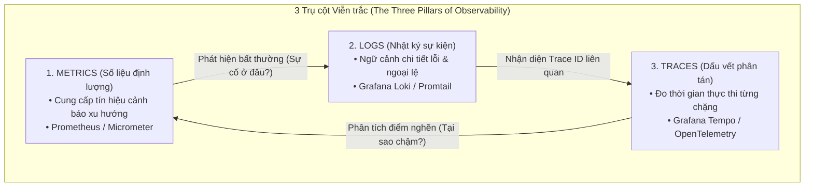
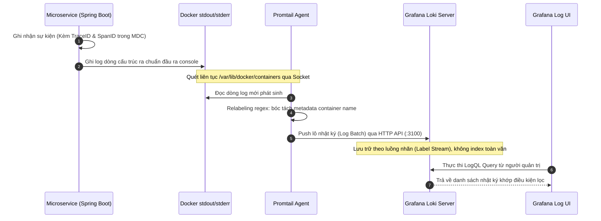
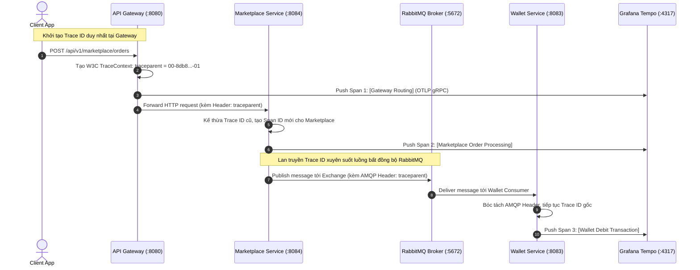

# CHƯƠNG 5. GIÁM SÁT HỆ THỐNG VÀ VIỄN TRẮC (MONITORING & OBSERVABILITY)

Trong một hệ thống phân tán gồm nhiều dịch vụ độc lập (Microservices) như Seika, việc kiểm soát trạng thái hoạt động, phát hiện sớm sự cố và chẩn đoán nguyên nhân gốc rễ (Root Cause Analysis - RCA) là một thách thức kỹ thuật phức tạp. Nếu chỉ kiểm tra trạng thái tĩnh theo mô hình giám sát truyền thống ("Hệ thống có đang sống hay không?"), kỹ sư vận hành không thể lý giải được nguyên nhân khi một chuỗi giao dịch mua sắm hoặc thanh toán bị trễ hoặc thất bại.

Chương này đi sâu trình bày việc hiện thực hóa hạ tầng **Khả năng quan sát toàn diện (Full-Stack Observability)** của nền tảng Seika. Thay vì sử dụng các công cụ rải rác hoặc các stack truyền thống (như ELK Stack kết hợp Jaeger riêng lẻ), Seika tích hợp đồng bộ hệ sinh thái **LGTM Stack (Loki - Grafana - Tempo - Prometheus)** kết hợp chuẩn mở **OpenTelemetry (OTLP)** và **Micrometer Actuator**, cung cấp cái nhìn thống nhất xuyên suốt các lớp ứng dụng, giao thức truyền thông và cơ sở dữ liệu.

---

## 5.1. Mô hình 3 trụ cột Viễn trắc và Tổng quan Kiến trúc Giám sát (The Three Pillars of Observability)

Hệ thống viễn trắc (Telemetry System) của Seika được thu thập và tổ chức xoay quanh ba trụ cột dữ liệu bổ trợ chặt chẽ cho nhau:



_Figure 5.1. Mối liên hệ tương quan hai chiều giữa 3 trụ cột viễn trắc trong hệ thống Seika._

1. **Metrics (Chỉ số định lượng thời gian thực)**: Dữ liệu dạng chuỗi thời gian (Time-series) đo lường các thuộc tính định lượng của hệ thống (như tỷ lệ yêu cầu thành công/thất bại, thời gian xử lý trung bình, tỷ lệ chiếm dụng bộ nhớ JVM Heap, tải CPU). Metrics có chi phí lưu trữ thấp, cho phép quét liên tục với tần suất cao để phát hiện bất thường ngay lập tức.
2. **Logs (Nhật ký cấu trúc)**: Dữ liệu ghi nhận chi tiết các sự kiện rời rạc xảy ra bên trong từng microservice (như ngoại lệ Java Exception, tham số yêu cầu đầu vào, trạng thái chuyển đổi đơn hàng). Do container Docker có tính chất vô thường (ephemeral), toàn bộ logs được thu thập tập trung về một kho lưu trữ bất biến.
3. **Traces (Dấu vết phân tán)**: Ghi nhận hành trình hoàn chỉnh của một yêu cầu (Request) từ lúc đi qua API Gateway, luân chuyển đồng bộ qua OpenFeign giữa các microservices, cho đến khi phát hành thông điệp bất đồng bộ qua RabbitMQ và tác động xuống CSDL. Traces cho phép xác định chính xác dịch vụ hoặc câu truy vấn SQL/MongoDB nào là điểm nghẽn gây trễ hệ thống.

### 5.1.1. Bảng cấu trúc thành phần giám sát (Observability Stack Registry)

Toàn bộ bộ công cụ giám sát được triển khai hoàn toàn tự động thông qua Docker Compose (`docker-compose.observability.yml`), chạy độc lập trong mạng ảo nội bộ `seika-network` nhằm không ảnh hưởng đến tài nguyên xử lý nghiệp vụ chính:

| Tín hiệu / Khả năng (Capability) | Công nghệ sử dụng (Technology) | Vai trò chi tiết trong hệ thống Seika                                                                                          | Phạm vi triển khai (Deployment Scope) |     Cổng giao tiếp (Port)      |
| :------------------------------- | :----------------------------- | :----------------------------------------------------------------------------------------------------------------------------- | :------------------------------------ | :----------------------------: |
| **Xuất dữ liệu Metrics**         | `Micrometer Actuator`          | Mở endpoint `/actuator/prometheus` tại tất cả 8 microservices và API Gateway, chuẩn hóa số liệu JVM & HTTP                     | Tích hợp trong Java Code (`pom.xml`)  |         `8080 - 8088`          |
| **Thu thập & Lưu trữ Metrics**   | `Prometheus Server`            | Quét (Scrape) định kỳ mỗi 15 giây toàn bộ các endpoint Actuator trong mạng nội bộ                                              | Docker Container (`prometheus`)       |             `9090`             |
| **Thu gom Logs Container**       | `Grafana Promtail`             | Gắn kết Docker Socket (`/var/run/docker.sock`) để đọc `stdout/stderr`, tự động gắn nhãn tên service và đẩy về Loki             | Docker Container Daemon (`promtail`)  |             `9080`             |
| **Lưu trữ Logs cấu trúc**        | `Grafana Loki v2.9.1`          | Lưu trữ và lập chỉ mục nhật ký tập trung không cần đánh chỉ mục toàn văn (chỉ đánh chỉ mục nhãn metadata) giúp tiết kiệm RAM   | Docker Container (`loki`)             |             `3100`             |
| **Thu thập & Lưu trữ Traces**    | `Grafana Tempo v2.4.1`         | Tiếp nhận luồng OTLP Traces từ `opentelemetry-exporter-otlp` qua giao thức gRPC tốc độ cao                                     | Docker Container (`tempo`)            | `4317` (gRPC)<br>`3200` (HTTP) |
| **Trực quan hóa Hợp nhất**       | `Grafana Dashboard`            | Giao diện quản trị trung tâm, kết nối đồng thời Prometheus, Loki và Tempo với khả năng tương quan dữ liệu (Correlated Queries) | Docker Container (`grafana`)          |             `3000`             |
| **Khám phá Dịch vụ động**        | `Netflix Eureka Server`        | Giám sát trạng thái nhịp tim (Heartbeat) và sơ đồ topology thực tế của các microservices                                       | Spring Boot Server (`eureka-server`)  |             `8761`             |
| **Giám sát Broker & Queue**      | `RabbitMQ Management UI`       | Trực quan hóa tốc độ xuất/nhập thông điệp, trạng thái Outbox/Inbox và Dead-Letter Exchange                                     | Docker Container (`rabbitmq`)         |            `15672`             |

_Table 5.1. Tổng hợp công nghệ và vai trò các thành phần trong bộ stack giám sát Seika._

---

### 5.1.2. Ma trận chẩn đoán vận hành (Diagnostic Question & Signal Matrix)

Bảng dưới đây minh họa cách kỹ sư vận hành sử dụng phối hợp các tín hiệu viễn trắc để trả lời các câu hỏi chẩn đoán thực tế khi vận hành nền tảng Seika:

| Tín hiệu viễn trắc (Signal)    | Câu hỏi chẩn đoán vận hành tiêu biểu                                                                                          | Kịch bản sử dụng thực tế trong nền tảng Seika                                                                                                                                            |
| :----------------------------- | :---------------------------------------------------------------------------------------------------------------------------- | :--------------------------------------------------------------------------------------------------------------------------------------------------------------------------------------- |
| **Metrics (`Prometheus`)**     | _"Hệ thống có đang bị suy thoái hiệu năng không?"_<br>_"Microservice nào đang chịu tải cao hoặc có tỷ lệ lỗi tăng đột biến?"_ | Giám sát biểu đồ tỷ lệ lỗi HTTP 5xx trên API Gateway; phát hiện sự gia tăng thời gian phản hồi (Latency P95/P99) tại `wallet-service` khi số lượng học viên nạp tiền tăng cao.           |
| **Logs (`Grafana Loki`)**      | _"Giao dịch lỗi xảy ra vì lý do nghiệp vụ gì?"_<br>_"Ngoại lệ (Exception) nào đã bị ném ra tại service đích?"_                | Lọc nhật ký của `marketplace-service` theo `orderId` để xem chi tiết thông báo lỗi từ tầng `GlobalExceptionHandler` (Ví dụ: `InsufficientBalanceException`).                             |
| **Traces (`Grafana Tempo`)**   | _"Thời gian thực thi bị tiêu tốn ở chặng nào?"_<br>_"Giao thức OpenFeign hay RabbitMQ đang gây nghẽn cổ chai?"_               | Phân tích waterfall chart của một giao dịch mua học liệu: xác định thời gian chờ giữa việc gửi `wallet.debit.requested` ra RabbitMQ và thời điểm nhận phản hồi `wallet.debit.succeeded`. |
| **Topology (`Eureka Server`)** | _"Các instance của microservice có đang đăng ký đầy đủ và khỏe mạnh không?"_                                                  | Kiểm tra trạng thái `UP` của 8 microservice và API Gateway trên Eureka Dashboard sau mỗi lần thực thi CI/CD Pipeline.                                                                    |
| **Queue Health (`RabbitMQ`)**  | _"Có hàng đợi nào đang bị tồn đọng tin nhắn chưa xử lý (Unacked/Ready backlog) không?"_                                       | Kiểm tra số lượng thông điệp chờ trong hàng đợi `marketplace.events` và `seika.events`; đảm bảo tiến trình Outbox Poller đang xuất tin nhắn mượt mà.                                     |

_Table 5.2. Ma trận câu hỏi chẩn đoán vận hành và ứng dụng tín hiệu viễn trắc tương ứng._

---

## 5.2. Nhật ký cấu trúc tập trung với Grafana Loki & Promtail (Centralized Structured Logging)

Trong các hệ thống phân tán, việc truy cập trực tiếp vào từng container qua `docker logs` là không khả thi. Seika hiện thực hóa quy trình tự động hóa thu thập nhật ký từ tầng ứng dụng đến kho lưu trữ tập trung:



_Figure 5.2. Quy trình thu thập, lập chỉ mục và truy vấn nhật ký tập trung với Promtail và Loki._

### 5.2.1. Chuẩn hóa ngữ cảnh chẩn đoán (MDC Log Formatting)

Tại tầng Spring Boot, thư viện `micrometer-tracing-bridge-otel` tự động chèn định danh theo dõi (`traceId`, `spanId`) vào bộ nhớ ngữ cảnh chẩn đoán ánh xạ (**MDC - Mapped Diagnostic Context**). Cấu hình xuất nhật ký trong `application.yaml` được chuẩn hóa để hiển thị rõ tên dịch vụ và mã theo dõi:

```yaml
logging:
  pattern:
    level: "%5p [%X{application:default},%X{traceId:-},%X{spanId:-}]"
```

Khi một sự kiện nghiệp vụ diễn ra, dòng nhật ký được xuất ra console có định dạng cấu trúc hoàn chỉnh:

```text
INFO  [wallet-service,8db8d4987f6a51ed76090464c02e062,5d68fc0b8d8f024] --- [nio-8083-exec-1] c.s.w.service.WalletService : Debiting balance for userId=d102e... amount=50.00 Seika Coin
```

### 5.2.2. Kỹ thuật bóc tách nhãn tự động với Promtail (Dynamic Relabeling)

Tác vụ `Promtail` được chạy với quyền truy cập chỉ đọc (`ro`) vào `/var/run/docker.sock` và `/var/lib/docker/containers`. Cấu hình `promtail-config.yaml` áp dụng biểu thức chính quy (Regex Relabeling) để chuyển đổi thuộc tính `__meta_docker_container_name` của Docker thành nhãn `container` trong Loki:

```yaml
scrape_configs:
  - job_name: container-logs
    docker_sd_configs:
      - host: unix:///var/run/docker.sock
    relabel_configs:
      - source_labels: [__meta_docker_container_name]
        regex: "/(.*)"
        target_label: "container"
```

### 5.2.3. Các truy vấn LogQL điển hình trong điều tra sự cố (Practical LogQL Queries)

Khi điều tra sự cố trên giao diện Grafana Explore, kỹ sư vận hành sử dụng ngôn ngữ **LogQL** để truy xuất và lọc log cực nhanh:

1. **Lọc toàn bộ log lỗi (ERROR) của dịch vụ Ví thanh toán (`wallet-service`)**:
   ```logql
   {container="seika-wallet-service-1"} |= "ERROR"
   ```
2. **Tìm kiếm toàn bộ chuỗi sự kiện liên quan đến một đơn hàng mua học liệu cụ thể (`orderId`) trên sàn Marketplace**:
   ```logql
   {container=~"seika-marketplace-service-1|seika-wallet-service-1"} |= "orderId=ORD-20260710-9981"
   ```
3. **Thống kê tốc độ phát sinh lỗi (Error Rate) theo khoảng thời gian 5 phút**:
   ```logql
   sum(rate({container=~"seika-.*"} |= "Exception" [5m])) by (container)
   ```

---

## 5.3. Thu thập Số liệu Thời gian thực và Trực quan hóa Phương pháp RED (Prometheus & RED Metrics)

### 5.3.1. Pipeline thu thập Pull-Based với Prometheus

Khác với mô hình Push (đẩy dữ liệu), Prometheus sử dụng mô hình **Pull-Based** (kéo dữ liệu), định kỳ mỗi 15 giây (`scrape_interval: 15s`) kết nối đến endpoint `/actuator/prometheus` của 8 microservice và API Gateway để thu thập số liệu thời gian thực theo chuẩn OpenMetrics.

```yaml
scrape_configs:
  - job_name: "spring-boot-actuator"
    metrics_path: "/actuator/prometheus"
    static_configs:
      - targets:
          - "identity-service:8081"
          - "profile-service:8082"
          - "wallet-service:8083"
          - "marketplace-service:8084"
          - "reward-service:8085"
          - "flashcard-service:8086"
          - "quiz-service:8087"
          - "notification-service:8088"
          - "api-gateway:8080"
```

### 5.3.2. Chuẩn hóa giám sát theo Phương pháp RED (RED Method Implementation)

Bảng điều khiển trung tâm tại Grafana (`Spring Boot 3.x Statistics Dashboard`) được thiết kế tuân thủ nghiêm ngặt **Phương pháp RED (Rate - Errors - Duration)** dành cho vi dịch vụ hướng sự kiện:

1. **Rate (Tần suất yêu cầu - Throughput)**: Tổng số lượng yêu cầu HTTP tiếp nhận trên mỗi giây (RPS).
   - _Truy vấn PromQL_:
     ```promql
     sum(rate(http_server_requests_seconds_count{application="marketplace-service"}[1m]))
     ```
2. **Errors (Tỷ lệ lỗi - Error Ratio)**: Tỷ lệ phần trăm các yêu cầu trả về mã lỗi HTTP `5xx` (Internal Server Error) hoặc `4xx` (Client Error).
   - _Truy vấn PromQL_:
     ```promql
     sum(rate(http_server_requests_seconds_count{application="marketplace-service", outcome="SERVER_ERROR"}[1m]))
     /
     sum(rate(http_server_requests_seconds_count{application="marketplace-service"}[1m])) * 100
     ```
3. **Duration (Độ trễ xử lý - Latency Percentiles)**: Thời gian thực thi yêu cầu theo các phân vị **P95** (95% yêu cầu nhanh hơn mốc này) và **P99** (99% yêu cầu nhanh hơn mốc này), giúp loại bỏ nhiễu của số trung bình cộng.
   - _Truy vấn PromQL (Phân vị P95)_:
     ```promql
     histogram_quantile(0.95, sum(rate(http_server_requests_seconds_bucket{application="marketplace-service"}[1m])) by (le))
     ```

Bên cạnh phương pháp RED cho tầng API, hệ thống kết hợp **Phương pháp USE (Utilization - Saturation - Errors)** để theo dõi sức khỏe nội tại của máy ảo Java (JVM):

- **JVM Heap Memory Utilization**: Giám sát lượng RAM bộ nhớ Heap đang sử dụng so với mức tối đa cho phép (`jvm_memory_used_bytes / jvm_memory_max_bytes`).
- **JVM Garbage Collection Overhead**: Theo dõi tần suất và thời gian dừng ứng dụng do bộ dọn rác (`jvm_gc_pause_seconds`).

---

## 5.4. Truy vết Phân tán Đầu-Cuối với Grafana Tempo & OpenTelemetry (Distributed Tracing)

Một trong những năng lực kỹ thuật phức tạp nhất được hiện thực hóa trong Seika là khả năng **Truy vết Phân tán xuyên suốt đa giao thức (Multi-Protocol Distributed Tracing)**, bao gồm cả các lời gọi HTTP đồng bộ (REST/OpenFeign) và luồng tin nhắn bất đồng bộ qua RabbitMQ.



_Figure 5.3. Cơ chế lan truyền ngữ cảnh W3C TraceContext xuyên suốt lời gọi HTTP và luồng sự kiện RabbitMQ._

### 5.4.1. Cơ chế Lan truyền Ngữ cảnh W3C TraceContext (Context Propagation)

Thư viện `opentelemetry-exporter-otlp` áp dụng tiêu chuẩn **W3C TraceContext**. Mỗi yêu cầu ban đầu đi vào API Gateway được tự động cấp một chuỗi nhận diện duy nhất theo định dạng:

```text
traceparent: 00-8db8d4987f6a51ed76090464c02e062-5d68fc0b8d8f024a-01
```

Trong đó:

- `8db8d4987f6a51ed76090464c02e062`: **Trace ID** (128-bit hex), giữ nguyên tuyệt đối qua toàn bộ hành trình của yêu cầu.
- `5d68fc0b8d8f024a`: **Span ID** (64-bit hex), định danh duy nhất cho từng chặng xử lý (Hop) tại một microservice.

### 5.4.2. Khả năng Tương quan Dữ liệu Hai chiều (Bi-directional Telemetry Correlation)

Điểm mạnh nhất của kiến trúc LGTM trong Seika là sự liên kết chặt chẽ giữa Logs và Traces được cấu hình tại `grafana-datasources.yaml`:

- **Từ Log sang Trace (`derivedFields`)**: Khi người quản trị xem một dòng nhật ký lỗi trên Loki có chứa `traceId=8db8d4987f6a...`, Grafana tự động chuyển đổi mã ID này thành một liên kết bấm được (Hyperlink). Khi click vào, Grafana mở ngay sơ đồ thác nước (Waterfall Trace Diagram) trên Tempo cho đúng giao dịch đó.
- **Từ Trace sang Log (`tracesToLogsV2`)**: Khi đang phân tích một Span xử lý trễ trên Tempo, nút tính năng **"View Logs for this Span"** cho phép lọc ngay lập tức chính xác các dòng nhật ký của microservice tương ứng phát sinh trong khung thời gian của Span đó.

---

## 5.5. Giám sát Hệ thống Hàng đợi và Trung gian Thông điệp (RabbitMQ Broker Monitoring)

Do kiến trúc thanh toán Marketplace và cấp quyền học liệu phụ thuộc vào mô hình Event-Driven Outbox/Inbox, sức khỏe của RabbitMQ Broker là yếu tố sống còn của hệ thống.

Tại cổng quản trị **RabbitMQ Management UI (`http://localhost:15672`)**, hệ thống được theo dõi qua các chỉ số trọng tâm:

1. **Message Rates (Tốc độ thông điệp)**: Theo dõi tốc độ xuất bản (`Publish rate`), tốc độ phân phối (`Deliver rate`) và tốc độ xác nhận thành công (`Ack rate`) trên các Exchange lõi (`marketplace.events`, `seika.events`).
2. **Queue Backlog (Lượng thông điệp tồn đọng)**: Kiểm tra số lượng thông điệp ở trạng thái `Ready` (chờ xử lý) và `Unacked` (đang xử lý nhưng chưa xác nhận hoàn tất). Sự gia tăng đột biến của `Unacked` là tín hiệu cho thấy microservice tiêu thụ (Consumer) đang gặp nghẽn CSDL hoặc ngoại lệ lặp lại.
3. **Dead-Letter Queue (DLQ) Tracking**: Giám sát các thông điệp bị xử lý lỗi vượt quá số lần thử lại cho phép (Retry Count threshold), được tự động chuyển hướng sang hàng đợi chết (`seika.dlq`) để kỹ sư kiểm tra thủ công mà không làm nghẽn luồng chính.

---

## 5.6. Giám sát Khám phá Dịch vụ & Topology Động (Netflix Eureka Service Registry)

Bản đồ kết nối và trạng thái khả dụng của hệ thống được quản lý trực tiếp tại bảng điều khiển **Netflix Eureka Registry Console (`http://localhost:8761`)**.

- **Heartbeat & Lease Renewal**: Mỗi microservice định kỳ 30 giây gửi tín hiệu nhịp tim (Heartbeat) về Eureka Server. Nếu một instance container bị sập hoặc mất kết nối mạng quá 90 giây (`Lease Expiration Duration`), Eureka tự động loại bỏ instance đó khỏi danh sách đăng ký (Registry Eviction), ngăn Gateway định tuyến lưu lượng vào container lỗi.
- **Self-Preservation Mode**: Trong trường hợp mạng nội bộ gặp biến động khiến nhiều service mất nhịp tim cùng lúc, Eureka tự động kích hoạt chế độ tự bảo vệ để không xóa nhầm các dịch vụ đang hoạt động tốt.

---

## 5.7. Ma trận Quản trị Vận hành & Cổng kết nối (Operational Access Matrix)

Để phục vụ công tác rà soát, đánh giá đồ án và kiểm thử vận hành, Bảng 5.3 tổng hợp chi tiết toàn bộ điểm truy cập của các công cụ quản trị trong mạng nội bộ Seika:

| Công cụ Quản trị (Operational Tool) | Đường dẫn truy cập cục bộ (Local Endpoint) | Thông tin Đăng nhập Mặc định (Default Access Credentials) | Mục đích Quản trị & Vận hành (Operational Scope)                                                   |
| :---------------------------------- | :----------------------------------------- | :-------------------------------------------------------- | :------------------------------------------------------------------------------------------------- |
| **API Gateway Entry Point**         | `http://localhost:8080`                    | _Public Entry / Bearer JWT_                               | Cổng điều phối chung, Swagger UI hợp nhất (`/webjars/swagger-ui/index.html`)                       |
| **Grafana Dashboard UI**            | `http://localhost:3000`                    | Tự động đăng nhập Admin (`GF_AUTH_ANONYMOUS=true`)        | Trực quan hóa hợp nhất Metrics, Logs, Traces và giám sát JVM/HTTP                                  |
| **Prometheus Server UI**            | `http://localhost:9090`                    | _No Authentication Required_                              | Giao diện kiểm tra Targets status, thực thi PromQL thô                                             |
| **Eureka Discovery UI**             | `http://localhost:8761`                    | _No Authentication Required_                              | Trực quan hóa danh sách 8 microservices đang đăng ký (UP/DOWN topology)                            |
| **RabbitMQ Management Console**     | `http://localhost:15672`                   | Username: `guest`<br>Password: `guest`                    | Quản trị Exchanges, Queues, kiểm tra Backlog & Dead-Letter Messages                                |
| **PostgreSQL Database Engine**      | `localhost:5432`                           | Username: `postgres`<br>Password: _(Cấu hình trong env)_  | Truy xuất 5 CSDL quan hệ (`identity_db`, `profile_db`, `wallet_db`, `marketplace_db`, `reward_db`) |
| **MongoDB Database Engine**         | `localhost:27017`                          | _No Authentication Required (Dev mode)_                   | Truy xuất 3 CSDL tài liệu (`flashcard_db`, `quiz_db`, `notification_db`)                           |

_Table 5.3. Ma trận cổng kết nối và công cụ quản trị vận hành nền tảng Seika._

---

## 5.8. Chỉ dẫn Đánh giá & Bằng chứng Vận hành Thực tế cho Báo cáo (Empirical Verification Guide)

> [!IMPORTANT]
> **[HƯỚNG DẪN DÀNH CHO SINH VIÊN HOÀN THIỆN HÌNH ẢNH MINH CHỨNG TRONG BÁO CÁO ĐỒ ÁN]**  
> Để phần đánh giá thực nghiệm (Empirical Evaluation) của Chương 5 đạt điểm tuyệt đối trước Hội đồng bảo vệ, bạn cần chạy hệ thống thực tế và bổ sung **6 ảnh chụp màn hình minh chứng (Screenshots)** vào các vị trí dưới đây:

### 1. Minh chứng 1: Bảng điều khiển Grafana Spring Boot Metrics (RED Method Dashboard)

- **Cách thực hiện**:
  1. Chạy lệnh: `docker compose -f docker-compose.yml -f docker-compose.observability.yml up -d`
  2. Tạo lưu lượng test bằng cách đăng nhập hoặc mua sản phẩm trên giao diện React (`http://localhost:5173`).
  3. Mở trình duyệt truy cập Grafana: `http://localhost:3000/d/spring_boot_21/spring-boot-3-x-statistics`
  4. Chọn mục **Application** -> `marketplace-service` hoặc `wallet-service`.
- **Chụp ảnh màn hình và chú thích**:
  - _Hình ảnh đặt tại đây: Chụp toàn bộ Dashboard hiển thị rõ các đồ thị CPU Usage, JVM Heap Memory, Request Rate và Error Rate._
  - _Caption gợi ý_: **Figure 5.4. Bảng điều khiển giám sát hiệu năng thực tế (RED & USE Metrics) của Marketplace Service trên Grafana.**

### 2. Minh chứng 2: Giao diện truy vấn nhật ký tập trung Grafana Explore (Loki Structured Logs)

- **Cách thực hiện**:
  1. Tại Grafana (`http://localhost:3000`), chọn thanh menu trái -> **Explore** -> Chọn nguồn dữ liệu **Loki**.
  2. Nhập câu lệnh LogQL lọc nhật ký của ví thanh toán: `{container="seika-wallet-service-1"}`
  3. Bấm **Run query** để hiển thị danh sách nhật ký có chứa `traceId` và thông điệp thanh toán.
- **Chụp ảnh màn hình và chú thích**:
  - _Hình ảnh đặt tại đây: Chụp màn hình kết quả nhật ký có nổi bật (Highlight) các chuỗi `traceId=...` trong dòng log._
  - _Caption gợi ý_: **Figure 5.5. Giao diện điều tra nhật ký cấu trúc tập trung từ kho dữ liệu Loki thông qua truy vấn LogQL.**

### 3. Minh chứng 3: Sơ đồ thác nước phân tích vết giao dịch phân tán (Grafana Tempo Distributed Tracing)

- **Cách thực hiện**:
  1. Trong màn hình kết quả log của Loki ở Bước 2, nhấp chuột vào đường dẫn màu xanh **Tempo** nằm cạnh một mã `traceId` bất kỳ của giao dịch mua học liệu.
  2. Màn hình Grafana hiển thị biểu đồ Waterfall Trace chi tiết từng bước xử lý qua các microservice.
- **Chụp ảnh màn hình và chú thích**:
  - _Hình ảnh đặt tại đây: Chụp biểu đồ Waterfall Trace thể hiện rõ luồng đi từ `api-gateway` -> `marketplace-service` -> `wallet-service` kèm thời gian thực thi (ms)._
  - _Caption gợi ý_: **Figure 5.6. Biểu đồ thác nước (Waterfall Trace) truy vết phân tán đầu-cuối một giao dịch mua học liệu qua Grafana Tempo.**

### 4. Minh chứng 4: Sơ đồ Topology Khám phá Dịch vụ động (Netflix Eureka Registry Dashboard)

- **Cách thực hiện**:
  1. Mở trình duyệt truy cập Eureka Server: `http://localhost:8761`
  2. Đảm bảo phần **Instances currently registered with Eureka** hiển thị trạng thái `UP (1)` cho đầy đủ 8 microservices và `API-GATEWAY`.
- **Chụp ảnh màn hình và chú thích**:
  - _Hình ảnh đặt tại đây: Chụp toàn bộ bảng danh sách dịch vụ đã đăng ký thành công trên Eureka Dashboard._
  - _Caption gợi ý_: **Figure 5.7. Giao diện giám sát trạng thái sức khỏe và đăng ký dịch vụ động trên Netflix Eureka Server.**

### 5. Minh chứng 5: Giám sát luồng thông điệp bất đồng bộ (RabbitMQ Management Console)

- **Cách thực hiện**:
  1. Truy cập RabbitMQ UI: `http://localhost:15672` (đăng nhập `guest`/`guest`).
  2. Chuyển sang tab **Exchanges** -> Nhấp vào `marketplace.events` hoặc tab **Queues** để xem tốc độ chuyển tiếp thông điệp (`Message rates`).
- **Chụp ảnh màn hình và chú thích**:
  - _Hình ảnh đặt tại đây: Chụp đồ thị thông lượng tin nhắn trên RabbitMQ Exchange `marketplace.events`._
  - _Caption gợi ý_: **Figure 5.8. Giao diện giám sát lưu lượng và trạng thái hàng đợi thông điệp trên RabbitMQ Management Console.**

### 6. Minh chứng 6: Danh sách mục tiêu thu thập số liệu (Prometheus Targets Status)

- **Cách thực hiện**:
  1. Truy cập Prometheus: `http://localhost:9090/targets`
  2. Kiểm tra nhóm job `spring-boot-actuator`, đảm bảo tất cả các endpoint `/actuator/prometheus` của microservices đều có trạng thái **UP** màu xanh lá.
- **Chụp ảnh màn hình và chú thích**:
  - _Hình ảnh đặt tại đây: Chụp trang danh sách Targets của Prometheus cho thấy 100% microservice đang UP._
  - _Caption gợi ý_: **Figure 5.9. Trạng thái thu thập số liệu thời gian thực từ các microservice trên Prometheus Targets.**
