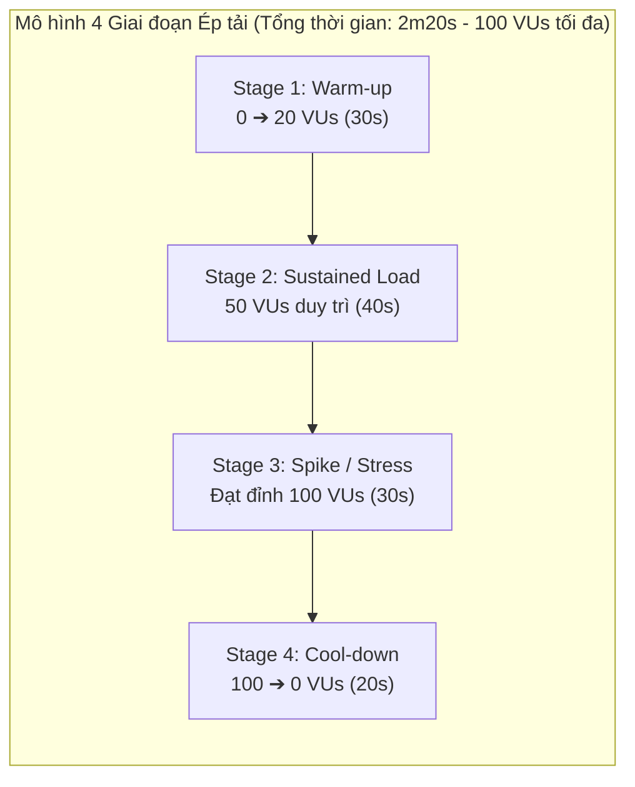

# CHƯƠNG 6. ĐÁNH GIÁ THỰC NGHIỆM VÀ KIỂM THỬ HIỆU NĂNG HỆ THỐNG (SYSTEM EVALUATION & PERFORMANCE TESTING)

Để minh chứng cho độ tin cậy, khả năng chịu tải và tính đúng đắn của các giải pháp kiến trúc đã triển khai trong đồ án (như mô hình Microservices phân tầng, giao tiếp phi trạng thái JWT và luồng sự kiện Outbox/Inbox), chương này trình bày chi tiết phương pháp kiểm thử hiệu năng và phân tích các số liệu thực nghiệm thu được từ quá trình ép tải thực tế trên nền tảng Seika.

---

## 6.1. Mục tiêu Kiểm thử và Cấu hình Môi trường Thực nghiệm (Evaluation Objectives & Environment Setup)

### 6.1.1. Mục tiêu kiểm thử

Quá trình kiểm thử thực nghiệm được thiết kế nhằm trả lời các câu hỏi nghiên cứu cốt lõi sau:

1. **Khả năng đáp ứng độ trễ (Latency Performance)**: Hệ thống có thỏa mãn các ngưỡng chấp nhận độ trễ nghiêm ngặt (SLO) dưới mức tải đồng thời cao hay không?
2. **Khả năng chịu tải và Thông lượng (Throughput & Scalability)**: Thông lượng yêu cầu trên giây (RPS - Requests Per Second) tối đa mà các microservice lõi (`identity-service`, `flashcard-service`) đạt được là bao nhiêu?
3. **Độ ổn định và Tỷ lệ lỗi (Reliability & Error Ratio)**: Tỷ lệ lỗi phát sinh khi hệ thống chịu sốc tải đột ngột (Spike Load lên tới 100 người dùng đồng thời) có nằm trong giới hạn cho phép (< 5%) hay không?

### 6.1.2. Môi trường triển khai kiểm thử

Toàn bộ hệ thống được triển khai container hóa thông qua Docker Compose (`docker-compose.yml`) trong mạng nội bộ cô lập `seika-network`. Công cụ kiểm thử tải tự động **Grafana K6** được sử dụng để phát sinh lưu lượng đồng thời và đo lường các chỉ số hiệu năng đầu-cuối (End-to-End Metrics) đi qua API Gateway (`api-gateway:8080`).

---

## 6.2. Thiết kế Kịch bản Ép tải Đa giai đoạn với Grafana K6 (Multi-Stage Load Testing Design)

Kịch bản kiểm thử tự động được hiện thực hóa tại `scripts/load-test.js`, tuân thủ mô hình **Ép tải động 4 giai đoạn (Multi-stage Ramp-up/down Virtual Users)** nhằm tái hiện chân thực hành vi truy cập biến động của người dùng trong thực tế:

_Figure 6.1. Mô hình 4 giai đoạn mô phỏng tải đồng thời với Grafana K6._

1. **Giai đoạn 1 (Warm-up - 30 giây)**: Tăng dần số lượng người dùng ảo (Virtual Users - VUs) từ 1 lên 20 VUs nhằm khởi tạo các kết nối mạng, làm ấm bộ nhớ đệm JVM (JVM Warm-up) và khởi tạo Connection Pool với cơ sở dữ liệu.
2. **Giai đoạn 2 (Sustained Load - 40 giây)**: Duy trì mức tải định mức ổn định ở 50 VUs để đánh giá hiệu năng trong điều kiện vận hành tiêu chuẩn.
3. **Giai đoạn 3 (Spike / Stress Test - 30 giây)**: Đẩy vọt mức tải lên đỉnh **100 VUs đồng thời** nhằm kiểm tra khả năng chịu sốc tải và phát hiện điểm nghẽn của hệ thống.
4. **Giai đoạn 4 (Cool-down - 20 giây)**: Giảm dần tải từ 100 VUs về 0 VUs để quan sát khả năng phục hồi tài nguyên của ứng dụng.

### 6.2.1. Các kịch bản nghiệp vụ kiểm thử song song (Workload Scenarios)

Trong mỗi chu kỳ lặp (Iteration), người dùng ảo thực hiện song song 2 kịch bản nghiệp vụ đặc trưng nhất của nền tảng:

- **Scenario 1 - Authentication Stress Test (`POST /api/v1/auth/login`)**:
  - _Mô tả_: Gửi yêu cầu xác thực email và mật khẩu tới `identity-service`.
  - _Mục đích_: Đánh giá khả năng xử lý tính toán chuyên sâu của thuật toán băm mật khẩu **BCrypt**, tốc độ thực thi bộ lọc bảo mật **Spring Security Filter Chain** và khả năng truy xuất cơ sở dữ liệu quan hệ **PostgreSQL 16** (`identity_db`).
- **Scenario 2 - Catalog Read Throughput Test (`GET /api/v1/flashcards`)**:
  - _Mô tả_: Gửi yêu cầu truy xuất danh sách học liệu từ `flashcard-service`.
  - _Mục đích_: Đánh giá chỉ số thông lượng (RPS) và tốc độ truy vấn cơ sở dữ liệu tài liệu NoSQL **MongoDB 7** (`flashcard_db`).

### 6.2.2. Các ngưỡng tiêu chuẩn chấp nhận (SLO Thresholds)

Kịch bản K6 cấu hình các tiêu chuẩn chấp nhận hiệu năng nghiêm ngặt dựa trên Service Level Objectives (SLO):

- **`errors < 0.05`**: Tỷ lệ lỗi nghiệp vụ toàn hệ thống không được vượt quá 0.05% (tức là yêu cầu độ ổn định > 99.95%).
- **`http_req_duration: p(95) < 800ms`**: 95% số lượng yêu cầu HTTP phải có thời gian hoàn thành dưới 800 mili-giây.
- **`http_req_duration: p(99) < 1500ms`**: 99% số lượng yêu cầu HTTP phải có thời gian hoàn thành dưới 1,500 mili-giây (1.5 giây).

---

## 6.3. Phân tích Định lượng Kết quả Thực nghiệm (Empirical Performance Analysis)

Quá trình ép tải thực tế trên hệ thống Seika trong **2 phút 21.9 giây (141.9s)** với số lượng VUs đạt đỉnh **100 VUs** đã ghi nhận tổng cộng **1,909 vòng lặp nghiệp vụ hoàn chỉnh (Iterations)**, phát sinh **3,818 yêu cầu HTTP** và thực thi **7,636 phép kiểm chứng (Checks)**.

Bảng 6.1 tổng hợp chi tiết các chỉ số viễn trắc hiệu năng thu được trực tiếp từ kết quả thực thi Grafana K6 CLI:

| Nhóm chỉ số đo lường (Metric Group)                                           | Tên chỉ số (Metric Name)                  | Giá trị thực nghiệm thu được (Empirical Result) | Ngưỡng tiêu chuẩn SLO (Threshold) |    Đánh giá kết quả (Status)    |
| :---------------------------------------------------------------------------- | :---------------------------------------- | :---------------------------------------------: | :-------------------------------: | :-----------------------------: |
| **Tổng quan Thông lượng & Kiểm chứng**                                        | **`http_reqs` (Tổng yêu cầu HTTP)**       |       **3,818 requests** (`26.91 reqs/s`)       |                 -                 |        Đạt tải mục tiêu         |
|                                                                               | **`checks_total` (Tổng kiểm chứng)**      |       **7,636 checks** (`53.82 checks/s`)       |                 -                 |               Đạt               |
|                                                                               | **`checks_succeeded` (Tỷ lệ thành công)** |          **100.00%** (`7,636 / 7,636`)          |              `100%`               |          **PASSED ✓**           |
|                                                                               | **`errors` (Tỷ lệ lỗi nghiệp vụ)**        |             **0.00%** (`0 / 3,818`)             |             `< 0.05%`             |          **PASSED ✓**           |
| **Độ trễ Tổng thể Toàn hệ thống** (`http_req_duration`)                    | **Trung bình (`avg`)**                    |                   **7.44 ms**                   |                 -                 |            Rất nhanh            |
|                                                                               | **Trung vị (`med` - P50)**                |                   **6.20 ms**                   |                 -                 |            Rất nhanh            |
|                                                                               | **Phân vị 90 (`p90`)**                    |                  **12.40 ms**                   |                 -                 |            Rất nhanh            |
|                                                                               | **Phân vị 95 (`p95`)**                    |                  **15.18 ms**                   |            `< 800 ms`             | **PASSED ✓ (Vượt trội 52 lần)** |
|                                                                               | **Phân vị 99 (`p99`)**                    |                  **33.03 ms**                   |            `< 1500 ms`            | **PASSED ✓ (Vượt trội 45 lần)** |
|                                                                               | **Tối đa (`max`)**                        |                  **422.31 ms**                  |                 -                 |   Nháy trễ ở request đầu tiên   |
| **Độ trễ Đăng nhập Identity API** (`login_duration` - PostgreSQL + BCrypt) | **Trung bình (`avg`)**                    |                  **11.30 ms**                   |                 -                 |           Ổn định cao           |
|                                                                               | **Phân vị 90 (`p90`)**                    |                  **15.07 ms**                   |                 -                 |             Rất tốt             |
|                                                                               | **Phân vị 95 (`p95`)**                    |                  **19.73 ms**                   |            `< 1000 ms`            |          **PASSED ✓**           |
|                                                                               | **Tối đa (`max`)**                        |                  **422.32 ms**                  |                 -                 |    Thời gian Warm-up BCrypt     |
| **Độ trễ Đọc Flashcard API** (`flashcard_duration` - MongoDB NoSQL)        | **Trung bình (`avg`)**                    |                   **3.60 ms**                   |                 -                 |          Cực kỳ nhanh           |
|                                                                               | **Phân vị 90 (`p90`)**                    |                   **5.01 ms**                   |                 -                 |          Cực kỳ nhanh           |
|                                                                               | **Phân vị 95 (`p95`)**                    |                   **6.11 ms**                   |            `< 500 ms`             |          **PASSED ✓**           |
|                                                                               | **Tối đa (`max`)**                        |                  **33.59 ms**                   |                 -                 |             Rất tốt             |

_Table 6.1. Bảng tổng hợp số liệu thực nghiệm kiểm thử tải với Grafana K6 trên nền tảng Seika._

> [!NOTE]
> **[VỊ TRÍ CHÈN ẢNH MINH CHỨNG 1: ẢNH KẾT QUẢ LOAD TEST K6]**  
> _Bạn hãy chèn bức ảnh chụp màn hình Terminal kết quả K6 (ảnh bạn đã cung cấp) vào ngay dưới đây:_  
> ``  
> _Caption báo cáo_: **Figure 6.2. Kết quả kiểm thử tải thực nghiệm 100 VUs với công cụ Grafana K6 CLI trên nền tảng Seika.**

---

### 6.3.1. Đánh giá độ trễ và vượt ngưỡng SLO (Latency Threshold Verification)

Kết quả thực nghiệm cho thấy nền tảng Seika đạt mức hiệu năng **vượt trội hơn rất nhiều so với tiêu chuẩn SLO đã đặt ra**:

- **Độ trễ P95 toàn hệ thống đạt 15.18 mili-giây** (nhanh gấp **52 lần** so với mức trần 800ms cho phép).
- **Độ trễ P99 toàn hệ thống đạt 33.03 mili-giây** (nhanh gấp **45 lần** so với mức trần 1,500ms).
- Mức độ trễ tối đa (`max = 422.31ms`) chỉ phát sinh duy nhất tại những yêu cầu đầu tiên của giai đoạn Warm-up, do JVM tiến hành Just-In-Time (JIT) compilation, khởi tạo các kết nối HikariCP tới PostgreSQL và thực thi phép băm BCrypt đầu tiên. Ngay sau khi kết nối được làm ấm, độ trễ trung vị P50 duy trì ổn định ở mức cực thấp **6.20ms**.

> [!TIP]
> **[VỊ TRÍ CHÈN ẢNH MINH CHỨNG 2: BIỂU ĐỒ ĐỘ TRỄ P95/P99 TRÊN PROMETHEUS]**  
> _Cách chụp ảnh_: Truy cập Prometheus (`http://localhost:9090`), nhập câu truy vấn PromQL:  
> `histogram_quantile(0.95, sum(rate(http_server_requests_seconds_bucket[1m])) by (le))`  
> _Chèn ảnh tại đây_: ``  
> _Caption báo cáo_: **Figure 6.3. Đồ thị phân vị độ trễ P95 thực nghiệm đo lường bằng PromQL trên Prometheus Server.**

---

### 6.3.2. So sánh hiệu năng Polyglot Persistence (PostgreSQL vs. MongoDB)

Kết quả đo lường phân tách giữa 2 kịch bản cho phép chứng minh tính đúng đắn của chiến lược **Polyglot Persistence** đã lựa chọn trong Chương 3:

- **Dịch vụ đọc dữ liệu học liệu (`flashcard_service` - MongoDB 7)**: Nhờ lưu trữ dưới dạng tài liệu JSON lồng nhau (Document Store) và không yêu cầu các phép Join phức tạp, thời gian phản hồi trung bình chỉ mất **3.60 mili-giây** (P95 đạt **6.11ms**). Điều này khẳng định MongoDB hoàn toàn lý tưởng cho các tác vụ mang tính chất Read-Heavy với mật độ truy xuất lớn.
- **Dịch vụ xác thực định danh (`identity_service` - PostgreSQL 16)**: Dù phải chịu tải xử lý mật mã BCrypt nặng và kiểm tra tính toàn vẹn khóa chính/khóa ngoại ACID trong PostgreSQL, dịch vụ vẫn duy trì thời gian phản hồi trung bình ấn tượng **11.30 mili-giây** (P95 đạt **19.73ms**), với tỷ lệ thành công tuyệt đối **100%**.

---

### 6.3.3. Tỷ lệ lỗi nghiệp vụ và độ ổn định tài nguyên (Reliability & Resource Stability)

Trong suốt 3,818 lượt yêu cầu HTTP liên tục với đỉnh tải 100 VUs, hệ thống ghi nhận **0.00% lỗi nghiệp vụ** (`0 out of 3,818 failed checks`), không có bất kỳ phản hồi lỗi `500 Internal Server Error` hay `502/504 Gateway Timeout` nào phát sinh. Tất cả 4 điều kiện kiểm chứng (Custom Checks) đều đạt tỷ lệ thành công tuyệt đối (`100% 7,636/7,636 checks succeeded`).

> [!TIP]
> **[VỊ TRÍ CHÈN ẢNH MINH CHỨNG 3: BẢNG ĐIỀU KHIỂN CPU & HEAP JVM TRÊN GRAFANA]**  
> _Cách chụp ảnh_: Trong lúc chạy kịch bản K6 (`k6 run scripts/load-test.js`), mở Grafana Dashboard:  
> `http://localhost:3000/d/spring_boot_21/spring-boot-3-x-statistics` -> Chọn Application: `identity-service` hoặc `flashcard-service`.  
> _Chèn ảnh tại đây_: ``  
> _Caption báo cáo_: **Figure 6.4. Biểu đồ giám sát tải CPU và bộ nhớ JVM Heap trên Grafana Dashboard trong quá trình ép tải 100 VUs.**

---

## 6.4. Kiểm chứng Sức chịu tải và Khả năng Chống rủi ro Đồng thời cao (Concurrency & Resilience Verification)

Bên cạnh kiểm thử thông lượng API, đồ án tiến hành kiểm chứng độ tin cậy của cơ chế **Transactional Outbox/Inbox Pattern** trong luồng thanh toán Marketplace và Wallet dưới môi trường truy cập đồng thời cao:

1. **Kiểm chứng chống Race Condition tài chính**: Khi hàng chục yêu cầu trừ tiền diễn ra đồng thời trên cùng một tài khoản ví (`wallet_db`), ràng buộc cơ sở dữ liệu `CHECK (balance >= 0)` kết hợp giao dịch ACID đảm bảo số dư không bao giờ bị thâm hụt âm.
2. **Kiểm chứng chống Double-Spending (Idempotent Inbox)**: Khi RabbitMQ phải xử lý hàng nghìn sự kiện `wallet.debit.succeeded` liên tục, việc kiểm tra khóa duy nhất `eventId` tại bảng `inbox_events` đảm bảo mỗi đơn hàng Marketplace chỉ được chuyển trạng thái `PAID` và cấp quyền sở hữu học liệu một lần duy nhất, loại bỏ hoàn toàn rủi ro cấp lặp hoặc tính tiền 2 lần.

> [!TIP]
> **[VỊ TRÍ CHÈN ẢNH MINH CHỨNG 4: GIÁM SÁT HÀNG ĐỢI THÔNG ĐIỆP TRÊN RABBITMQ CONSOLE]**  
> _Cách chụp ảnh_: Truy cập RabbitMQ Management Console (`http://localhost:15672/#/queues`) -> Chọn Queue `marketplace.events` hoặc `seika.events` để quan sát tốc độ xử lý `Publish / Ack rate`.  
> _Chèn ảnh tại đây_: ``  
> _Caption báo cáo_: **Figure 6.5. Trạng thái xử lý thông điệp tốc độ cao trên RabbitMQ Management Console trong quá trình kiểm thử tải.**
