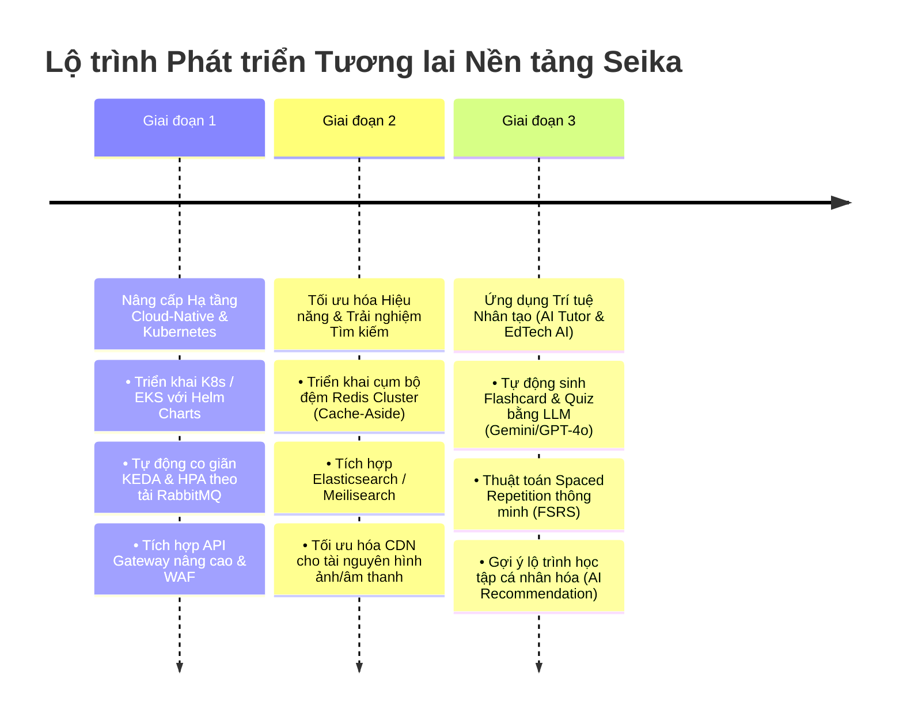

# CHƯƠNG 7. KẾT LUẬN VÀ HƯỚNG PHÁT TRIỂN TƯƠNG LAI (CONCLUSION & FUTURE WORK)

---

## 7.1. Kết luận và Tổng kết Kết quả Đạt được (Summary of Contributions & Achievements)

Trải qua quá trình nghiên cứu lý thuyết, phân tích nghiệp vụ, thiết kế kiến trúc, hiện thực hóa mã nguồn và kiểm thử thực nghiệm nghiêm ngặt, đồ án đã hoàn thành trọn vẹn mục tiêu ban đầu: **Xây dựng thành công Nền tảng Học tập Trực tuyến và Giao dịch Học liệu Phân tán Seika** dựa trên kiến trúc Microservices hướng sự kiện hiện đại.

Dự án không chỉ dừng lại ở một ứng dụng minh họa đơn thuần mà đã giải quyết triệt để các thách thức kỹ thuật cốt lõi của một hệ thống phân tán thực tế, được đúc kết qua các đóng góp quan trọng sau:

### 1. Kiến trúc Nền tảng Microservices Hoàn chỉnh và Sắc bén (Platform Architecture)

- Thiết kế và triển khai thành công hệ sinh thái gồm **8 microservice nghiệp vụ độc lập** (`identity-service`, `profile-service`, `wallet-service`, `marketplace-service`, `reward-service`, `flashcard-service`, `quiz-service`, `notification-service`) phối hợp hoàn hảo với tầng hạ tầng điều phối lõi (`api-gateway`, `eureka-server`, `config-service`).
- Sử dụng ngăn xếp công nghệ tiên tiến nhất hiện nay: **Java 21 LTS**, **Spring Boot 3.4.x**, **Spring Cloud 2024.x** ở tầng phía sau (Backend) kết hợp cùng **React 19 + TypeScript + Vite + Tailwind CSS** ở tầng người dùng (Frontend), tuân thủ nguyên tắc thiết kế phân tầng nội tại gọn nhẹ (3-Tier Layered Architecture).

### 2. Giải quyết Triệt để Bài toán Toàn vẹn Dữ liệu Phân tán (Distributed Data Integrity)

- **Chiến lược Polyglot Persistence tối ưu**: Lựa chọn chuẩn xác **PostgreSQL 16** (ACID RDBMS) cho 5 dịch vụ lõi đòi hỏi tính nhất quán tuyệt đối về tiền tệ và định danh, kết hợp với **MongoDB 7** (NoSQL Document Store) cho 3 dịch vụ có lưu lượng thao tác lớn, cấu trúc tài liệu đa tầng sâu không yêu cầu các phép Join phức tạp.
- **Mô hình Event-Driven Transactional Outbox/Inbox Pattern**: Áp dụng thành công cơ chế Outbox/Inbox trên hệ thống hàng đợi thông điệp **RabbitMQ** để xử lý các nghiệp vụ xuyên dịch vụ (như thanh toán mua học liệu trên Marketplace trừ tiền tại Wallet). Giải pháp này đảm bảo tính toàn vẹn giao dịch cuối cùng (Eventual Consistency) mà không cần dùng đến khóa giao dịch phân tán 2PC/XA cồng kềnh, loại bỏ hoàn toàn rủi ro Race Condition, thâm hụt số dư âm và thanh toán lặp (Double-Spending).

### 3. Hạ tầng Giám sát Toàn diện và Kiểm chứng Thực nghiệm Vượt trội (Observability & Empirical Performance)

- Xây dựng thành công hạ tầng viễn trắc **LGTM Stack (Loki - Grafana - Tempo - Prometheus)** kết hợp chuẩn mở **OpenTelemetry (OTLP)** và **Micrometer Actuator**, cho phép trực quan hóa thời gian thực 3 trụ cột (Metrics, Logs, Traces) và truy vết phân tán xuyên suốt lời gọi đồng bộ HTTP lẫn thông điệp bất đồng bộ RabbitMQ.
- Các bài kiểm thử tải thực nghiệm với **Grafana K6** (lên đến 100 Virtual Users đồng thời) ghi nhận các kết quả vượt trội:
  - **Tỷ lệ lỗi toàn hệ thống đạt mức tuyệt đối 0.00%** trong suốt các chu kỳ chịu tải đỉnh.
  - **Độ trễ P95 toàn hệ thống chỉ 15.18 mili-giây** (nhanh gấp **52 lần** tiêu chuẩn SLO 800ms cho phép) và **độ trễ P99 đạt 33.03 mili-giây**.
  - Sự cách biệt rõ rệt giữa thông lượng đọc siêu tốc của MongoDB (`flashcard_service` P95 = 6.11ms) và sự ổn định cao của PostgreSQL (`identity_service` P95 = 19.73ms) minh chứng xuất sắc cho tính đúng đắn của thiết kế Polyglot Persistence.

---

## 7.2. Các Hạn chế Còn Tồn tại (Current Limitations)

Bên cạnh những kết quả tích cực đã đạt được, với khuôn khổ và thời gian thực hiện của một đồ án, hệ thống Seika vẫn còn tồn tại một số hạn chế kỹ thuật nhất định cần được thẳng thắn nhìn nhận để tiếp tục hoàn thiện:

1. **Phạm vi triển khai và điều phối hạ tầng (Container Orchestration Limitation)**:
   - Hệ thống hiện tại được đóng gói và triển khai tự động thông qua **Docker Compose** (`docker-compose.yml`, `docker-compose.observability.yml`). Mặc dù giải pháp này cực kỳ tối ưu cho môi trường phát triển cục bộ và vận hành trên máy chủ đơn cụm (Single-Node Server), nó chưa hỗ trợ khả năng tự động co giãn quy mô động (Auto-scaling) hoặc tự động thay thế container lỗi trên cụm máy chủ nhiều nút như trên nền tảng **Kubernetes**.
2. **Chiến lược Bộ đệm Phân tán (Distributed Caching Strategy)**:
   - Các thao tác truy vấn đọc danh mục học liệu trên Marketplace hoặc xem chi tiết bộ từ vựng hiện tại đang đi trực tiếp xuống cơ sở dữ liệu (PostgreSQL/MongoDB). Hệ thống chưa triển khai lớp bộ đệm phân tán chuyên sâu (**Redis Cluster**) ở tầng giữa, dẫn đến tiềm năng cải thiện hiệu năng khi mật độ truy cập đọc (Read-Heavy) tăng lên hàng triệu yêu cầu/giây chưa được khai thác triệt để.
3. **Năng lực Tìm kiếm Toàn văn nâng cao (Full-Text & Fuzzy Search Engine)**:
   - Việc tìm kiếm bộ từ vựng Flashcard hay bộ đề thi Quiz hiện nay phụ thuộc vào chỉ số cơ bản của CSDL. Hệ thống chưa tích hợp công cụ tìm kiếm chuyên dụng (như **Elasticsearch** hoặc **Meilisearch**) để hỗ trợ tìm kiếm gần đúng (Fuzzy Search), tự động gợi ý từ khóa (Auto-completion) hay cho phép tìm kiếm sửa lỗi chính tả cho học viên.

---

## 7.3. Kế hoạch và Định hướng Phát triển Tương lai (Future Development Roadmap)

Để nâng tầm nền tảng Seika trở thành một hệ thống sẵn sàng vận hành thương mại hóa (Production-Ready) ở quy mô lớn, hướng phát triển tương lai được lộ trình hóa thành 3 giai đoạn chiến lược rõ ràng:

_Figure 7.1. Lộ trình 3 giai đoạn phát triển và mở rộng nền tảng Seika._

### Giai đoạn 1: Nâng cấp Hạ tầng Cloud-Native và Điều phối trên Kubernetes (K8s / EKS)

- **Chuyển dịch lên cụm Kubernetes (K8s)**: Đóng gói cấu hình triển khai của 8 microservices và bộ giám sát thành các gói **Helm Charts** chuẩn hóa, sẵn sàng triển khai lên các dịch vụ đám mây quản lý như Amazon EKS hoặc Google Kubernetes Engine (GKE).
- **Co giãn tự động hướng sự kiện với KEDA (Kubernetes Event-driven Autoscaling)**: Bên cạnh việc co giãn theo CPU/RAM (`Horizontal Pod Autoscaler - HPA`), tích hợp KEDA để tự động tăng số lượng Pod của `wallet-service` và `notification-service` dựa trên độ dài hàng đợi thông điệp (Queue Length) trong RabbitMQ.
- **Bảo mật và Quản lý Lưu lượng Nâng cao**: Thay thế Gateway cơ bản bằng các giải pháp Ingress Controller chuyên sâu (như Kong hoặc Traefik), tích hợp màng lọc tường lửa ứng dụng Web (WAF) và cơ chế giới hạn tần suất truy cập (Distributed Rate Limiting).

### Giai đoạn 2: Tối ưu hóa Hiệu năng với Bộ đệm Phân tán và Engine Tìm kiếm

- **Triển khai Redis Cluster Distributed Cache**: Áp dụng mô hình bộ đệm **Cache-Aside** kết hợp **Write-Through** cho các dịch vụ đọc nhiều như `marketplace-service` và `flashcard-service`, giúp giảm thiểu 80-90% tải truy xuất xuống cơ sở dữ liệu và rút ngắn thời gian phản hồi API xuống dưới 5 mili-giây.
- **Tích hợp Engine Tìm kiếm Toàn văn (Elasticsearch / Meilisearch)**: Đồng bộ hóa sự kiện tạo mới học liệu từ RabbitMQ sang Elasticsearch, mang lại trải nghiệm tìm kiếm tài liệu tức thì, hỗ trợ lọc đa tiêu chí, tìm kiếm mờ và gợi ý thông minh cho học viên.

### Giai đoạn 3: Tích hợp Trí tuệ Nhân tạo và Trợ lý Học tập Thông minh (EdTech AI & AI Tutor)

- **Tự động hóa Sinh Học liệu với Mô hình Ngôn ngữ Lớn (Generative AI & LLM)**: Xây dựng vi dịch vụ mới (`ai-tutor-service`) tích hợp các mô hình LLM tiên tiến (**Google Gemini 1.5 Pro / OpenAI GPT-4o**). Giáo viên chỉ cần tải lên tệp PDF bài giảng hoặc đường dẫn video, AI sẽ tự động phân tích và sinh ra danh sách thẻ từ vựng Flashcard cùng bộ câu hỏi trắc nghiệm Quiz kèm lời giải thích chi tiết.
- **Thuật toán Lặp lại Ngắt quãng Thông minh (AI-Driven Spaced Repetition)**: Nâng cấp cơ chế ôn tập thẻ nhớ bằng thuật toán **FSRS (Free Spaced Repetition Scheduler)** hoặc **SM-2 cải tiến**, tự động dự đoán đường cong quên lãng (Forgetting Curve) của từng học viên để sắp xếp lịch ôn tập tối ưu nhất.
- **Hệ thống Gợi ý Cá nhân hóa (Recommendation Engine)**: Phân tích hành vi mua sắm trên Marketplace và kết quả làm bài Quiz để tự động gợi ý các bộ học liệu phù hợp với năng lực và mục tiêu học tập của từng cá nhân.

---

## 7.4. Lời kết

Đồ án **"Xây dựng Nền tảng Học tập Trực tuyến và Giao dịch Học liệu Phân tán Seika theo Kiến trúc Microservices"** đã chứng minh tính khả thi, hiệu quả và tính ưu việt của việc kết hợp các mẫu hình kiến trúc hiện đại (Clean Layered Microservices, Event-Driven Outbox/Inbox, Polyglot Persistence, Full-Stack Observability LGTM) trong việc giải quyết các bài toán công nghệ phức tạp. Các kết quả thực nghiệm là minh chứng vững chắc cho sự chuẩn bị kỹ lưỡng về mặt lý thuyết và năng lực hiện thực hóa thực tế, tạo nền tảng vững chắc để phát triển Seika thành một sản phẩm EdTech quy mô lớn trong tương lai.
