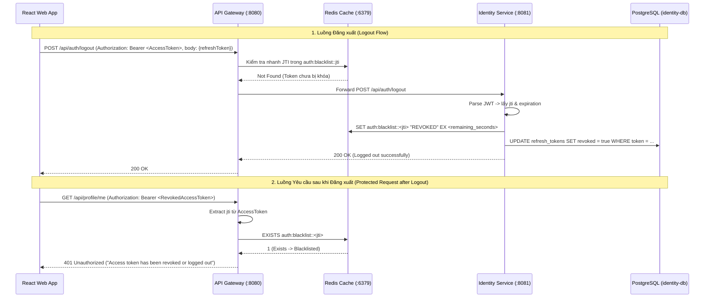

# Implementation Plan - Redis Distributed Caching Integration Phase 2 (Identity & Security)

## Goal Description

Tích hợp hệ thống phân tán Redis Cache vào `identity-service` và `api-gateway` (Phase 2) nhằm xây dựng cơ chế **JWT Token Blacklisting (Khóa Access Token sau khi đăng xuất hoặc thu hồi)** và endpoint **`POST /api/auth/logout`**. Giải quyết hoàn toàn điểm yếu bảo mật khi Access Token vẫn còn hiệu lực sau đăng xuất cho đến hết thời gian `expiration`.

---

## Architecture & Data Flow

---

## Proposed Changes

### 1. Configuration Separation (`config-service`)

- `identity-service.yaml`: Thêm cấu hình `spring.data.redis.host/port/password: seika_redis_secret`.
- `identity-service-prod.yaml`: Thêm cấu hình `spring.data.redis.password: ${REDIS_PASSWORD}` (Không fallback).
- `api-gateway.yaml`: Thêm cấu hình Redis reactive cho gateway.
- `api-gateway-prod.yaml`: Thêm cấu hình Redis reactive không fallback cho gateway prod.

### 2. `identity-service` Implementation

- **`RedisCacheConfig.java`**: Cấu hình `RedisTemplate<String, String>` chuyên dụng cho blacklist (`StringRedisSerializer`) và `RedisCacheManager` với allowlist `PolymorphicTypeValidator` (`com.seika.`, `java.util.`, `java.time.`) phục vụ cho các DTO/session cache nếu cần.
- **`TokenBlacklistService.java`**:
  - `void blacklistToken(String accessToken)`: Phân tích JWT để lấy `jti` và `expiration`. Tính toán TTL `= expiration - now`. Ghi vào Redis: `redisTemplate.opsForValue().set("auth:blacklist::" + jti, "REVOKED", remainingSeconds, TimeUnit.SECONDS)`.
  - `boolean isBlacklisted(String accessToken)`: Lấy `jti` và kiểm tra `Boolean.TRUE.equals(redisTemplate.hasKey("auth:blacklist::" + jti))`.
- **`JwtService.java`**: Cập nhật `isValidToken(String token)` để gọi `tokenBlacklistService.isBlacklisted(token)` (trả về `false` nếu đã bị blacklist).
- **`AuthController.java` & `AuthService.java`**:
  - Thêm `POST /api/auth/logout`: Nhận `Authorization` header (`Bearer ...`) và `RefreshTokenRequest` (tùy chọn).
  - Thu hồi `RefreshToken` trong DB và đưa `AccessToken` vào blacklist trên Redis.

### 3. `api-gateway` Implementation

- Thêm dependency `spring-boot-starter-data-redis-reactive` vào `src/api-gateway/pom.xml`.
- **`RedisConfig.java`**: Tạo `ReactiveStringRedisTemplate` bean.
- **`AuthenticationFilter.java`**:
  - Khi xác thực token, trích xuất `jti` từ token: `jwtService.extractJti(token)`.
  - Kiểm tra reactive: `reactiveStringRedisTemplate.hasKey("auth:blacklist::" + jti)`. Nếu `true`, lập tức từ chối `401 Unauthorized` với thông báo `Access token has been revoked`.

---

## Verification & Testing Plan

### 1. Automated Unit / Slice Tests

- **`TokenBlacklistServiceTest.java`**: Kiểm thử mock/slice verify `blacklistToken` ghi đúng key `auth:blacklist::<jti>` với đúng TTL vào Redis.
- **`RedisCacheSerializationTest.java`**: Verify cấu hình serializer của `identity-service`.
- **`AuthenticationFilterTest.java` / Gateway test**: Verify filter chặn token nằm trong blacklist.

### 2. End-to-End Verification via Docker Compose

- Rebuild toàn bộ stack: `docker compose up -d --build redis config-service identity-service api-gateway`
- Thực hiện Login -> Nhận Access Token.
- Thực hiện `POST /api/auth/logout` với Access Token vừa nhận -> Nhận 200 OK.
- Kiểm tra Redis: `docker compose exec redis redis-cli -a seika_redis_secret keys "auth:blacklist::*"` -> thấy key xuất hiện.
- Thực hiện lại yêu cầu tới bất kỳ endpoint bảo vệ nào với Access Token cũ -> Nhận `401 Unauthorized`.
